# 位运算符

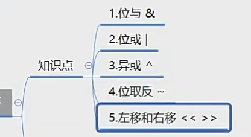

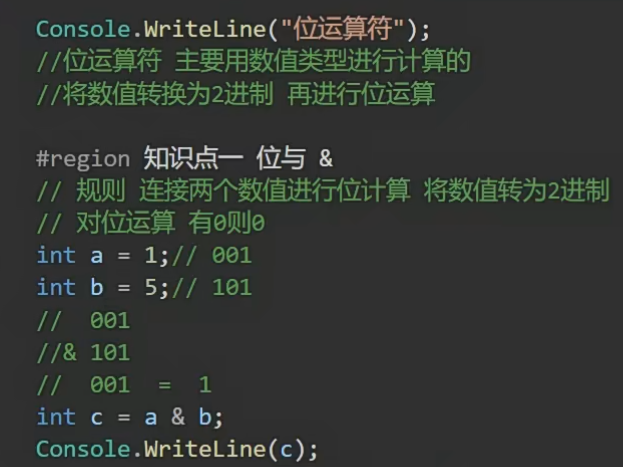

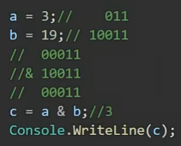

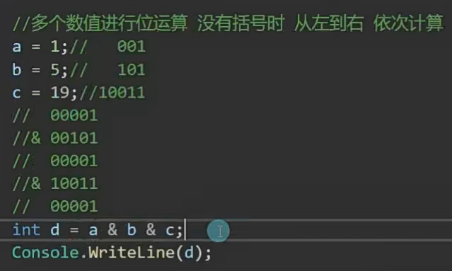

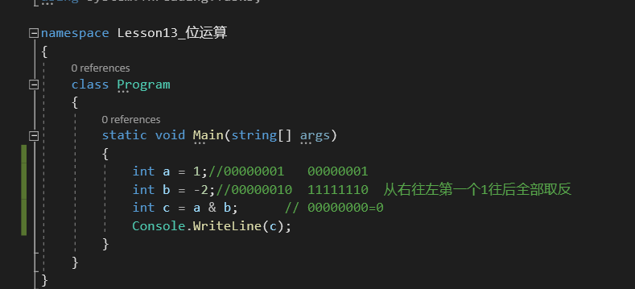

总结：从左往右换成二进制按位与，有0出0，结果自动转成数值

负数按补码形式参加按位与运算，原码&补码=新值

**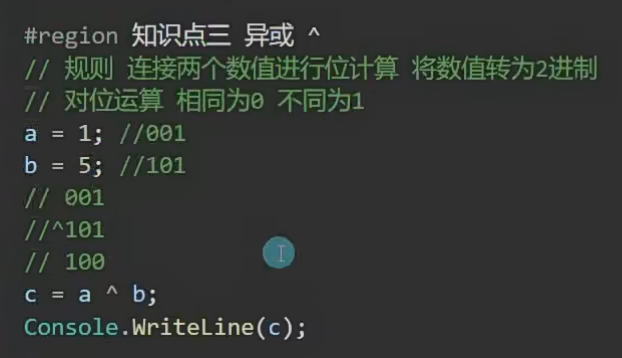**

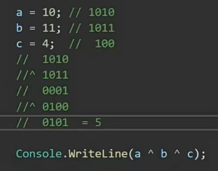

总结：从左往右换成二进制按位异或，相同为0，不同为1，结果自动转成数值

负数按补码形式参加按位与运算

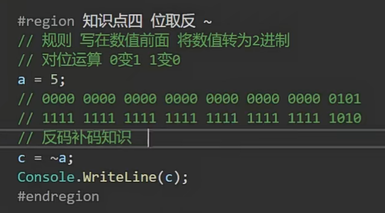

因为a是int带符号的，所以占4个字节 一个字节占八位

原——反——补

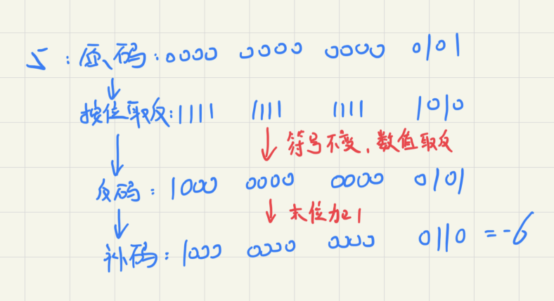

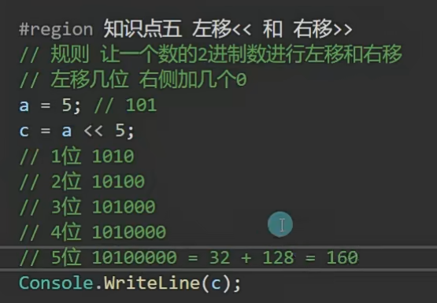

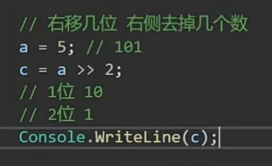

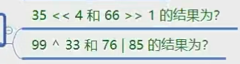

1.

560,33

2.

66,93
