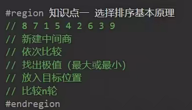
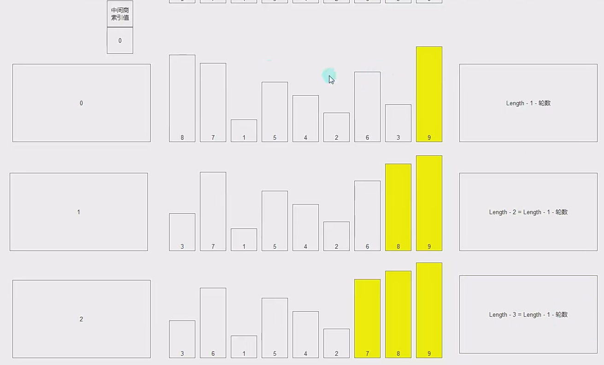
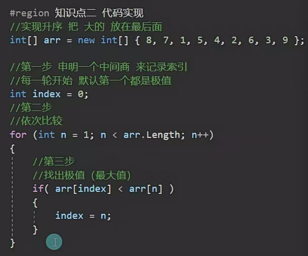
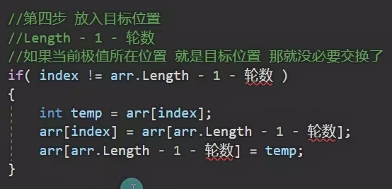
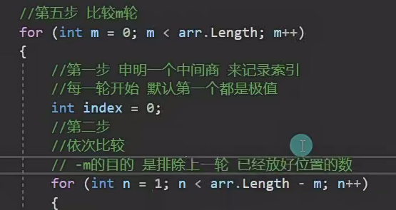
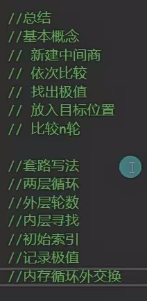

# 29.选择排序

一轮的代码

比较m轮:

using System;

class Program

{

    static void Main(string[] args)

    {

        // 创建一个长度为20的整型数组

        int[] arrays = new int[20];

        Random random = new Random();

        // 用随机数填充数组，范围是 0 到 100 之间的整数

        for (int i = 0; i < arrays.Length; i++)

        {

            arrays[i] = random.Next(0, 101); // 生成随机数并赋值给数组元素

        }

        // 调用排序方法对数组进行排序

        ArraysSort(arrays);

        // 输出排序后的数组

        foreach (int item in arrays)

        {

            Console.Write(item + " "); // 输出每个数组元素

        }

    }

    // 定义排序方法，用来对数组进行排序

    void ArraysSort(int[] arrays)

    {

        // 外层循环控制排序轮次，从0到arrays.Length-1

        for (int i = 0; i < arrays.Length; i++)

        {

            // 假设当前未排序部分的最大值索引是0

            int index = 0;

            // 内层循环找到未排序部分中的最大值

            // 注意：这里的内层循环从 j = 1 开始，并且每次外层循环后 j 范围缩小

            for (int j = 1; j < arrays.Length - i; j++)

            {

                // 如果当前值比找到的最大值还大，则更新最大值的索引

                if (arrays[index] < arrays[j])

                {

                    index = j;

                }

            }

            // 如果找到的最大值索引不是当前未排序部分的最后一个位置

            if (arrays[index] != arrays[arrays.Length - 1 - i])

            {

                // 交换当前最大值和当前未排序部分的最后一个元素

                int temp = arrays[index];

                arrays[index] = arrays[arrays.Length - 1 - i];

                arrays[arrays.Length - 1 - i] = temp;

            }

        }

    }

}
