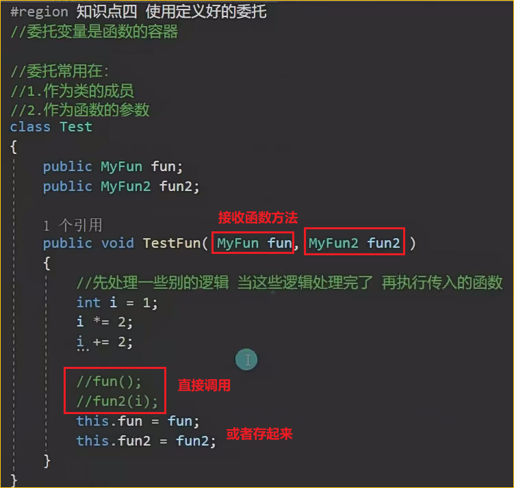

# 24.委托


第一种调用的方式:


第二种调用的方式：


有参有返回值的形式的两种调用方法





2.


 


```c#
 class Program
    {
        //方法1 定义委托
        public delegate void MethodDelegate(string s);

        //定义匹配委托签名的方法
        static void printStr(string s)
        {
            Console.WriteLine(s);
        }
        static void Main(string[] args)
        {
            //方法1 :实例化委托
            //new MethodDelegate(printStr) 创建了一个委托实例，它"指向"printStr方法
            MethodDelegate iDelegate = new MethodDelegate(printStr);
            //调用委托
            //调用iDelegate("...")实际上就是调用printStr("...")
            iDelegate("1 this is instance delgate");

            //方法2 :直接赋值
            //C# 允许直接将方法赋值给委托变量（语法糖）与方法一一致
            MethodDelegate mDelegate = printStr;
            //调用委托
            mDelegate("2 this is method delgate");

            //方法3 匿名委托
            //使用delegate关键字创建匿名方法,不需要预先定义printStr这样的方法
            //直接在赋值时定义方法,调用aDelegate("...")会执行匿名方法中的代码
            MethodDelegate aDelegate = delegate (string s) { Console.WriteLine(s); };
            aDelegate("3 this is anonymous delegate");

            //方法4 lambda 表达式
            //和前面一致，用lamda表达式
            MethodDelegate lDelegate = (s) => { Console.WriteLine(s); };
            lDelegate("4 this is anonymous delegate");
        }
```

为什么赋值后可以直接输出？

关键在于理解委托的本质：

1. 赋值操作：当你将一个方法（或匿名方法/Lambda）赋值给委托变量时，实际上是在告诉这个变量："当你被调用时，去执行这个方法"。
2. 调用操作：当你调用委托变量（如iDelegate("..."）时，C#运行时：
   - 查找这个委托变量"指向"的方法
   - 将参数("...")传递给该方法
   - 执行该方法

为什么Lambda表达式不用delegate关键字？
因为Lambda表达式会根据前面的MethodDelegate自动判断此时的s是string类型（不是委托类型，而是委托参数类型）。

Lambda表达式：
MethodDelegate lDelegate = s => Console.WriteLine(s);

编译后等价于：
MethodDelegate lDelegate = new MethodDelegate(<编译器生成的方法名>);
private static void <编译器生成的方法名>(string s) {
Console.WriteLine(s);
}
