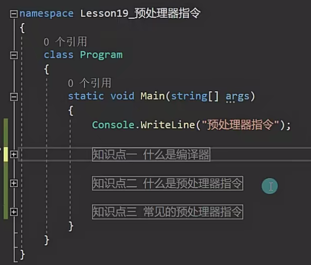
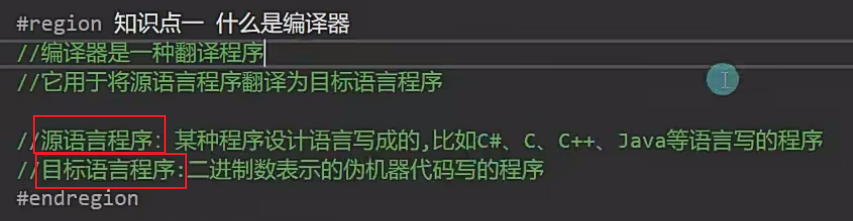
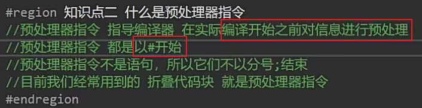
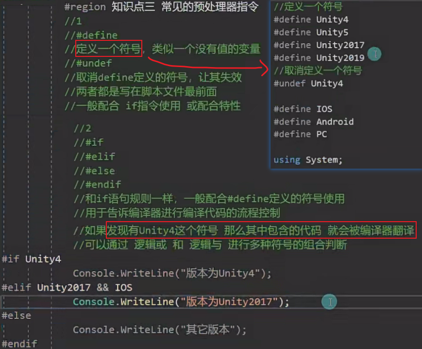
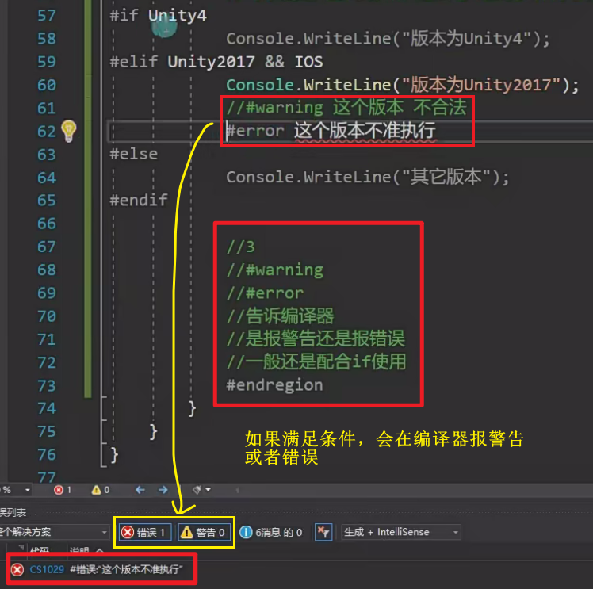
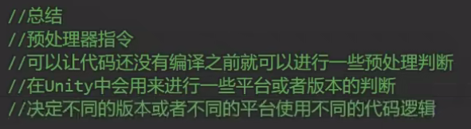

# 39.预处理指令

什么是链表，栈和堆?

栈和堆都是计算机在内存中存储数据的一种方式，栈存储的方式先进后出，就是先来的数据一般最后被windows销毁回收，一般存储在栈中的数据，移动和复制都是直接在内存中重新创建一个区域复制该数据过去，但是存储在堆中的数据就不是这样了，存储在堆中的数据一般都是指向的一个内存地址，如果复制一个新的数据，则是在内存中开辟一个新的存储空间，然后将其指向原有的数据内存空间，堆中的数据一般都是由程序员自己控制销毁，然后再由GC进行回收，因为不同的场景和应用所以才会使用不同的存储方式，存储栈的优点就是结构简单不用担心销毁和回收，都是由windows统一进行控制，但是有些浪费存储空间，因为栈的空间都是连成一片的，如果空间1和空间3中间的空间2是空的，则会造成内存的浪费，堆的优点就是全部由程序员控制销毁，有良好的可操控性，且内存是不连续存储不会造成空间的浪费，链表是一种线性结构，由数据和指针组成，链表的本质就是一片不连续的存储空间，由指针将其连接，十分的节省空间。因为链表节省空间的特性，所以可以常用链表来实现需要经常查询和插入的数据存储，链表的缺点也很明显，因为是线性的，所以如果要查询链表中间的某值，就需要从开头依次向后才能找到，十分的耗费性能，链表有单链表和双链表以及循环链表多个不同的形式，以应对不同的使用场景，栈也可以用链表进行实现，一个栈就是一个链表，当有一个新的元素添加进来就添加到链表尾部，删除链表值时就将头指针向后移移位就可以了
