# 41.反射概念和关键类Type

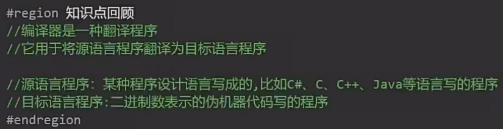

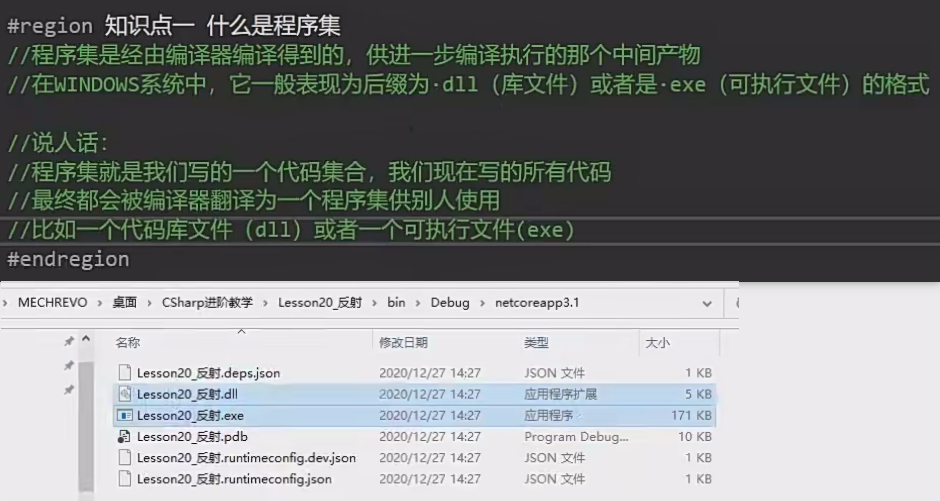

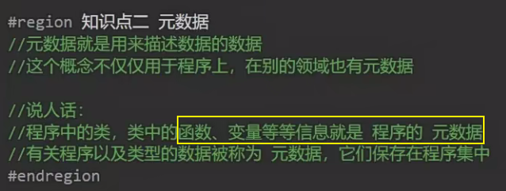

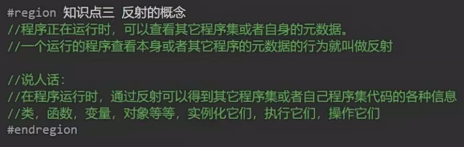

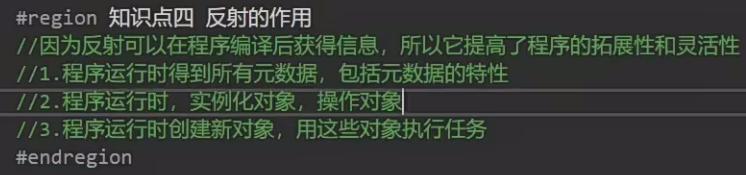

反射最大的作用：

在一个程序集里面去使用另一个程序集里写好的代码

可以利用反射的形式，实例化另一个程序集代码里的一个类，并控制它，实现自己的一些功能

自己不用去写别人写好的一些代码了

                                                        ——预制代码

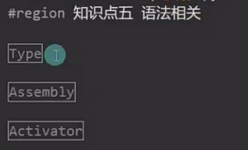

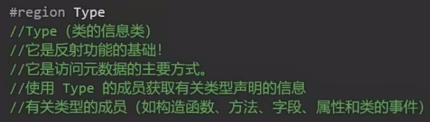

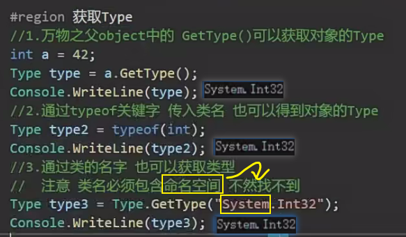

三种获得Type的方式都是指向的同一个内存地址

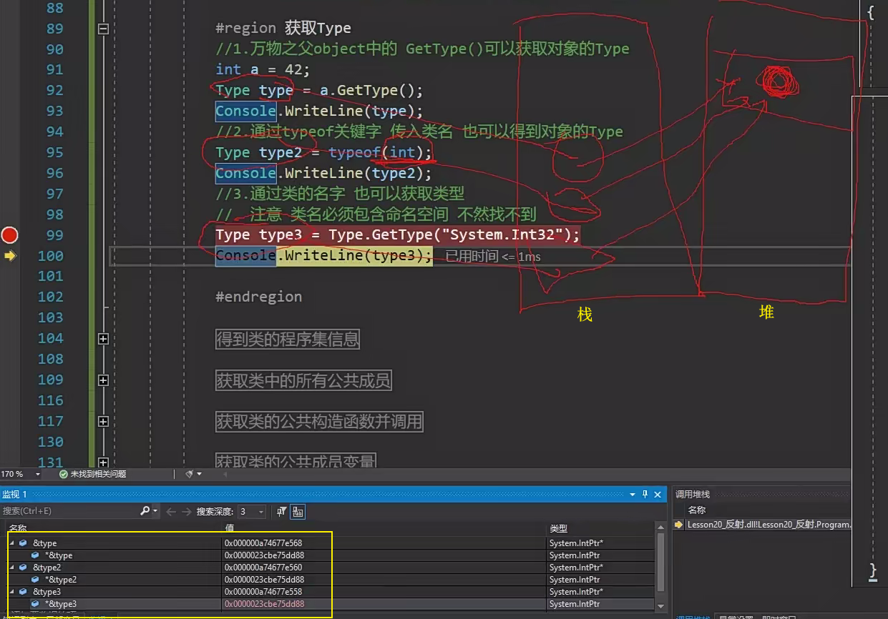

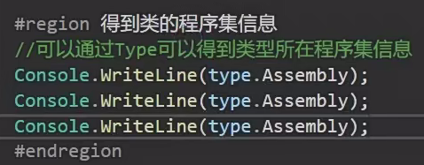

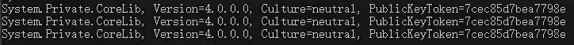

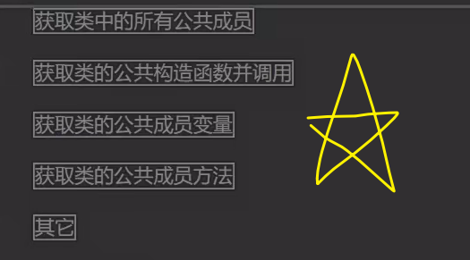

获取其他程序集需要在前面加命名空间.

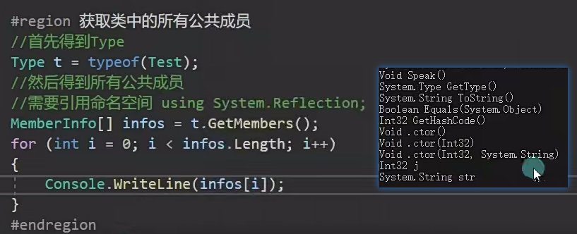

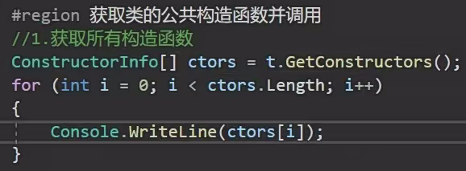

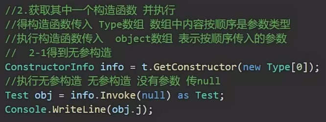

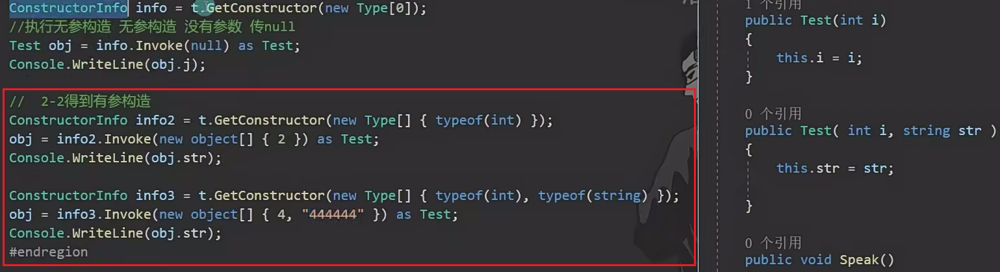

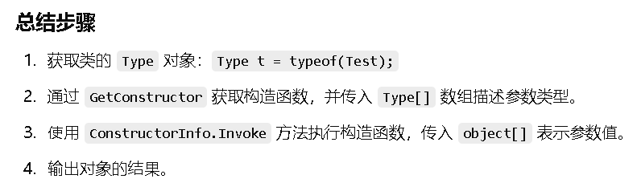

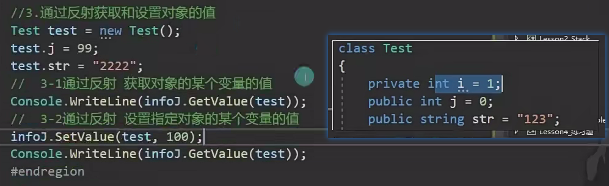

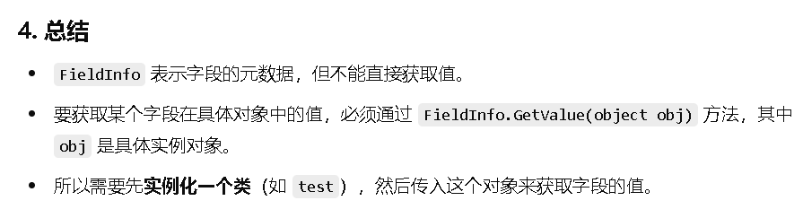

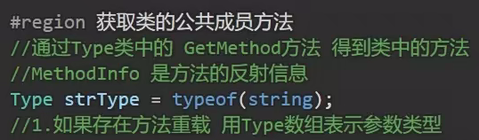

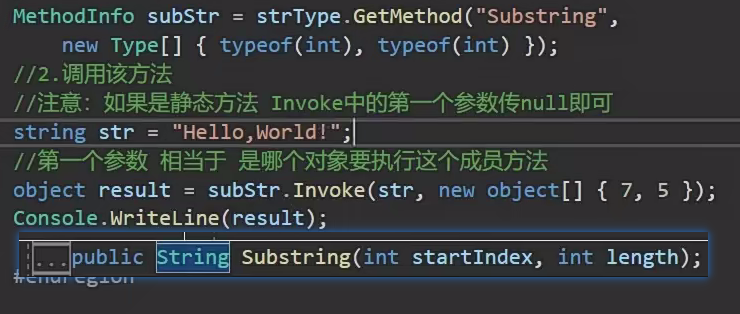

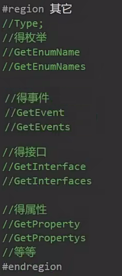

总结：

1.获取对象的Type

2.利用Type里面的API得到指定的成员变量，构造函数，成员函数等具体信息，装起来

3.调用传参执行
