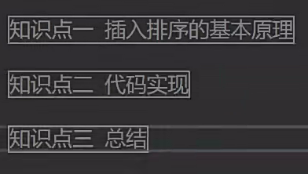
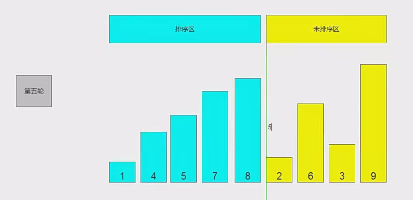
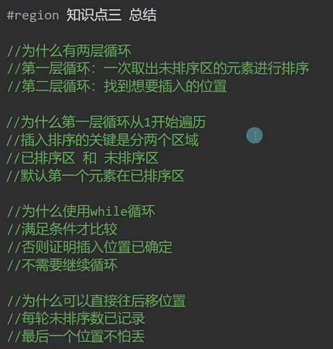

# 50.插入排序




```
插入排序是从后往前排，也就是从未排区选一个，在排序区中从后往前比较
eg:
	2往前依次和1，4，5，7，8进行比较交换，比2大的就往后移一格，但是不进行交换，直到有数字比2小，则进行插入操作
```





```c#
using System;
/// <summary>
/// 插入排序
/// 1，要有排序区和未排序区
/// 2.中间用索引隔开
/// 3.两种情况停止排序：一、排到最前面 二、前面的值比自身大
/// </summary>
class Program
{
    static void Main(string[] args)
    {
        int[] ints=new int[10];//定义数组
        Random random=new Random();//定义随机数
        for (int i = 0; i < ints.Length; i++)
        {
            ints[i]=random.Next(1,100);//随机数填入数组
        }
        Console.Write("打印数组: ");
        foreach (int item in ints)
        {
            Console.Write(item+" "); 
        }
        Resort(ints);
        Console.WriteLine();
        Console.Write("打印数组2: ");
        foreach (int item in ints)
        {
            Console.Write(item+" "); 
        }
        void Resort(int[] ints){
            for (int i = 1; i <ints.Length; i++)//第一层循环，分区
            {
                int index=i-1;//排序区
                int outValue=ints[i];//待排的数
                while(index>=0 && ints[index]>outValue){//不断的往前比较，比它大的往后移
                    ints[index+1]=ints[index];
                    index--;
                }
                ints[index+1]=outValue;//插入到合适的位置，合适的位置是当前位置+1
            }
        }
    }
}
```

