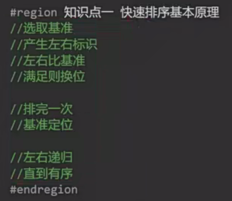
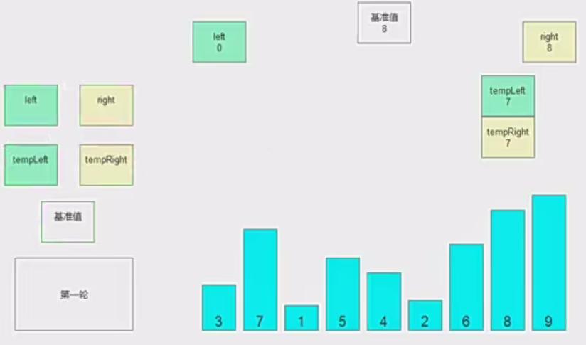
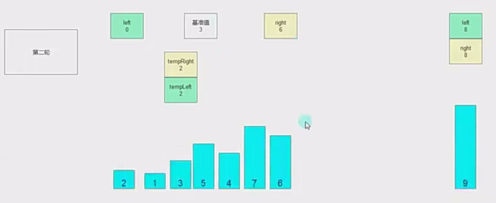
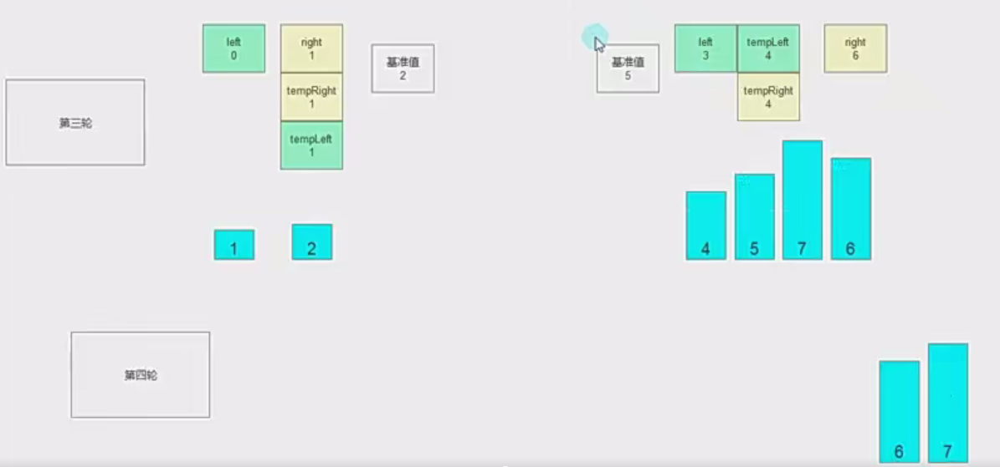

# 53.快速排序

**

二�**�

****

****

****

```c#
using System;

/// <summary>
/// 快速排序辅助工具类
/// 包含分区操作的核心逻辑
/// </summary>
public class QuickSortHelper
{
    // 静态随机数生成器，用于生成基准索引
    private static readonly Random _random = new Random();

    /// <summary>
    /// 生成指定范围内的随机整数
    /// </summary>
    /// <param name="start">起始位置（包含）</param>
    /// <param name="end">结束位置（包含）</param>
    /// <returns>[start, end]范围内的随机整数</returns>
    private static int RandomInRange(int start, int end)
    {
        // C#的Next方法参数是左闭右开区间，所以需要end+1
        return _random.Next(start, end + 1);
    }

    /// <summary>
    /// 交换两个整数的值
    /// </summary>
    /// <param name="a">第一个整数的引用</param>
    /// <param name="b">第二个整数的引用</param>
    private static void Swap(ref int a, ref int b)
    {
        // 使用临时变量进行值交换
        int temp = a;
        a = b;
        b = temp;
    }

    /// <summary>
    /// 快速排序分区操作核心方法
    /// </summary>
    /// <param name="data">待排序数组</param>
    /// <param name="length">数组长度（可省略，因C#数组自带Length属性）</param>
    /// <param name="start">分区起始索引</param>
    /// <param name="end">分区结束索引</param>
    /// <returns>基准元素的最终位置</returns>
    /// <exception cref="ArgumentException">参数不合法时抛出</exception>
    public static int Partition(int[] data, int length, int start, int end)
    {
        // 参数合法性检查
        if (data == null || length <= 0 || start < 0 || end >= length)
            throw new ArgumentException("Invalid Parameters");

        // 步骤1：随机选择基准元素(pivot)并交换到末尾
        int pivotIndex = RandomInRange(start, end);
        Swap(ref data[pivotIndex], ref data[end]);

        // small指针用于跟踪最后一个小于基准元素的位置
        int small = start - 1;

        // 遍历[start, end-1]区间内的元素
        for (int i = start; i < end; i++)
        {
            // 如果当前元素小于基准元素（末尾元素）
            if (data[i] < data[end])
            {
                // 移动small指针并交换元素
                small++;
                if (small != i)
                {
                    // 将较小元素交换到左侧区域
                    Swap(ref data[i], ref data[small]);
                }
            }
        }

        // 将基准元素交换到正确的位置
        small++;
        Swap(ref data[small], ref data[end]);

        // 返回基准元素的最终位置
        return small;
    }
}
```

### 使用示例：

```c#
// 初始化测试数据
int[] array = { 9, 3, 7, 4, 5, 1, 6 };

// 执行分区操作
int pivot = QuickSortHelper.Partition(
    data: array,
    length: array.Length,
    start: 0,
    end: array.Length - 1
);

/*
执行结果：
array变为类似 [3,4,1,5,9,7,6] 的分区形式
pivot值为3（基准元素5的最终位置）
*/
```
关键：
1. 标准的快排只能从小往大排，small最终会移动到选取的基准点位置
2. 如果想实现从大往小排，则除了改变循环逻辑，small也要改变，初始值=数组长度，每次移动时都--

**步骤：**
1. 随机基准点（%% 避免了总是选择最坏基准元素的风险（如已排序数组、逆序数组等）。这种方法能够大大降低退化为 `O(n^2)` 时间复杂度的几率，使得快速排序更加高效，尤其在面对大规模数据时。 %%）
2. 交换基准点与数组最后一个元素的值
3. 循环数组，小的就交换small和当前的值，每次交换small指针++
4. small指针指向的是最后一个比基准点小的值，如果下次遇到还有比基准点小的值，就进行交换
{ 5, 3, 8, 5, 4, 5, 7 }基准3
