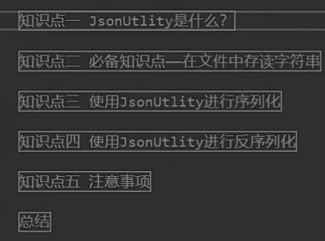
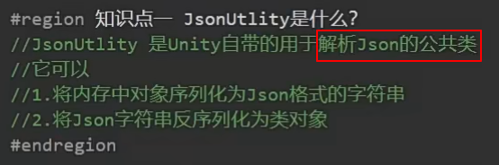
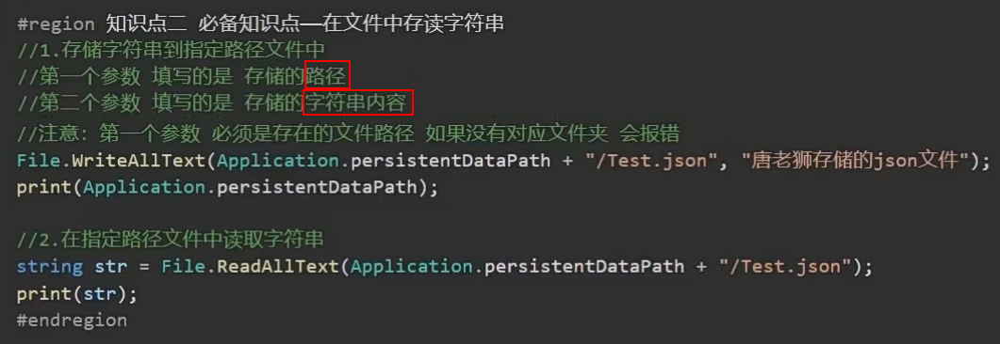
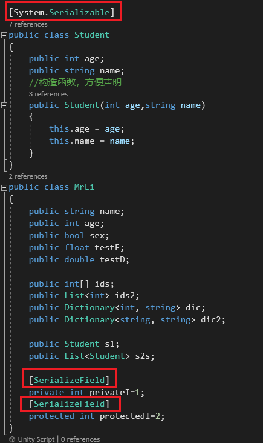
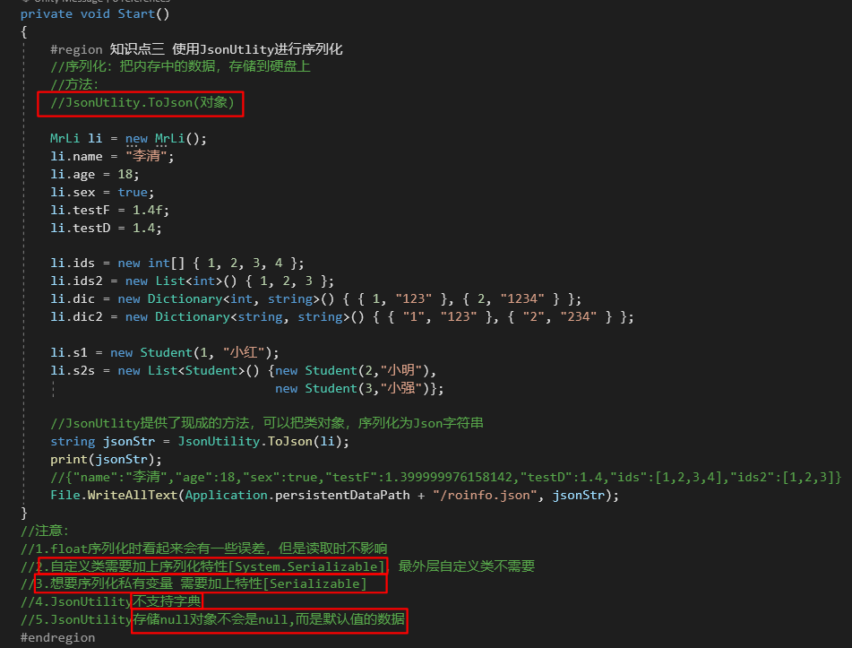
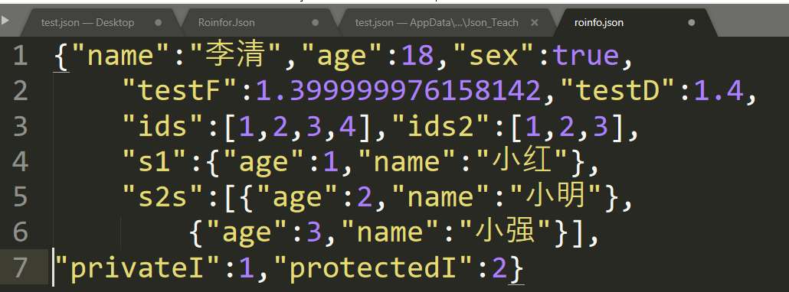

# 4.JsonUtlity序列化

写一个数据类，用于序列化举例

注意：Application.perisistentDataPath是Unity中 **一个可读写路径，指向游戏的持久存储位置**。 这个路径可以用于存储玩家的游戏数据、配置文件和其他持久数据

总结：

1. **数据转换为JSON**：将对象或数据结构转换为JSON字符串。这通常使用 **JsonUtility.ToJson** 或类似的方法。
2. **存储JSON数据**：将生成的JSON字符串保存到文件或其他存储介质中。
3. **自定义类加上特性**：在自定义类中添加特性（如 **[System.Serializable]**）以确保类可以被正确序列化和反序列化。
4. **字典存储问题**：在某些序列化框架中，字典类型的数据可能需要特殊处理或不被直接支持。
