# 5.JsonUtlity反序列化

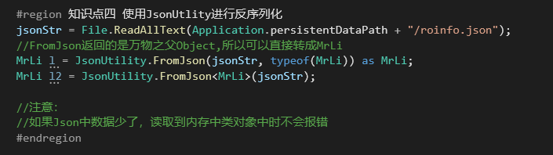

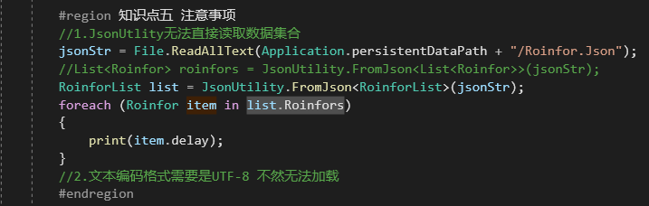

1.数据集合就是这种list类型的，直接由Excel转换而来的数据

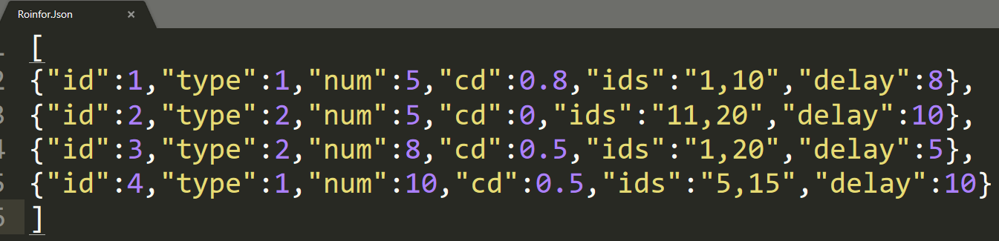

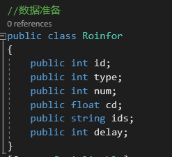

直接读取会报错

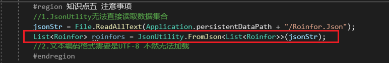

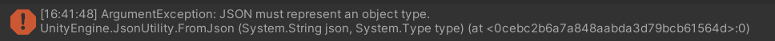

那如何解决呢？

把这个数据类，再包裹一层List类型的类，且将.Json文件修改成由对象包裹的形式

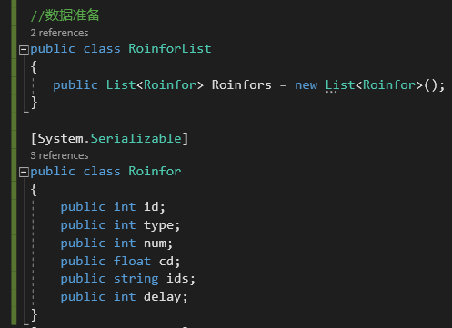

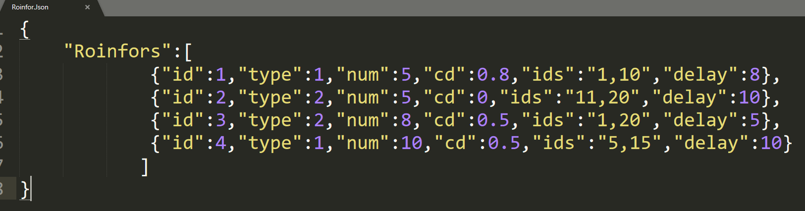

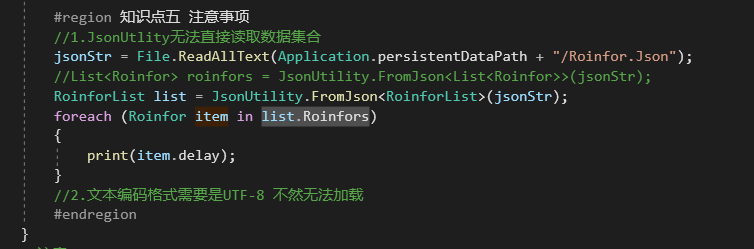

2.除UTF-8以外，其他类型读取都会报错

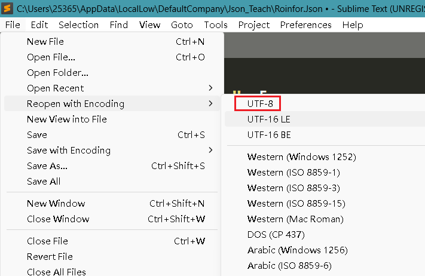

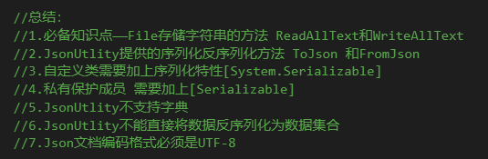

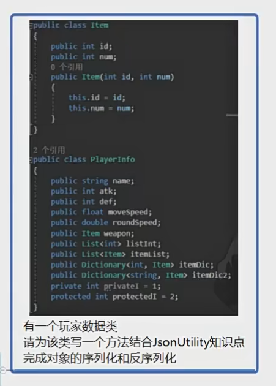

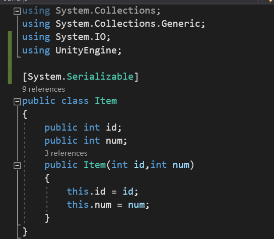

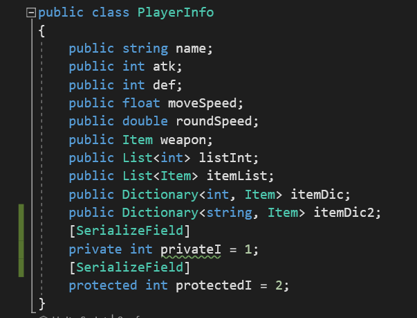

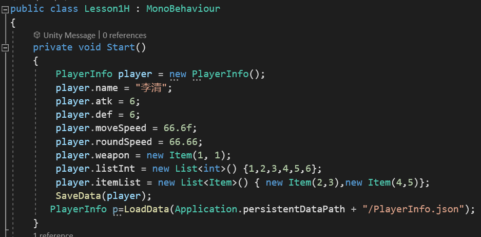

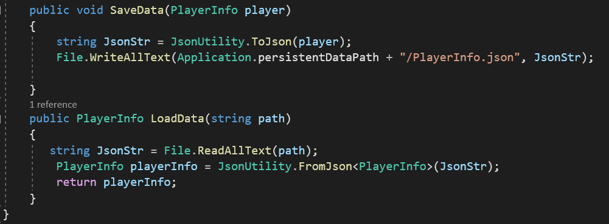

总结：

1. **读取文件**：使用 **File.ReadAllText** 方法将JSON文件的内容读取为字符串。
2. **反序列化**：使用 **JsonUtility.FromJson** 方法将读取到的JSON字符串转换为相应的对象或对象列表。
3. **使用类装载数据**：将反序列化得到的数据存储在相应的类实例中，以便后续操作。
