# 22.图集制作

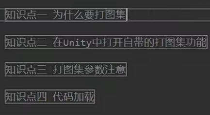

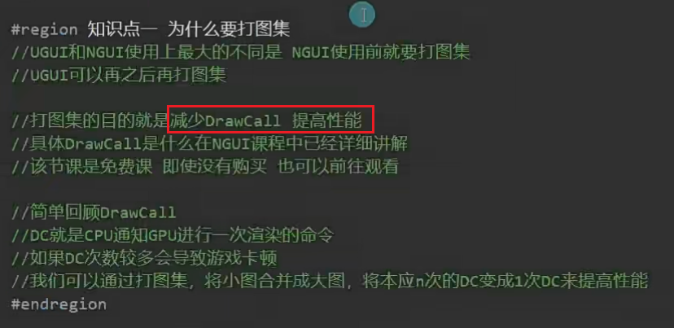

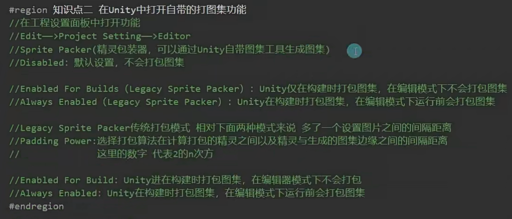

制作UI时，图集的这两个选项不要勾选

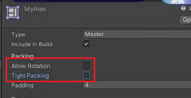

如何查看drawCall?

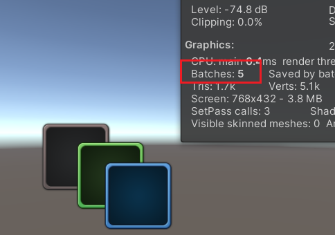

如何打图集？

1.开启打图集功能，运行和导出都能打包图集

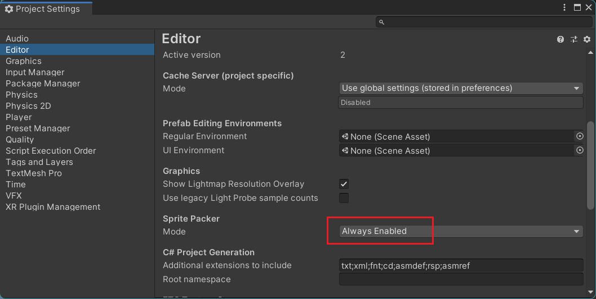

2.新建图集并导入要使用的图片

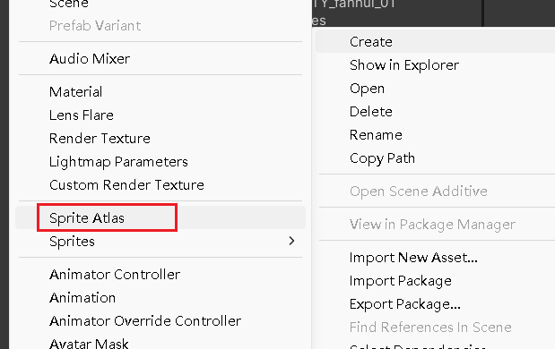

3.就打好图集了

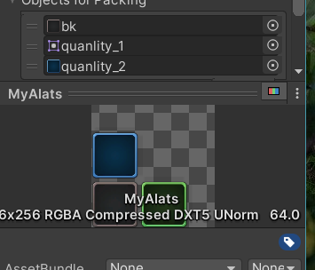

注意：

1.只有重叠的时候才计算drawCall，不重叠不算的，UI本来就有2个

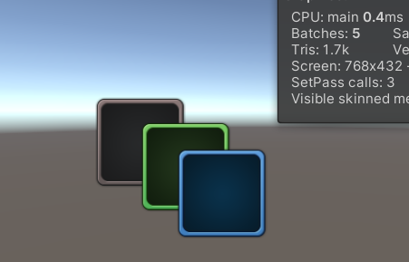

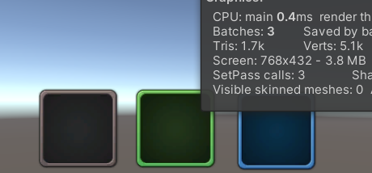

2.当一个图集的图片中插入一个算三个drawCall

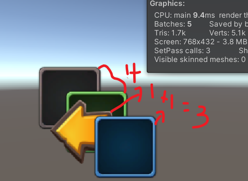

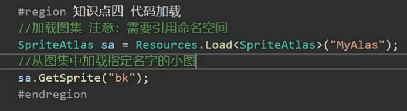

 
