# 3.Canvas渲染模式的控制

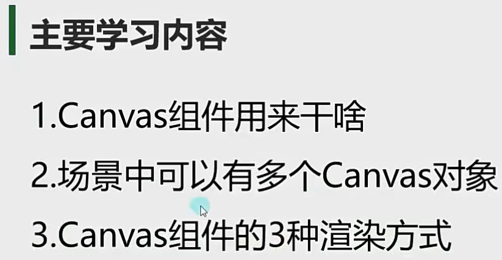

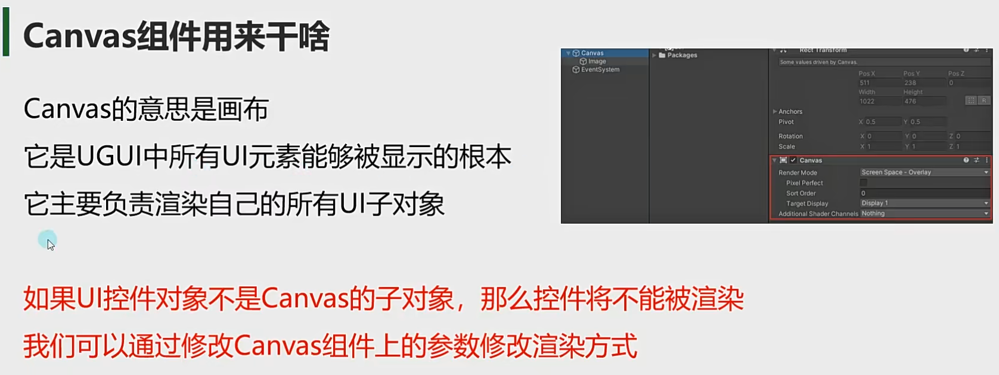

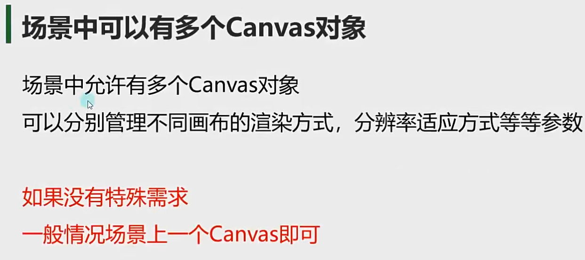

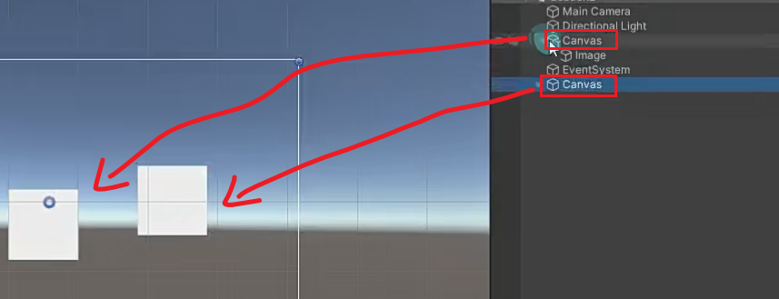

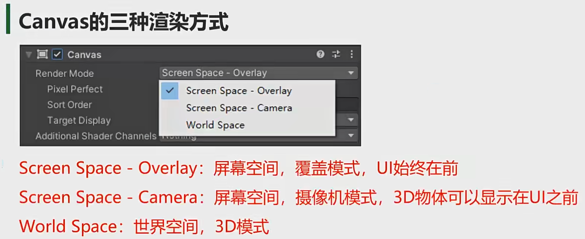

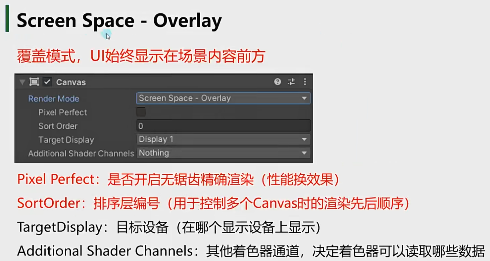

数字越大，越后渲染，越后渲染，越显示在前方

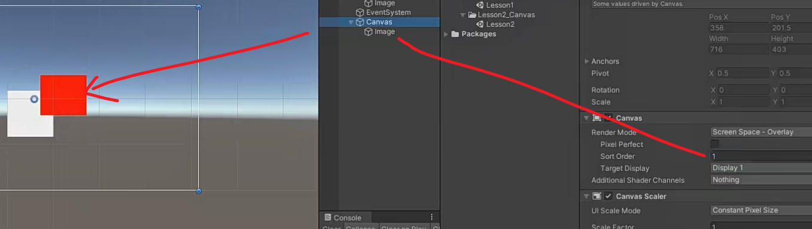

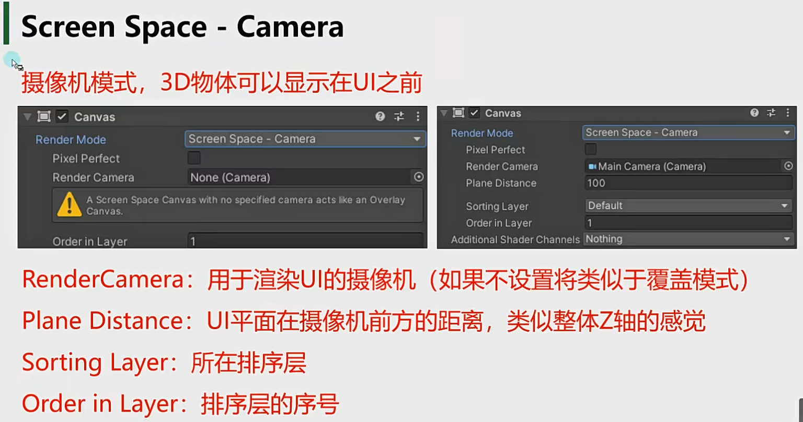

小技巧：

1.创建一个摄像机专门用来渲染UI层，摄像机渲染模式选择只渲染自己层相关的东西

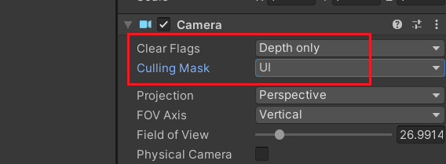

2.选择渲染模式

3.如果某一些3D对象想渲染在UI界面之前，单独创建在UI界面上

4.排序层越大，越后渲染，显示越前面

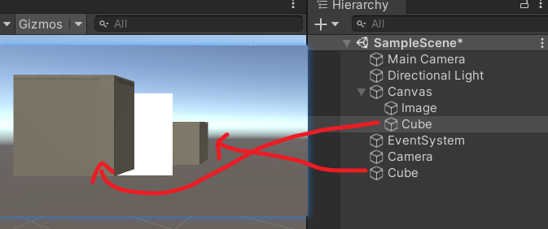

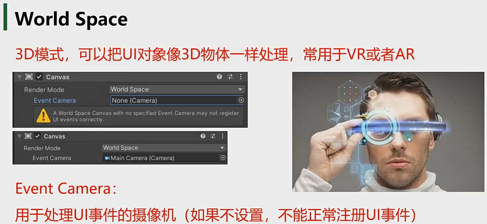

注意：

一般3D模式关联的就是主摄像机，因为要监听所有的事件

这种模式其实就是把UI图片当成3D物体来处理了 ，缩放大小和尺寸都是和世界坐标一样的 

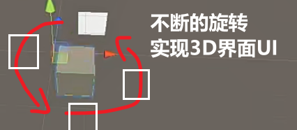

 
