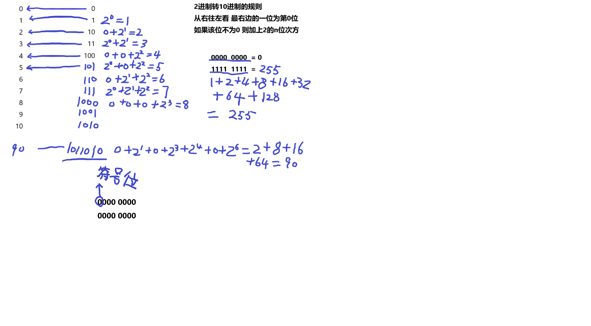
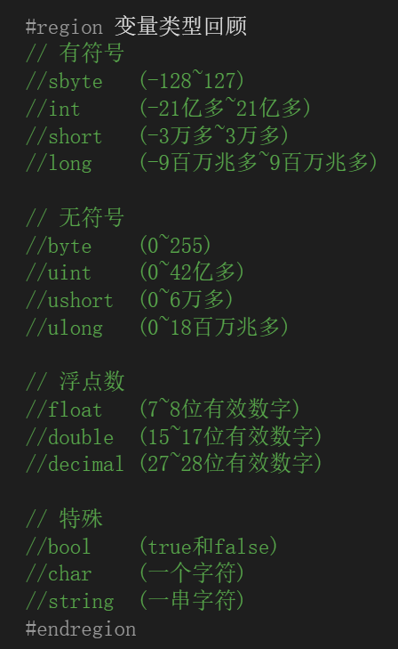
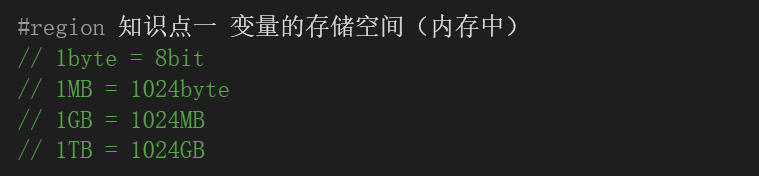
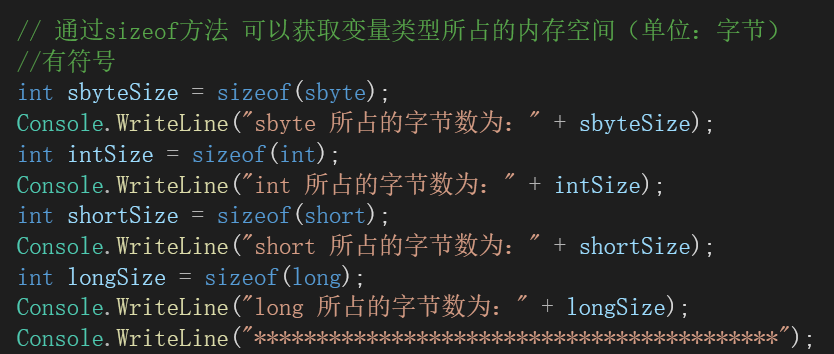
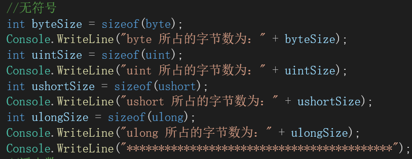
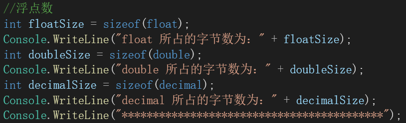
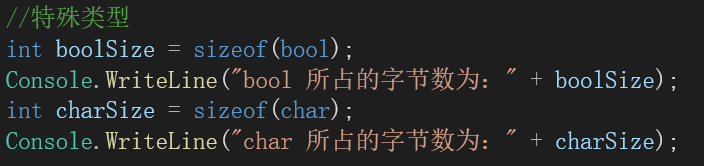
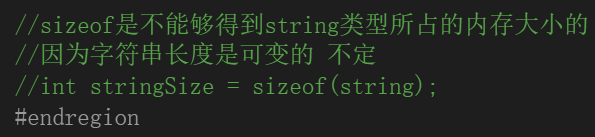
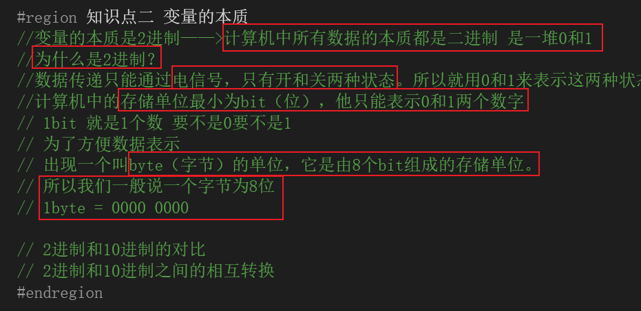
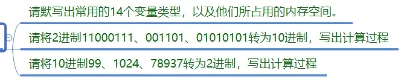

# 变量的本质知识点

**bool**: 1 字节

**byte**: 1 字节

**sbyte**: 1 字节

**char**: 2 字节

**short**: 2 字节

**ushort**: 2 字节

**int**: 4 字节

**uint**: 4 字节

**long**: 8 字节

**ulong**: 8 字节

**float**: 4 字节

**double**: 8 字节

**decimal**: 16 字节

**object**: 取决于运行时环境，通常为 4 或 8 字节

**string**: 每个字符占用 2 字节，加上字符串对象的额外开销（例如长度信息），大致是每个字符加 1 到 2 个字节不等

1.

有符号

sbyte:-128~128

int 21亿~-21亿

short -3万~3万

long -9百万~9百万

无符号

byte:0-255

uint:0-42亿

ushort:0-6万

ulong：0-18百万

小数

float:小数点后7-8位

double:15~17位

decical:27~28位

特殊

bool:true和false

char:一个字符

string:一串字符

2.

11000111=199

。。。

3.

99=01100011
