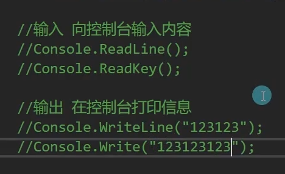

# 第一个应用程序

[C#入门—3第一个应用程序.pdf](./file/C#入门—3第一个应用程序.pdf)

命名空间——工具包

类——工具

函数——工具能做的事情

主函数——一个程序的主入口

Console.WriteLine:打印完自动空一行

Console.Write：打印完后不空行

Console.ReadLine:检测玩家输入信息，按回车键结束，才会继续执行后面的代码

Console.Key:检测玩家是否按键，只要按了任何一个键，就会认为输入结束

