# C++是如何工作的

**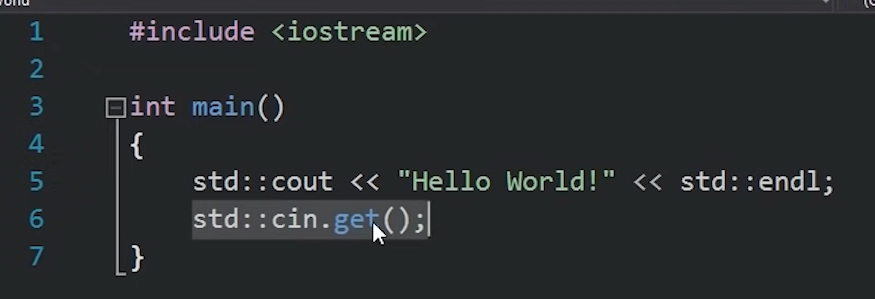**

#include <iostream>：搜索iostream连接起来，预处理程序，还没运行就处理好的程序

会复制iostream里所有的文件，然后粘贴进main.cpp

因为cout等函数都是iostream里写好的，所以要先引用iostream才能使用cout

int main函数：程序开始的函数，程序进入main函数，开始一句一句执行整个代码，会默认返回0，因为是main函数很特殊所以不用主动返回值

<<:重载运算符，将它视为函数

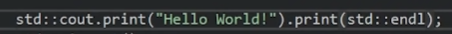 

1.发送字符串”Hello World“到cout函数，该函数将行打印到控制台上

2.传递endl，它将光标移动到新行

3.cin.get（）函数是等待按下回车移动到程序的下一行，所以程序会停在第6行等待我们按下回车键

4.返回0，然后程序结束

c++是如何把代码编译成实际的机器代码的？

两个重要的参数

 

 

项目配置和平台配置

（配置：构建项目时应用的一组规则）

（平台：编译所针对的平台的设置）

eg：x86-意味着将为windows生成32位应用程序

定义平台的编译我们可以更改的一些规则：

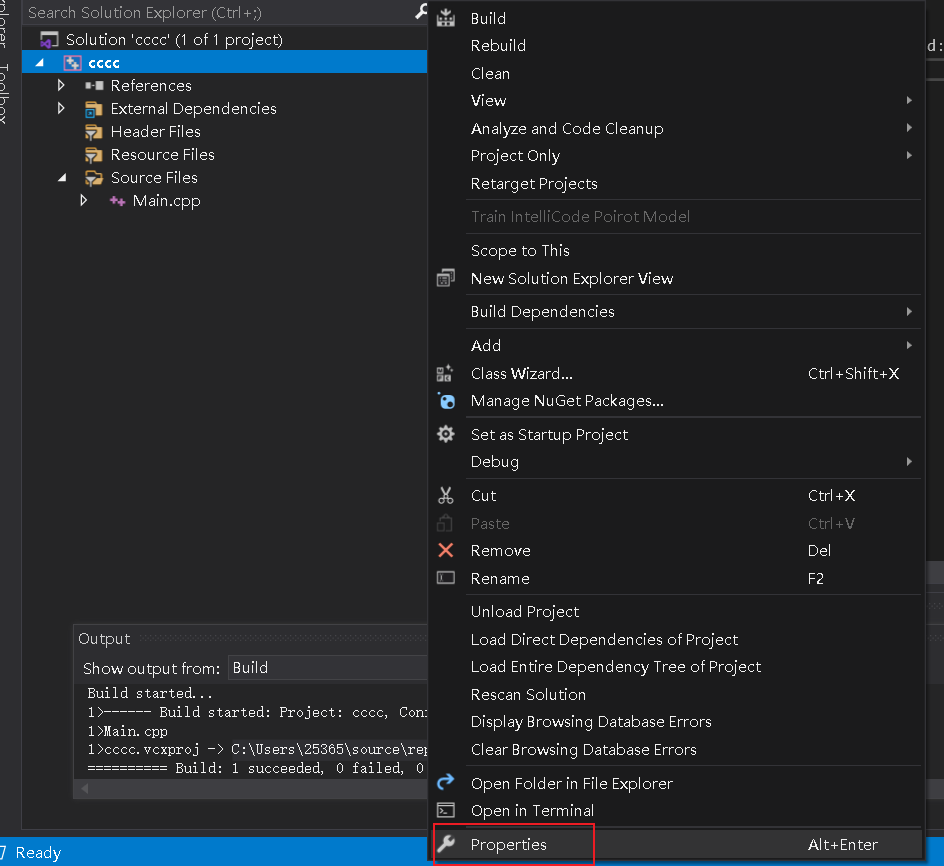

打开visual studio规则界面

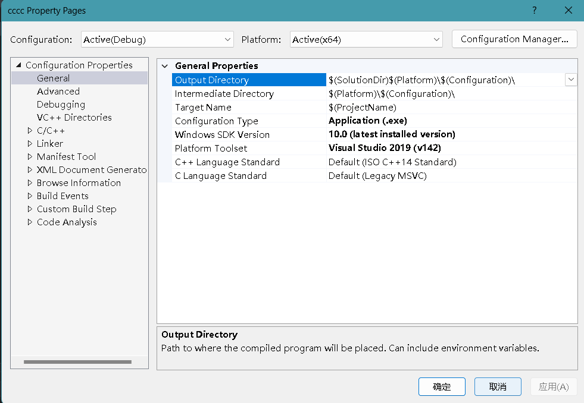

1.选择正确的配置和平台

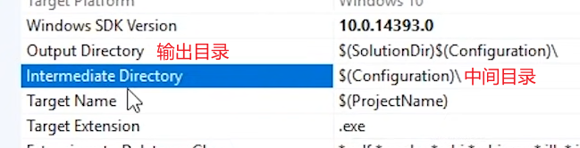

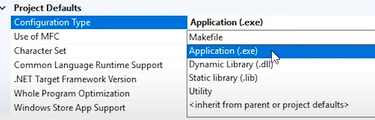

我们需要.exe文件，所以将安装保留在Application(.exe)上

**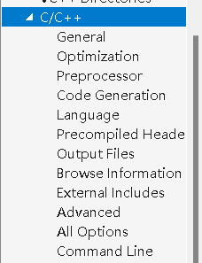

编译器设置位于c/c++部分，我们不需要做任何设置**

**但是就是因为这些文件决定我们的文件如何编译**

**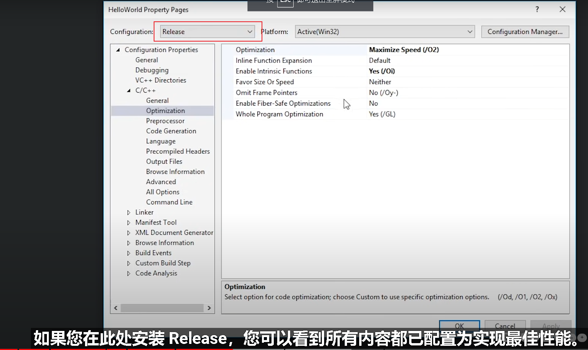**

**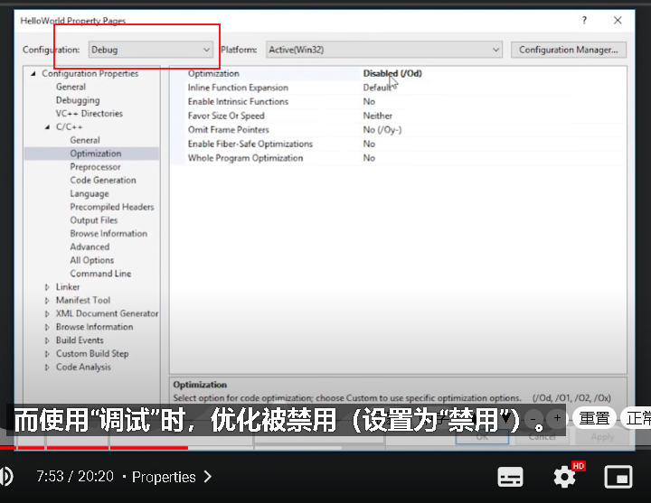**

****

****

****

**我们项目的每个.ssr文件都会被编译，标头不会被编译，只有.ssr文件�**�

**记住：标头包含在前处理阶段，#include,直接进入.ssr文件并在那儿编译**

**几个.ssr文件，都是单独编译的，每个.ssr文件都被编译成一个目标文件**

**visual studio将目标文件使用.obj命名**

**编译各种.ssr文件，得到一些.obj文件，然后就会将它们组合成一个.exe文件（用linker）**

**linker的任务就是收集所有的.obj文件，然后组合成一个.exe文件夹中**

**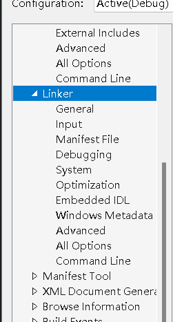**

**如何单独编译一个.ssr**

**在外面右键**

**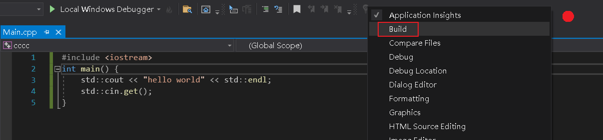**

**或�**�

**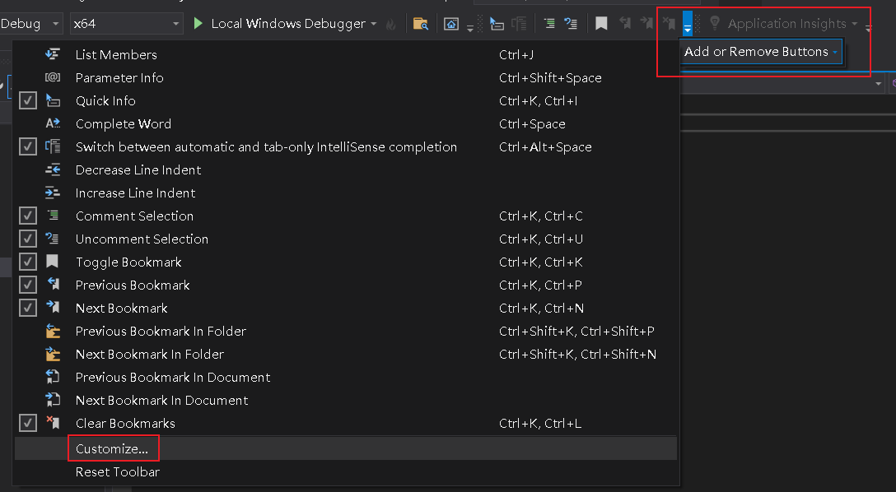**

**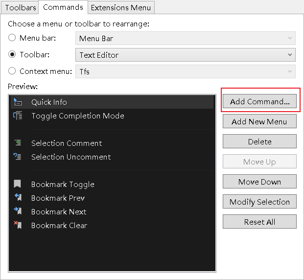**

**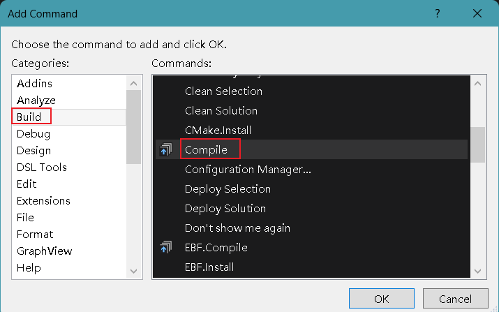**

**然后会出现这个图标，直接点就可以了**

****

**打开这个，我们的构建文件就会在里面**

**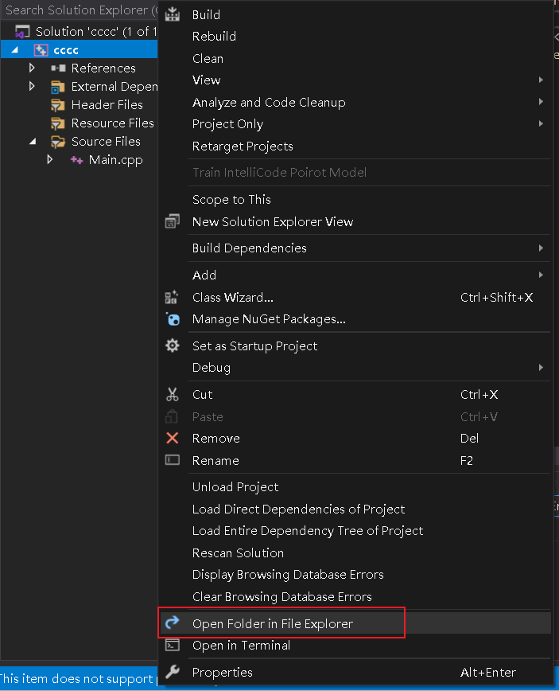**

**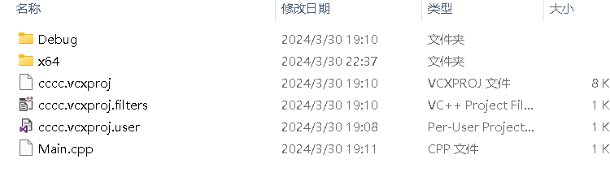**

**用一个函数做这个输出方法，主函数只要调用就可以了**

**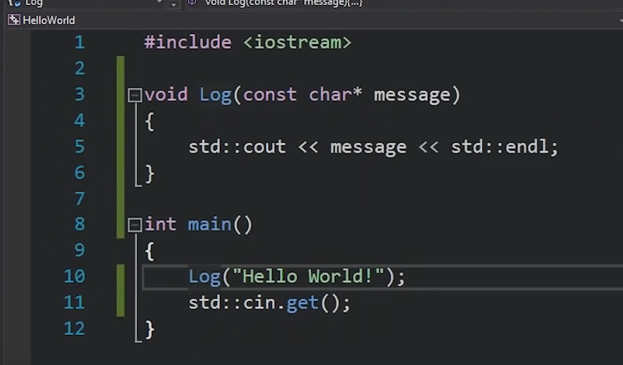**

**但是这样写会把所有函数都挤在这个界面，代码会越来越多，越来越乱，怎么办？**

**1.新构建一个项目****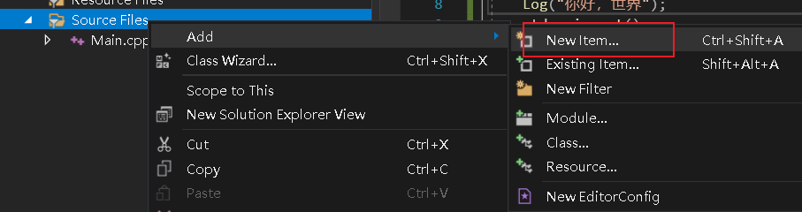**

**2.****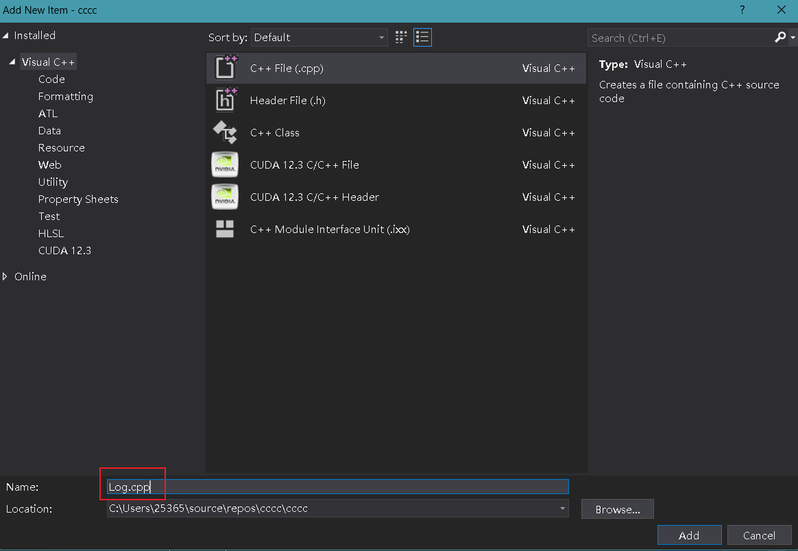**

**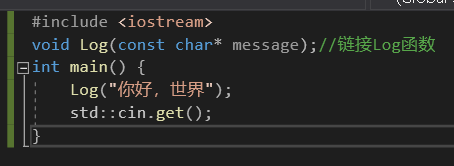**

**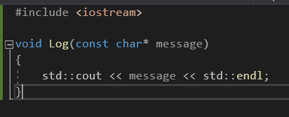**

**built编译，然后就会对.ssr进行编译，为每个CBP(.cpp)文件形成obj文件**

**获取他们然后组成一个exe文件**

**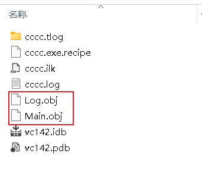**
