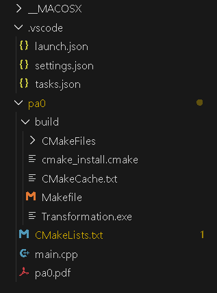

# c++编译流程

1.

cmake-->makefile文件-->Transformation.exe(机器语言)

2.tasks.json和launch.json的作用是vscode自动化cmake生成makefile文件,makefile文件再生成机器文件

tasks.json需要配置的参数是：

1.第一个{}不管，复制两个到下面

2.第二个{}

1）写"label": "cmake生成Makefile",，说明这个操作的名字，

"command": "cmake.exe",cmake.exe是Cmake工具的可执行文件

2）写

"args": [

                "-B",//指定makefile的存放目录

                "build",//makefile的存放目录

                "-G",//指定生成器，指定构建系统的类型，这里是makefiles类型

                "MinGW Makefiles"//表示使用 MinGW Makefiles 作为构建系统生成器

            ],:这部分指定的是cmake.exe命令的参数

综合起来，这个配置的作用是告诉 **cmake.exe**：

- 使用 MinGW Makefiles 作为构建系统生成器。
- 将生成的构建系统文件保存到名为 "build" 的目录中。

3.第三个{}

"dependsOn":["cmake生成Makefile"],

表示这个任务依赖于label为 "cmake生成Makefile" 的任务的文件，只有"cmake生成Makefile" 的任务正确执行了，这个任务才会执行，表现出了先cmake生成makefile文件，makefile文件再生成为机器语言的严谨性

 "label": "Makefile生成可执行文件",任务名称

"command": "mingw32-make.exe", **mingw32-make.exe** 是 Make 工具的可执行文件，用于执行 Makefile 中定义的构建规则。

"args": [

            "-C",//表示切换到指定目录进行构建

            "build"//是指定的构建目录

            ],

综合起来，这个配置的作用是在执行构建任务时，先切换到指定的 "build" 目录，然后使用 `mingw32-make.exe` 执行该目录中的 Makefile 进行实际的编译和链接。
