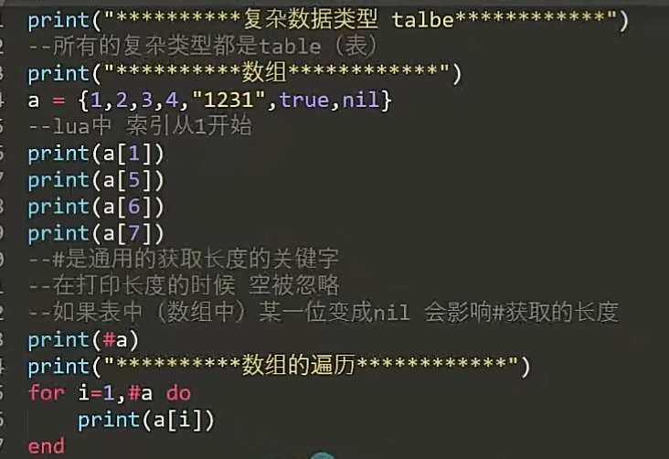

# 15.table表实现数组




```
-- 创建一个表
local t = {1, 2, 3}
-- 插入元素
table.insert(t, 2, 10)  -- t 变为 {1, 10, 2, 3}
-- 删除元素
table.remove(t, 2)      -- t 变为 {1, 2, 3}
-- 连接元素
local str = table.concat(t, ", ")  -- str = "1, 2, 3"
-- 排序元素
table.sort(t)  -- t 变为 {1, 2, 3}
-- 解包元素
local a, b, c = table.unpack(t)  -- a = 1, b = 2, c = 3
-- 移动元素
local src = {1, 2, 3, 4, 5}
local dest = {}
table.move(src, 2, 4, 1, dest)  -- dest 变为 {2, 3, 4}
-- 清空表
table.clear(t)  -- t 变为空表
```
