# 3.AB包资源打包

第一个下载方法：高版本不适用

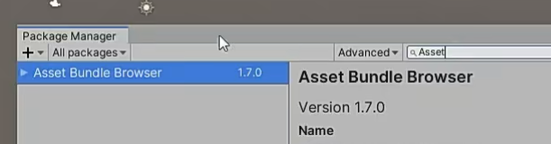

第二个下载方法：直接在github上下载代码拖进来

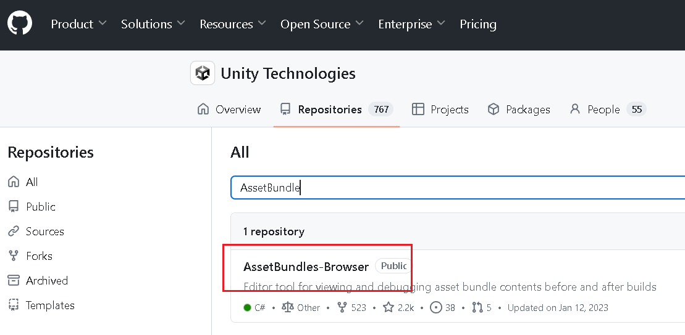

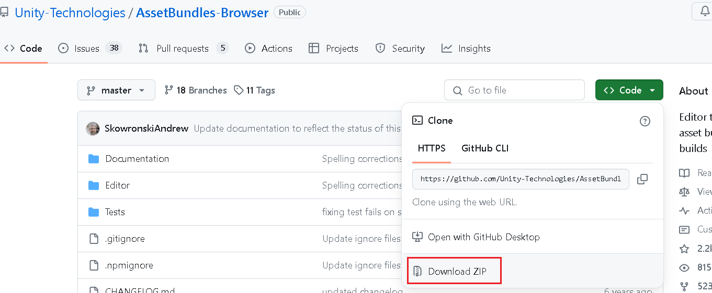

第三个方法：通过github url进行在线下载（注意：必须开全局梯子，不然可能因网络问题失败）

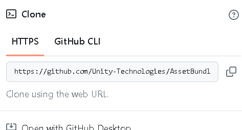

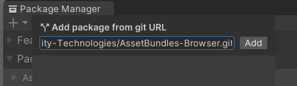

1.如何把资源关联到AB包里？

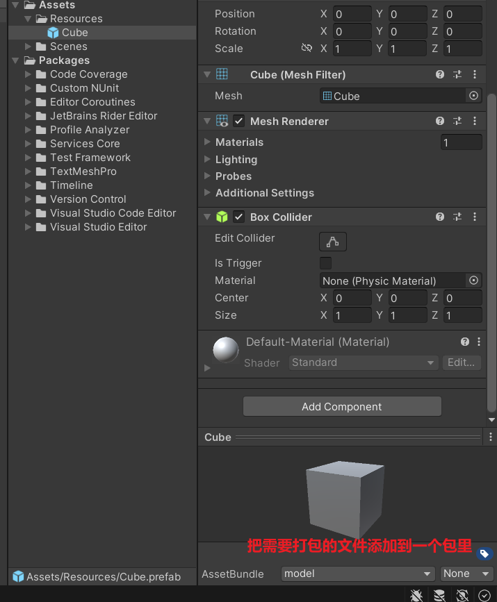

打开AssetBundles就会看到一个模型的AB包

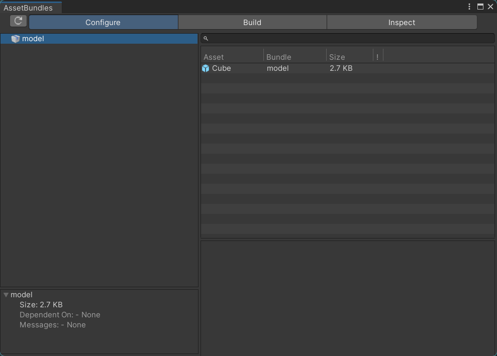

注意：U3D里C#代码不能被打进AB包中，所以才需要Lua语言

C#是一个编译型语言，所以不能被打包

预设体本质上就是文件包，关联了哪些脚本其实就是关联的文件ID

不是把脚本打成了AB包，而是把关联的数据打成了AB包

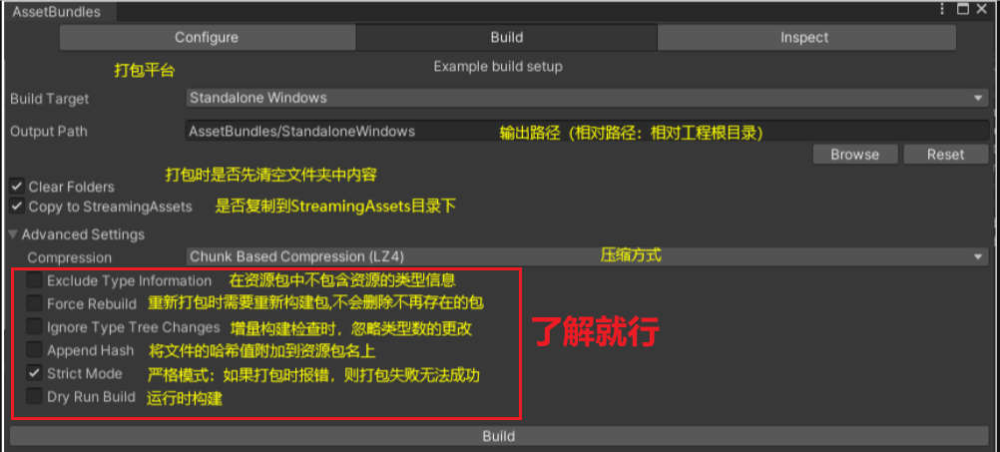

AB包打包，每次打包都是指定一个平台进行打包，不同平台需要重新打包

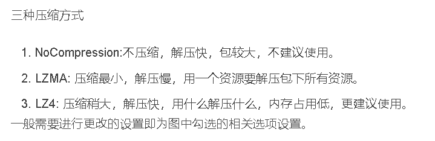

打包后的位置

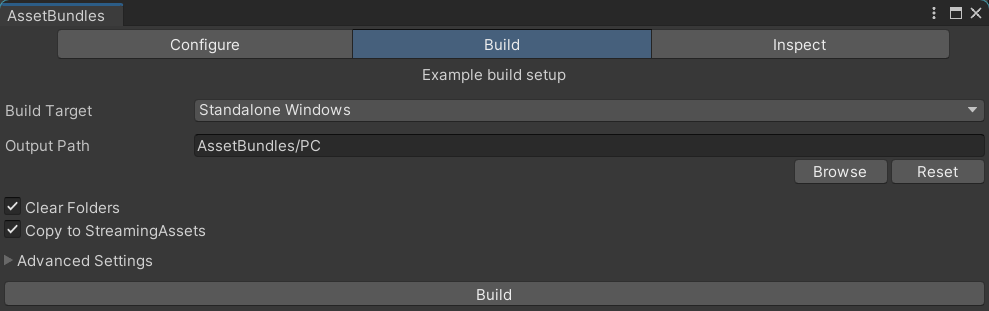

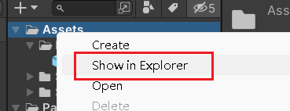

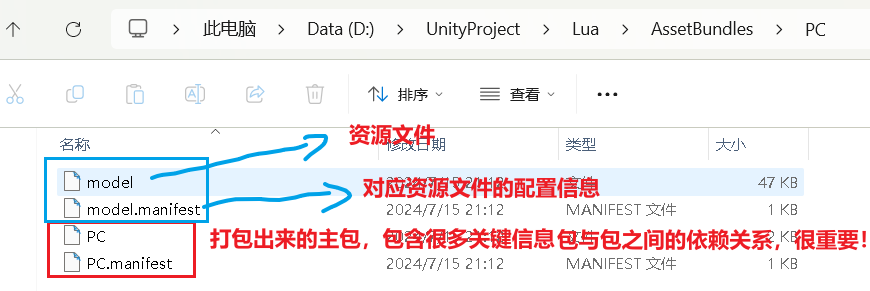
