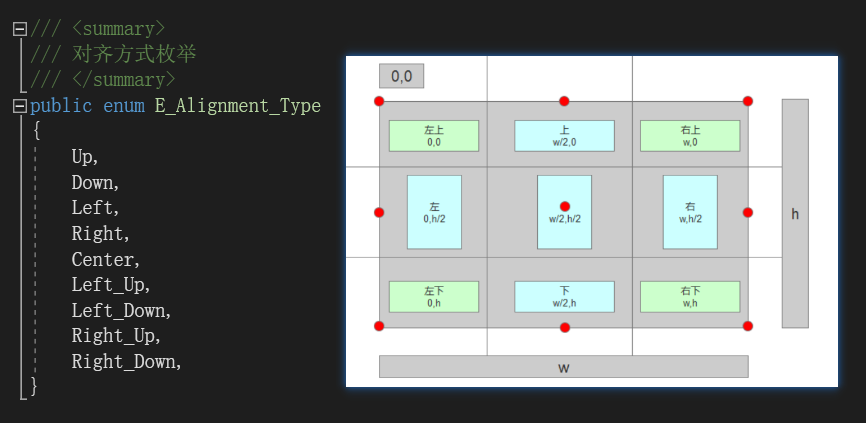
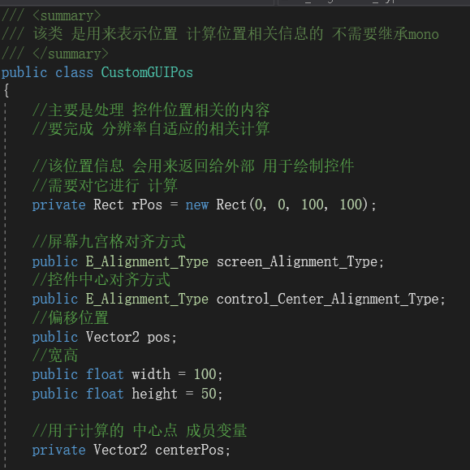
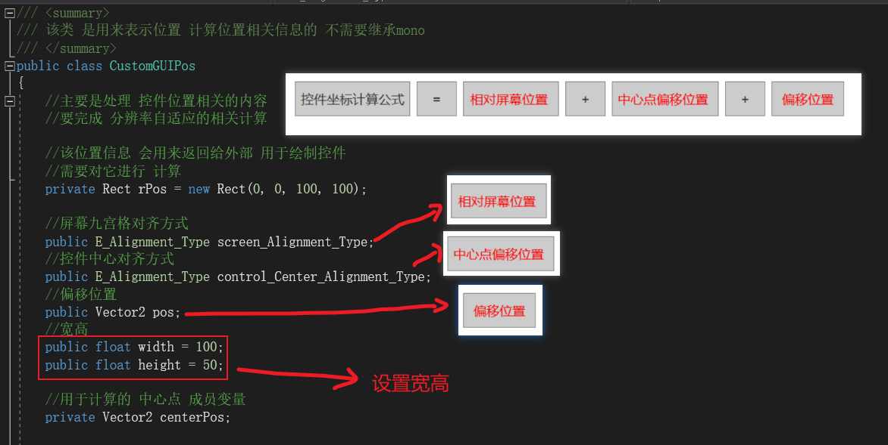
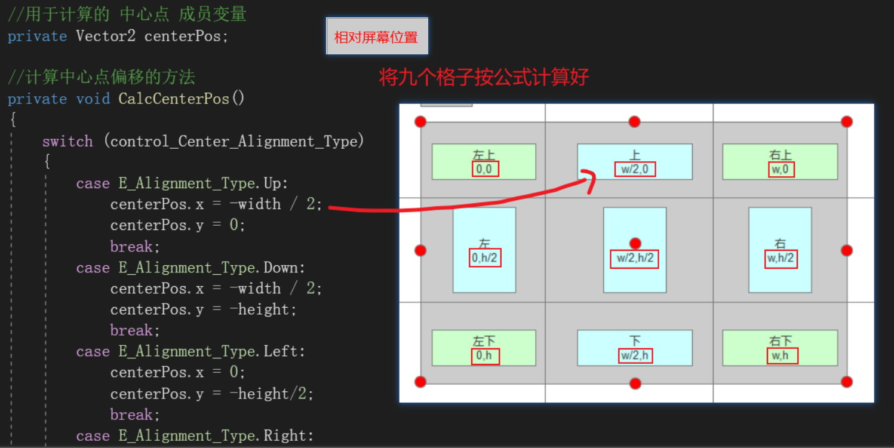
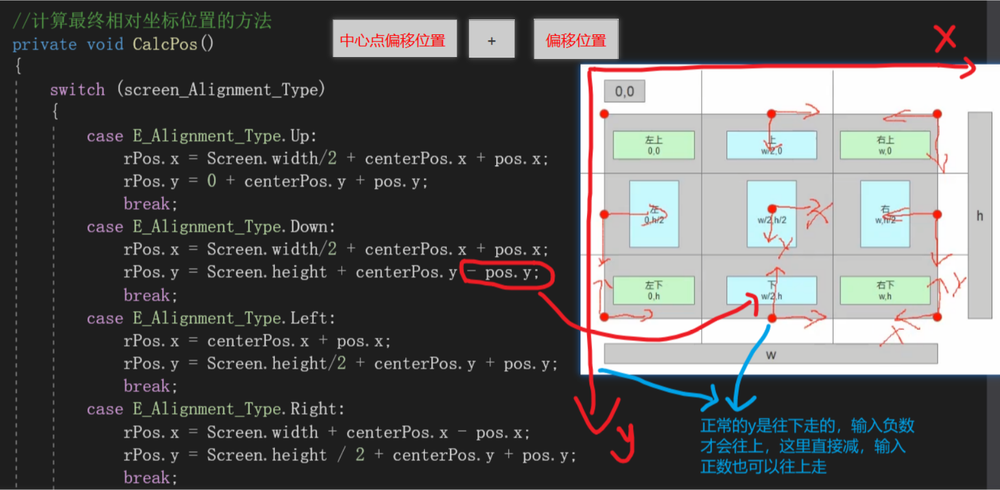
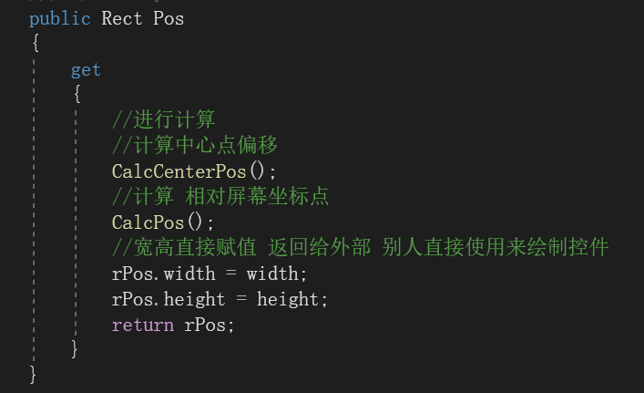
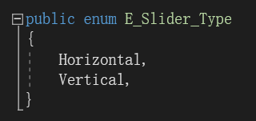

# 实践小项目控件位置信息类

这是一个成员属性，返回的是一个rPos坐标

必须先调用中心点偏移的函数，再调用相对屏幕坐标点

步骤：

1.定义九宫格枚举 eg：一个锤子，两个人分别拿过去锤不同的东西

2.定义一个初始的位置

3.定义偏移量，控件宽高，控件中心点

3.定义屏幕九宫格（包含最终位置）和控件九宫格

4.控件偏移方法+屏幕九宫格偏移方法

5.定义一个类的属性，每次其他类调用这个类的时候会自动执行里面的方法

{

1.校准屏幕和控件位置

2.加宽高

}

【九宫格控件+屏幕九宫格最终位置（屏幕九宫格相对位置+控件九宫格位置+偏移量）】
