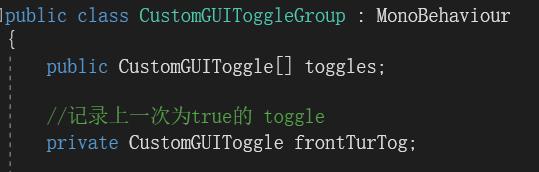
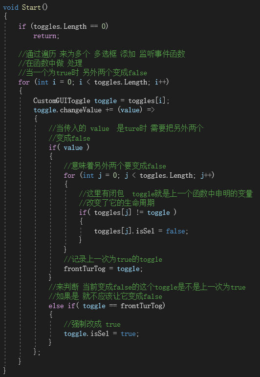
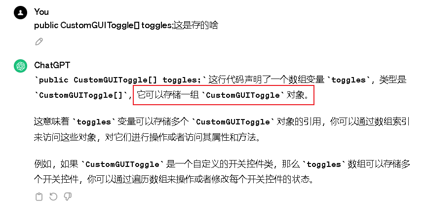
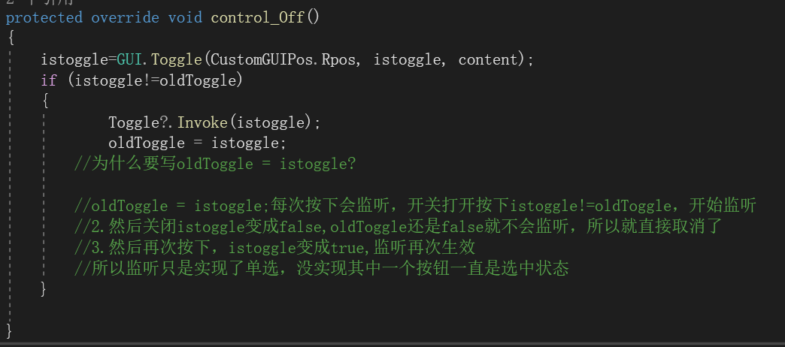
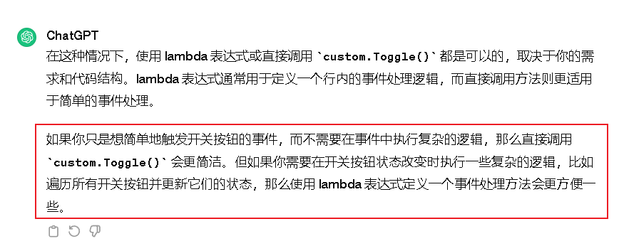
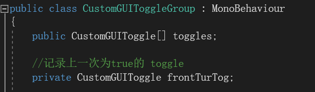
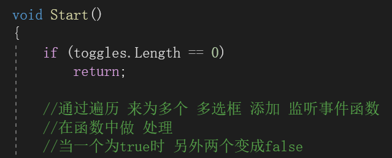
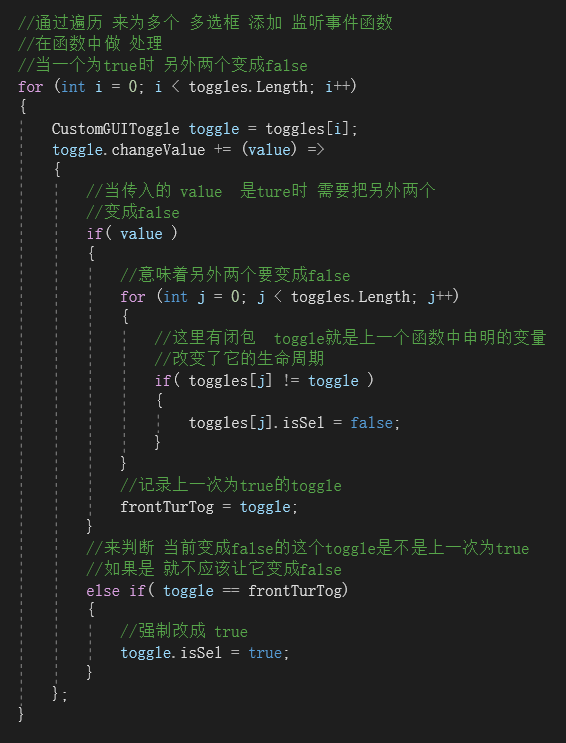

# 实践小项目自定义单选框控件

因为不在同一个OnGUI里，所以不能用if()+int一个变量进行选择

现在的Toggle是多个对象，在多个脚本里面

所以重新写一个脚本用来管理Toggle,单选框脚本管理者来管理同一分组的Toggle，实现我选中其他不能选中的情况

通过父对象来管理

---

---

---

---

---

---

---

---

为什么这里的监听要用lamda表达式？

---

全部代码：

---
