# 实践小项目自定义图片绘制和面板功能

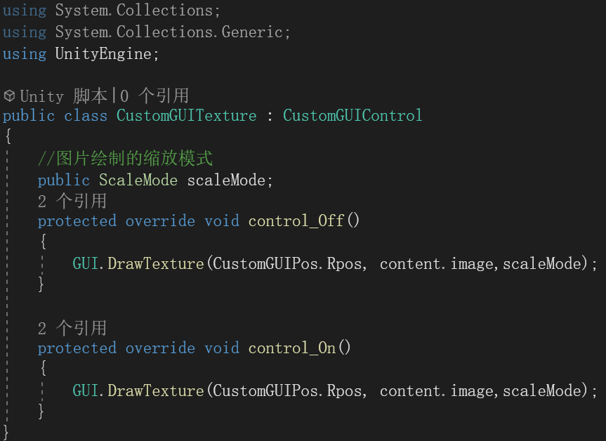

---

---

为什么On和Off里面写的是一样的？

因为图片不用设置样式，但是又不能空着

---

---

1.先用按钮把样式画好

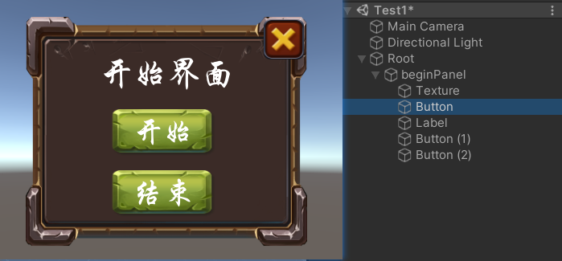

2.在下面创建一个beginPanel的物体，所有要操作的对象都挂载到beginPanel下面用来统一操作

，把需要操作的对象改名

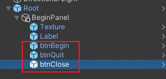

在beginPanel声明三个按钮

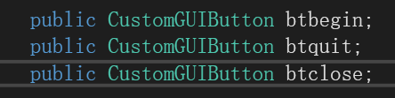

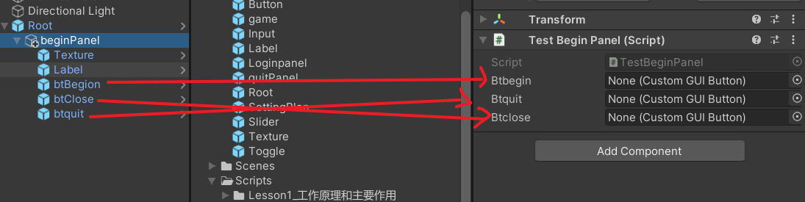

3.调用监听实现方法

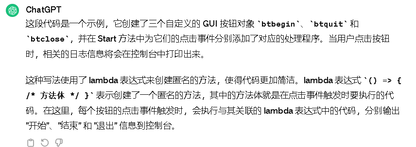

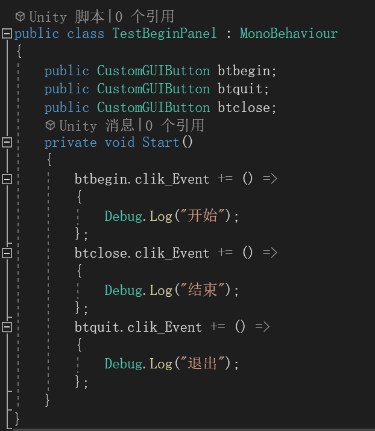

---

---

如何导出所有预设体和脚本？

1.脚本和预设体各有一个统一的文件夹包裹

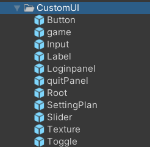

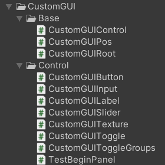

2.同时选中，右键导出包

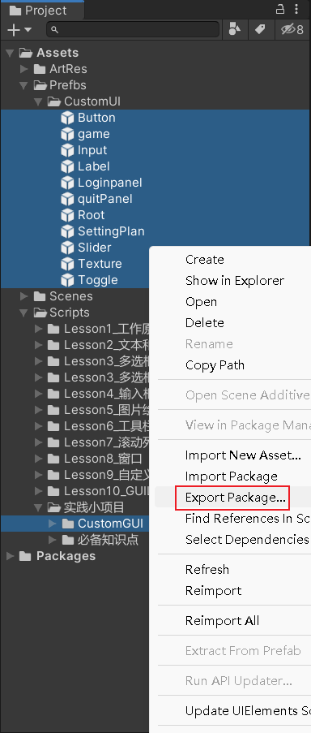

3.只保留需要的代码和预设体

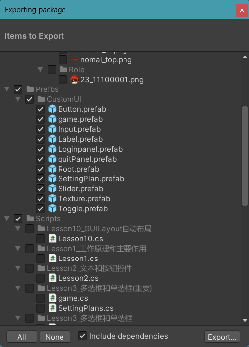

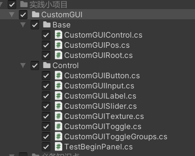

4.导出即可

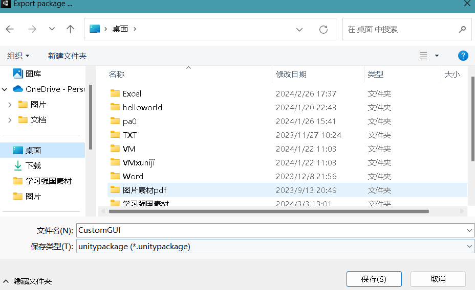

---

---

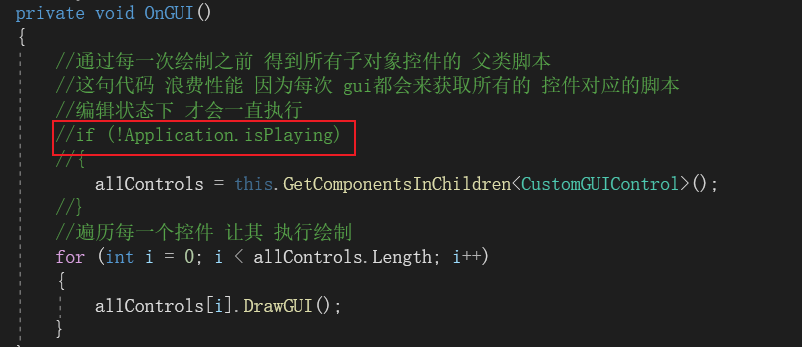

为什么要把这个if注释？

答：因为这个只会运行一次把所有的子对象存起来，但是接下来的子对象失活，root就不知道了。

删掉就是实时的获取子对象
