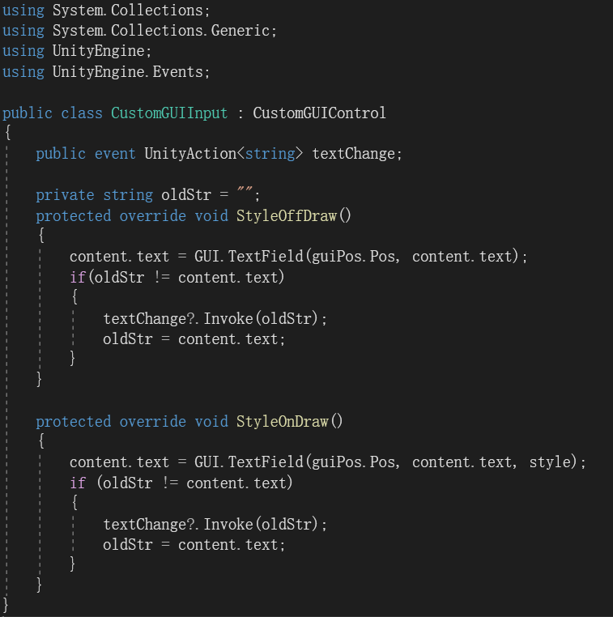
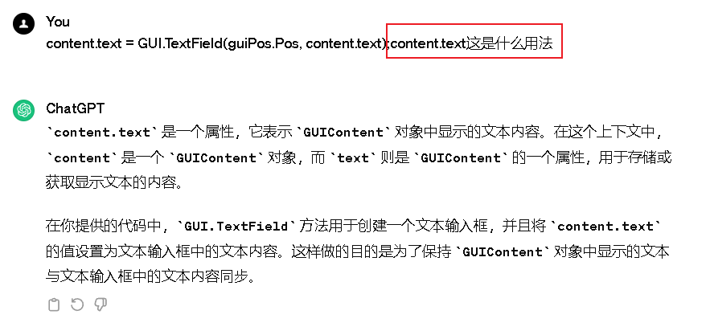
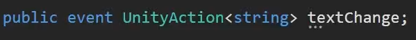
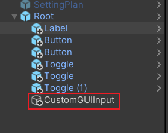
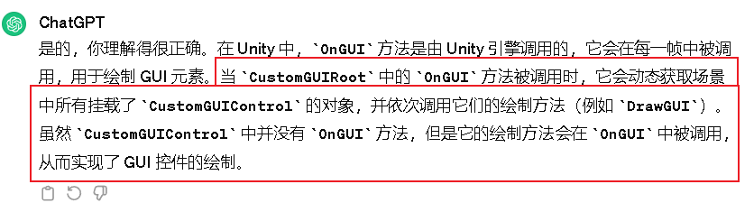
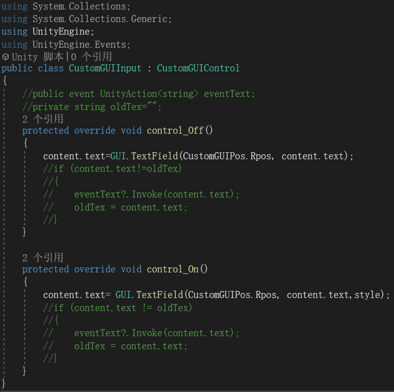
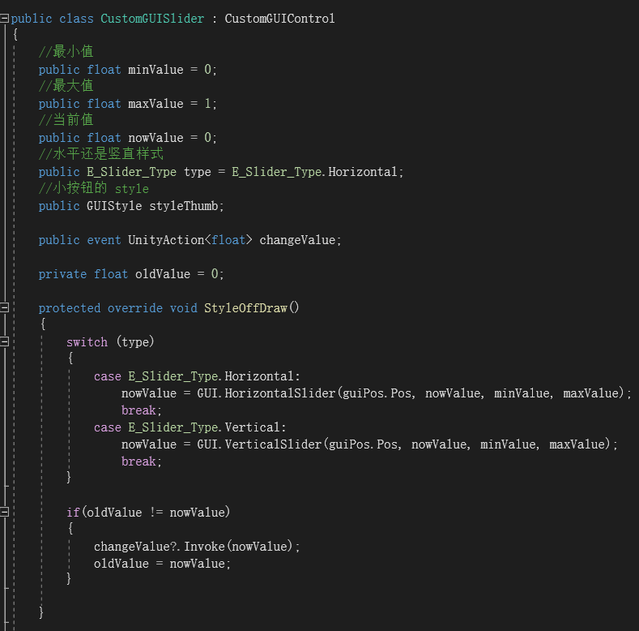
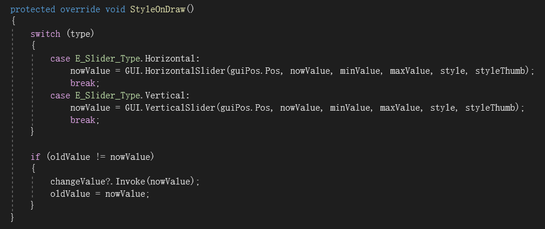

# 实践小项目自定义输入框和拖动条控件

---

---

---

---

如何让外面用这个输入框？

1.外面通过content.text得到输入框的内容，因为content.txt是string类型，所以直接可以得到

2.为输入框添加一个事件，当输入框变化时，会响应这个事件

---

---

为什么一定要放在Root子对象下？

因为Root动态获取挂载了CustomGUIControl的对象，当执行到CustomGUIInput时，它的监听会调用CustomGUIControl，但是CustomGUIControl里没有ONGUI函数，是通过Root的ONGUI去调用CustomGUIControl的绘制函数才实现的

---

---

如果不用监听可以吗？

可以的

---

---

---

---

为什么有两个style?

因为前一个控制的是整体样式，后一个是控制的按钮图标样式
