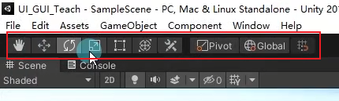
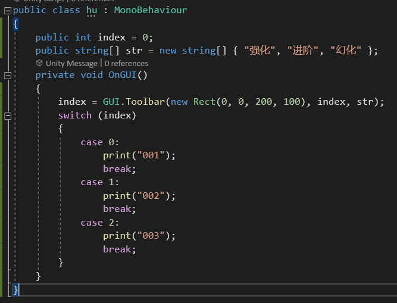
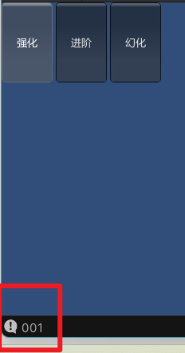
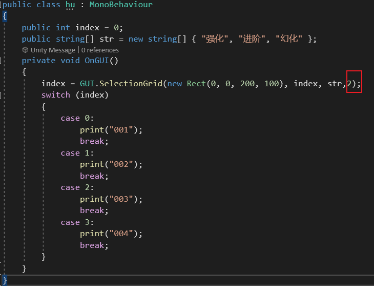
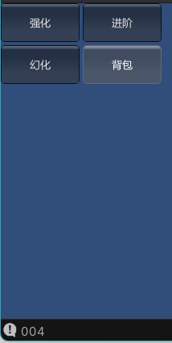
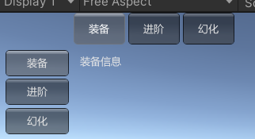

# 工具栏和选择网格 知识点

都属于工具栏，选中一个其他的就不能选中了

Switch用来返回 按下不同按钮的操作

知识点一：ToolBar

知识点二：

SelectionGrid

ToolBar和SelectionGrid唯一的区别加速Selectiongrid可以控制一行显示多少个按钮

%!(EXTRA markdown.ResourceType=, string=, string=)

