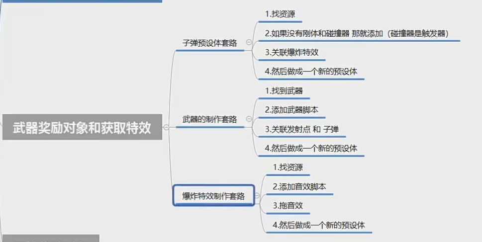
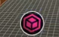
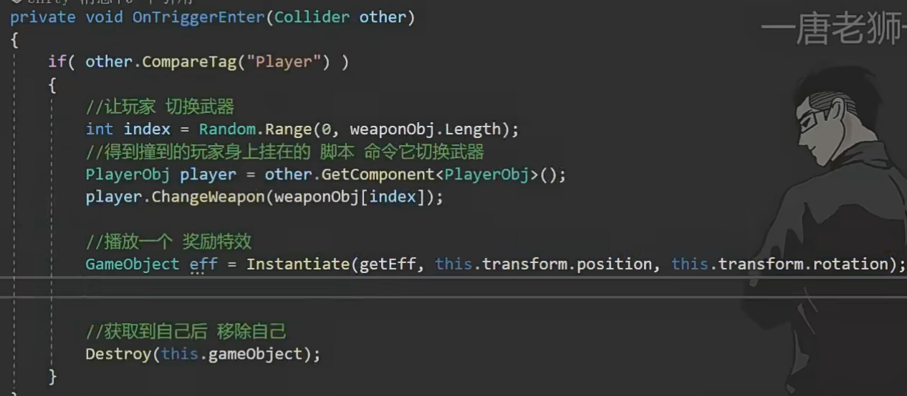
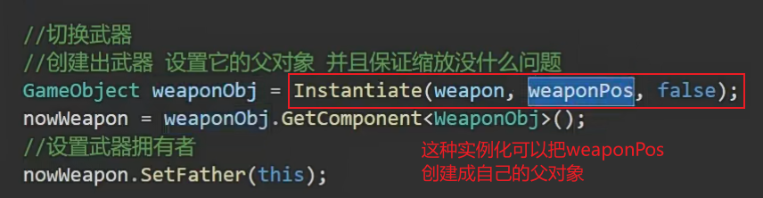
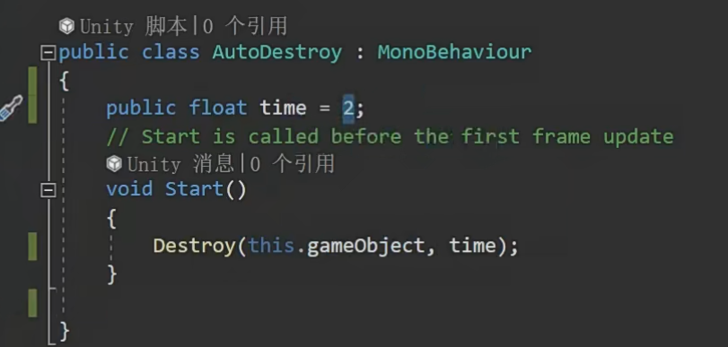

# 实践小项目武器奖励对象和获取特效

获取武器，获取时有特效，会把玩家对象传递给子弹，自动移除子弹和特效

如何获取武器？

1.设置多个武器预设体

2.设置一个预设体图标，碰到就会触发

3.新建一个奖励文件夹，武器奖励脚本，碰到就奖励武器

标签是player才能触发奖励

****玩家：****

********

**4.自动移除的脚本，用来移除爆炸特效**

****

**5.获取特效**
