# 碰撞检测之刚体

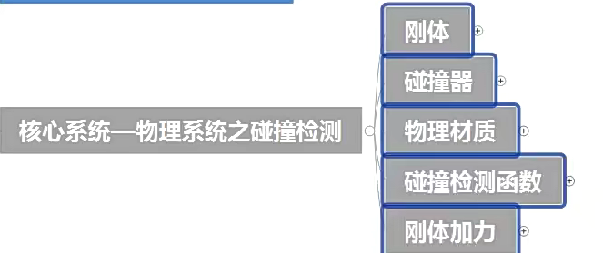

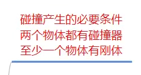

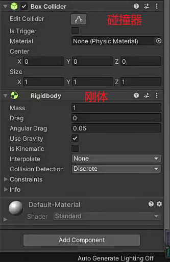

刚体=让一个物体模拟力的效果，产生力的作用

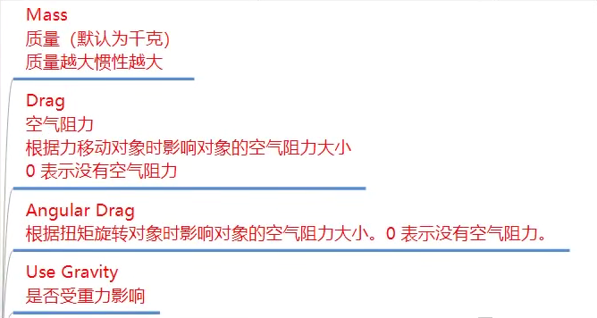

质量越大，越不容易被别的力推动

空气阻力就是下降的地心引力，是影响下降的阻力

扭矩阻力是影响物体旋转的阻力

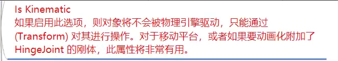

开启之后相当于刚体失效

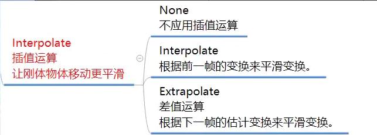

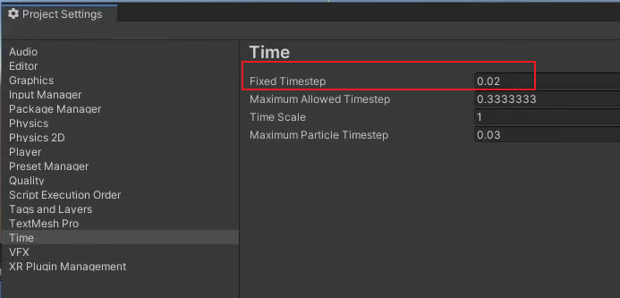

物理帧的更新对刚体影响很大，解决物理帧更新太长造成的卡顿

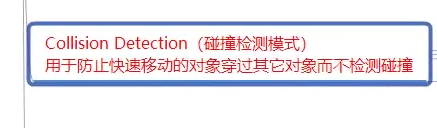

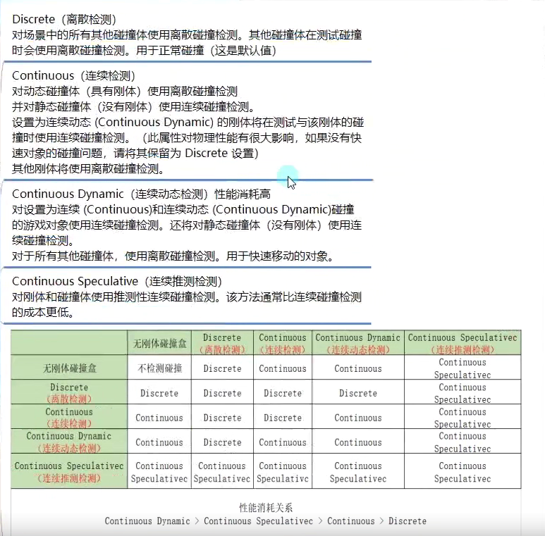

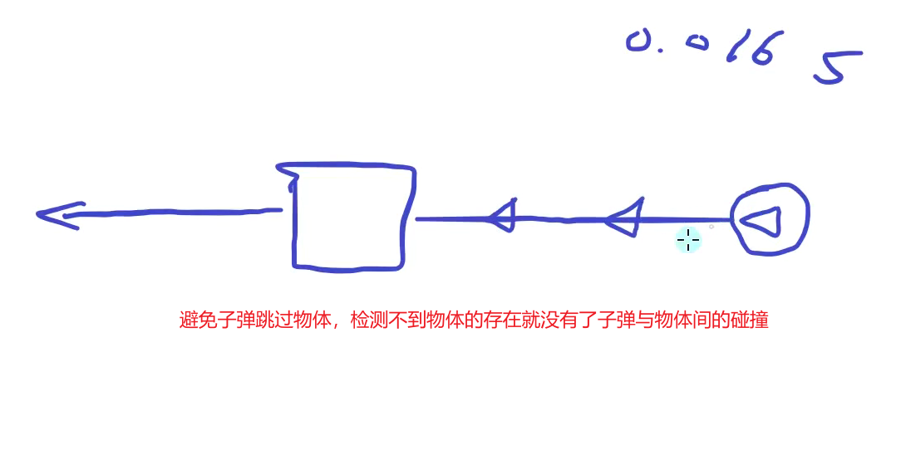

性能消耗越大，检测越准确，只要看两个物体检测与检测间的搭配就好了

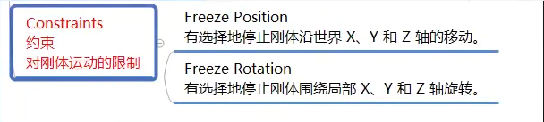

限制某一个对象在一个轴上面的位移或者旋转，eg:玩家碰到一个物体不至于弹飞
