# 碰撞检测之碰撞器

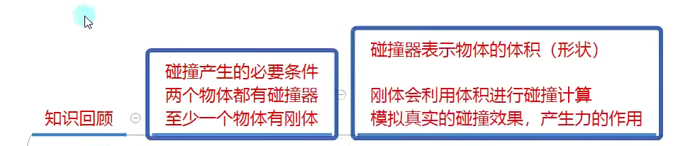

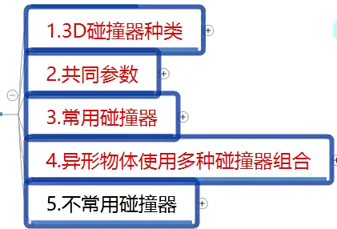

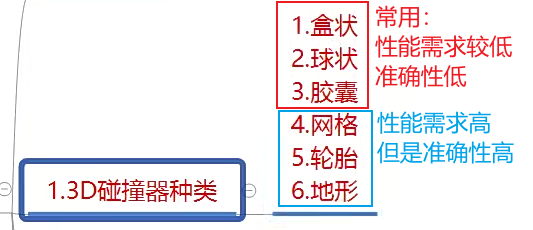

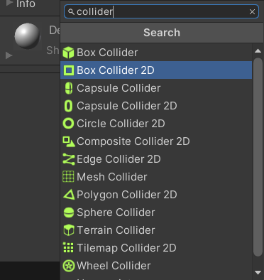

后面没有加2D的就是将要学习的6种碰撞器

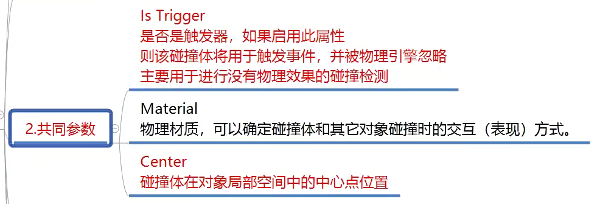

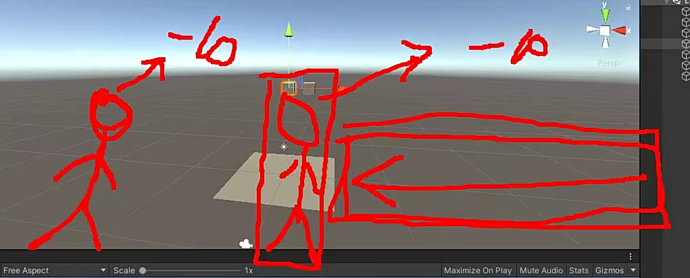

Is Trigger=有物理规则但是不会有碰撞，打到人身上不会停下来，会穿过去，但是会触发扣血事件

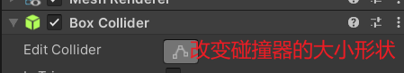

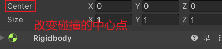

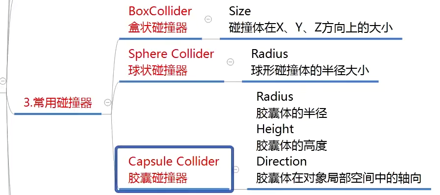

都是改变碰撞器形状的

只要给父对象加一个刚体，所有的子对象都会有刚体效果

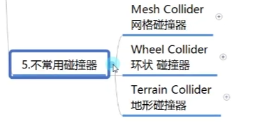

网格碰撞器：

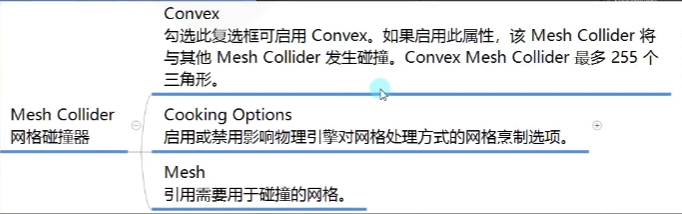

网格碰撞每一个面都会计算物理碰撞，所以性能消耗是较高的，如果要加刚体，贼必须将Convex勾选上

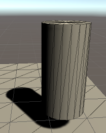

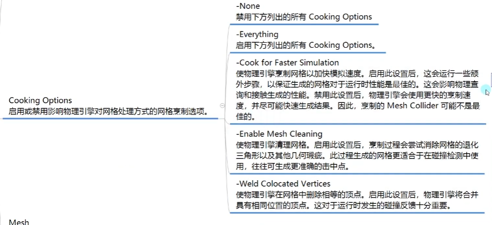

环状碰撞器：

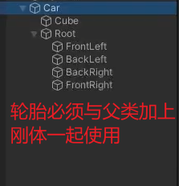

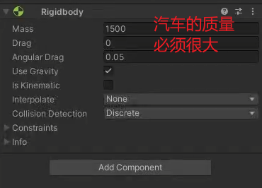

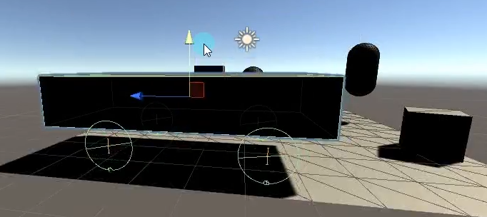
