# MathF

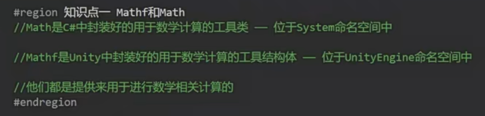

Math是静态类，Mathf是结构体，两个都是静态，所以基本上看到静态的内容就是工具类的常量和方法

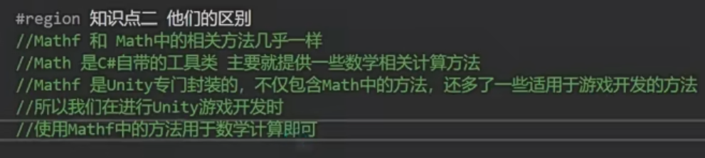

Math中的数学方法基本上Mathf里都有，除此以外还有专门为游戏开发所有的数学方法

一般用Mathf开发就可以了

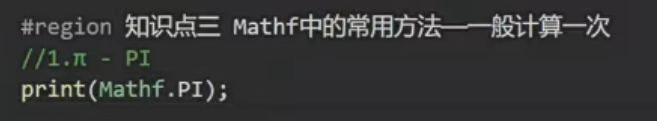

PI已经在里面写好了直接用就可以:3.14159274

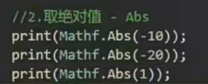

输出：10,20,1

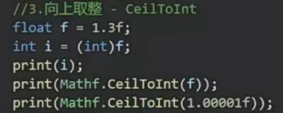

输出：1,2,2

因为c#强转默认是向下取整，而向上取整比如1.00001f，只要比1大一点点都会取2

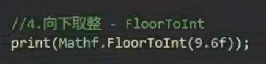

除了强转，也可以用这个方法向下取整，但是不是根据四舍五入转的，9.6也是转成9

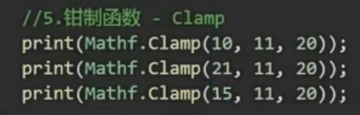

输出：11,20,15

(取值,最小,最大)，取值只能在最小和最大中间取，超过范围，取最大值和最小值其中一个

---

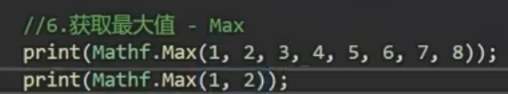

输出最大值，8,2

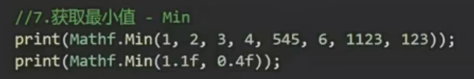

输出最小值，1,0.4

且最大值和最小值可以整数和小数混搭

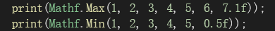

---

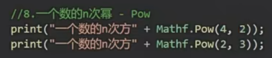

输出，16,8

（底数，幂），4的2次方

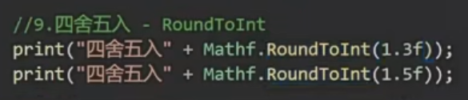

输出：1，2

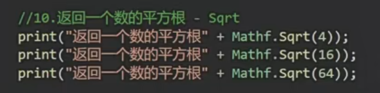

输出：2,16,64

就是开根号

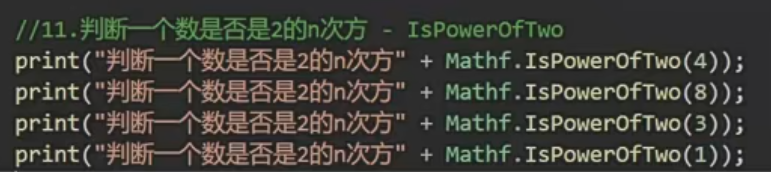

输出：true,true,false,true

只要是2的n次方就输出true

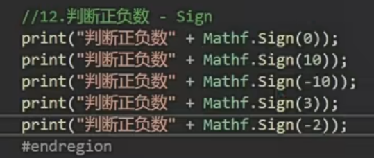

输出：1,1，-1,1，-1

正数输出1，负数输出-1

---

线性插值：

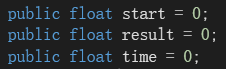

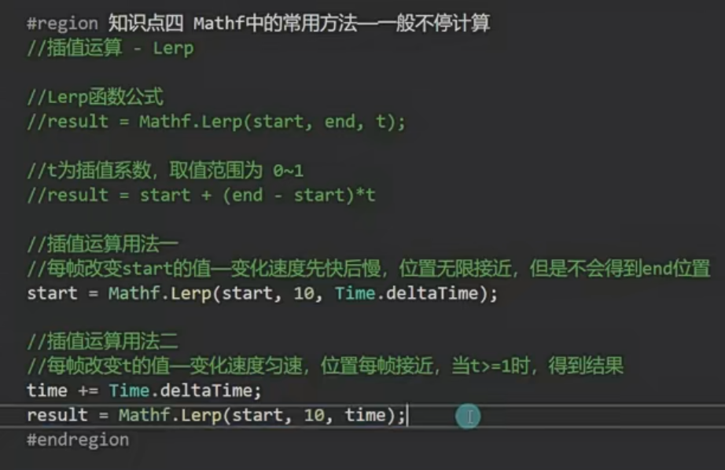

用法一：先快后慢，无限接近end位置

用法二：匀速到达end位置，匀速直线运动必须每次运动清空，time,result,和start的值

用法：

1.某个对象跟随另一个对象移动的时候

2.某一个值要趋近于一个值的时候

用法一：无限接近目标值，先快后慢

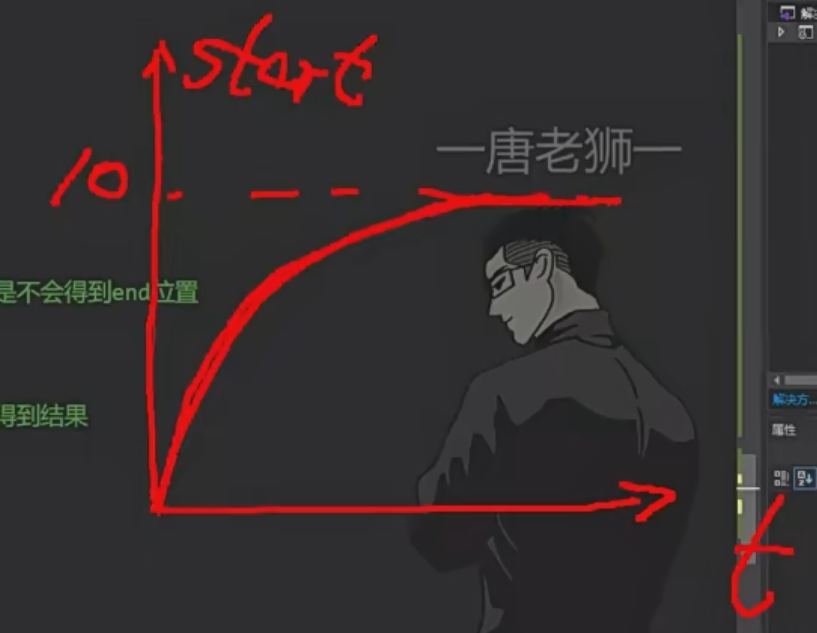

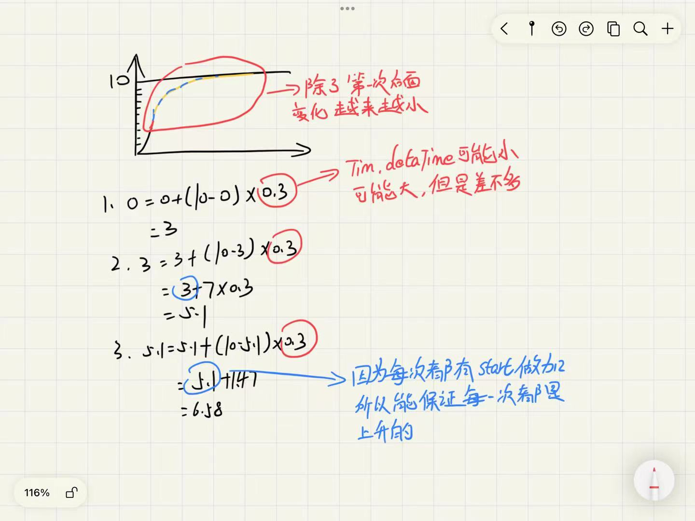

用法二：匀速到达目标值

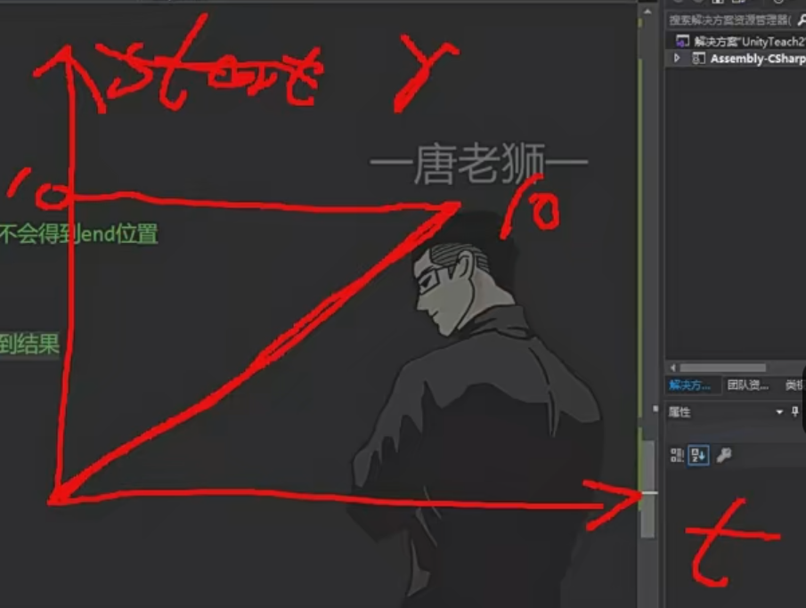

---

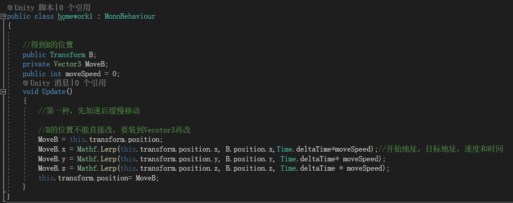

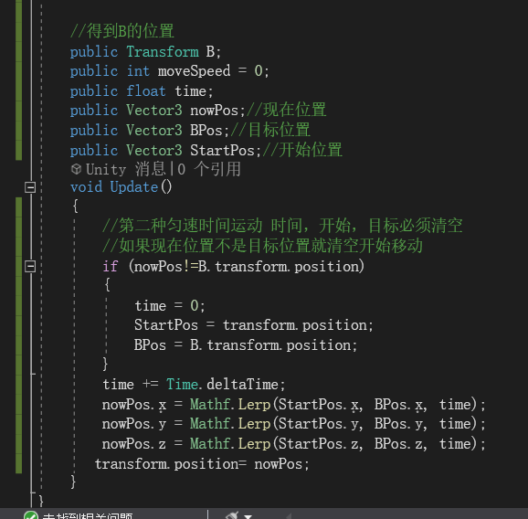
