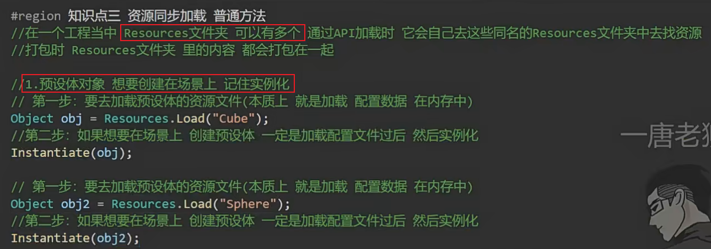
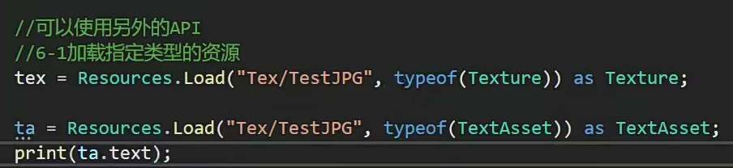

# Resources资源同步加载


```
在 Unity 中，Resources 文件夹中的资源是通过资源路径进行加载的。由于 Resources 文件夹中的资源类型是不确定的，因此在加载时返回的类型通常是 object。
Resources.Load 和 Resources.LoadAsync 方法都返回 object 类型，因为它们可以加载各种类型的资源，如纹理、音频、预制体等。在使用这些方法加载资源后，你需要将返回的 object 强制转换为你想要的实际类型，比如 Texture、AudioClip 或者 GameObject。
这种设计使得 Resources 文件夹非常灵活，因为你可以在其中存储各种类型的资源，并在运行时根据需要加载它们。但是需要注意的是，由于返回类型是 object，因此在强制类型转换时需要确保转换是安全的，否则可能会导致运行时错误。
```








如何解决每次要as一次？


一般都会使用泛型，Load高级版，基于上面的方法


如果同时加载多次会浪费资源吗？

不会，只存在性能浪费，不存在性能浪费


