# Resources资源异步加载

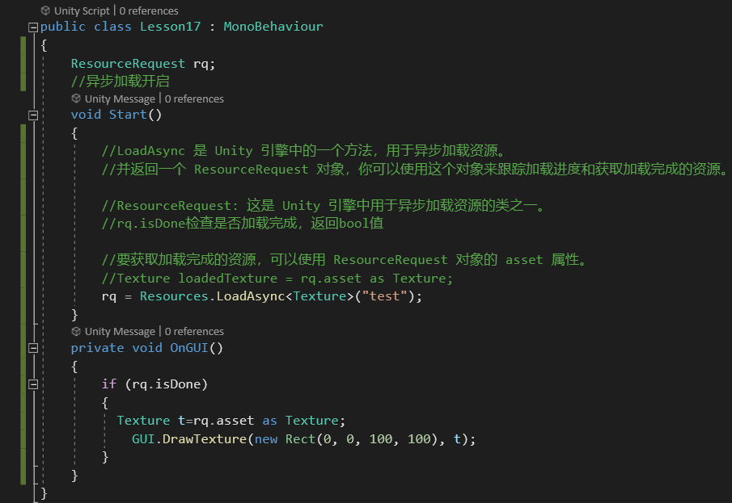

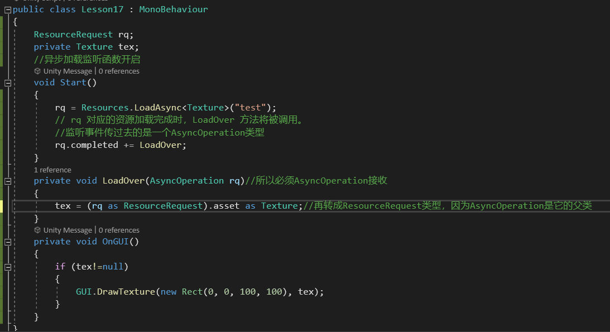

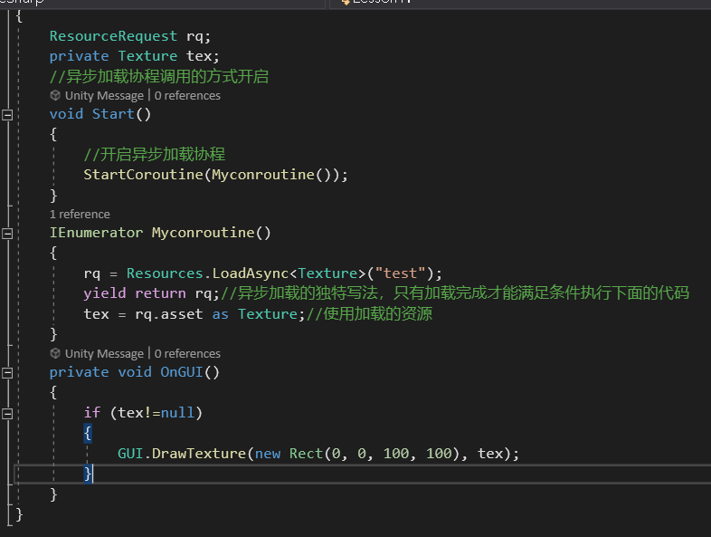

---

---

同步加载会将全部资源加载到内存中，如果文件过大，可能会造成每16.66ms加载不玩所有文件

这样就会造成卡顿

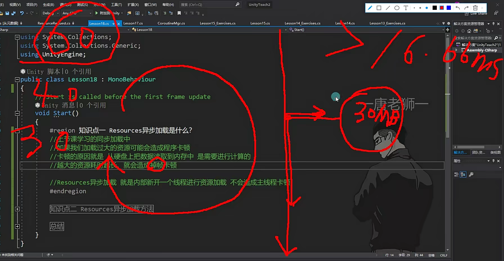

异步加载是新开一条线程然后用来加载资源，加载完了主线程再使用

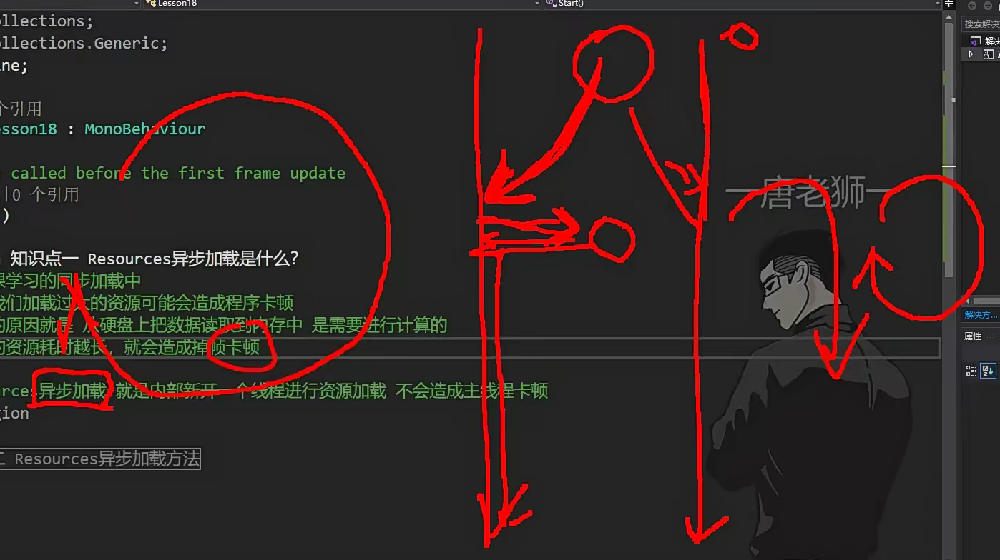

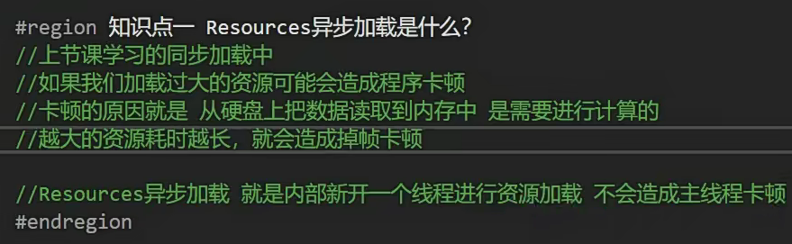

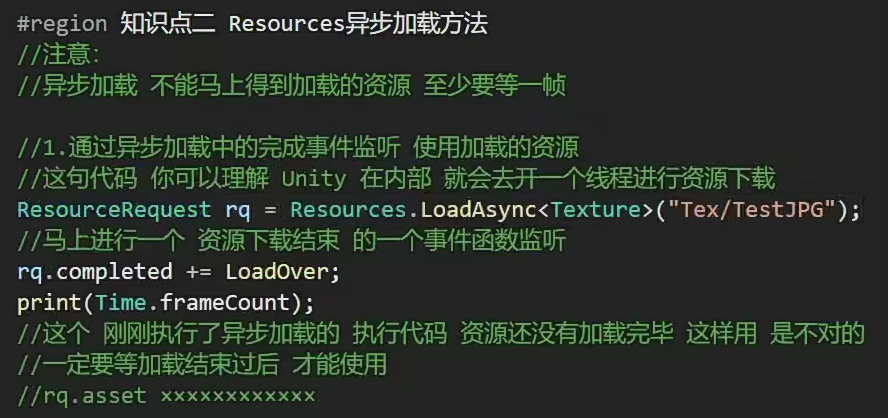

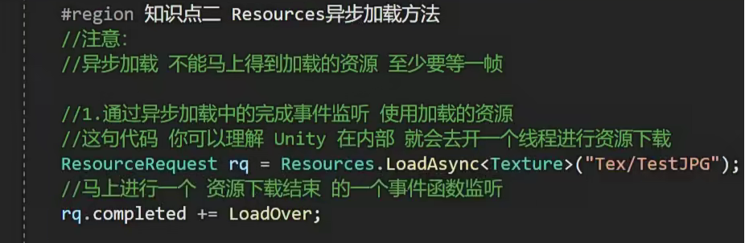

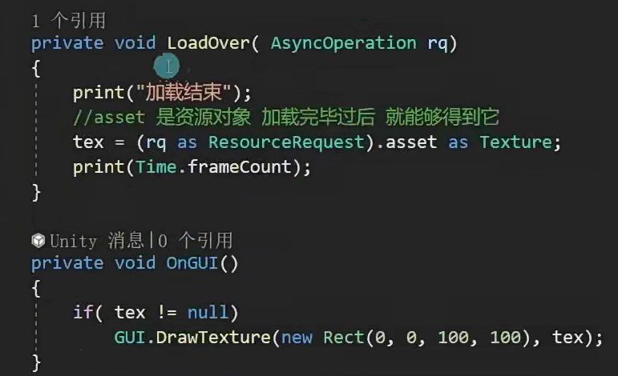

LoadAsync会新开一个线程进行资源处理

completed事件监听，监听资源加载结束

Load函数写具体的资源加载逻辑

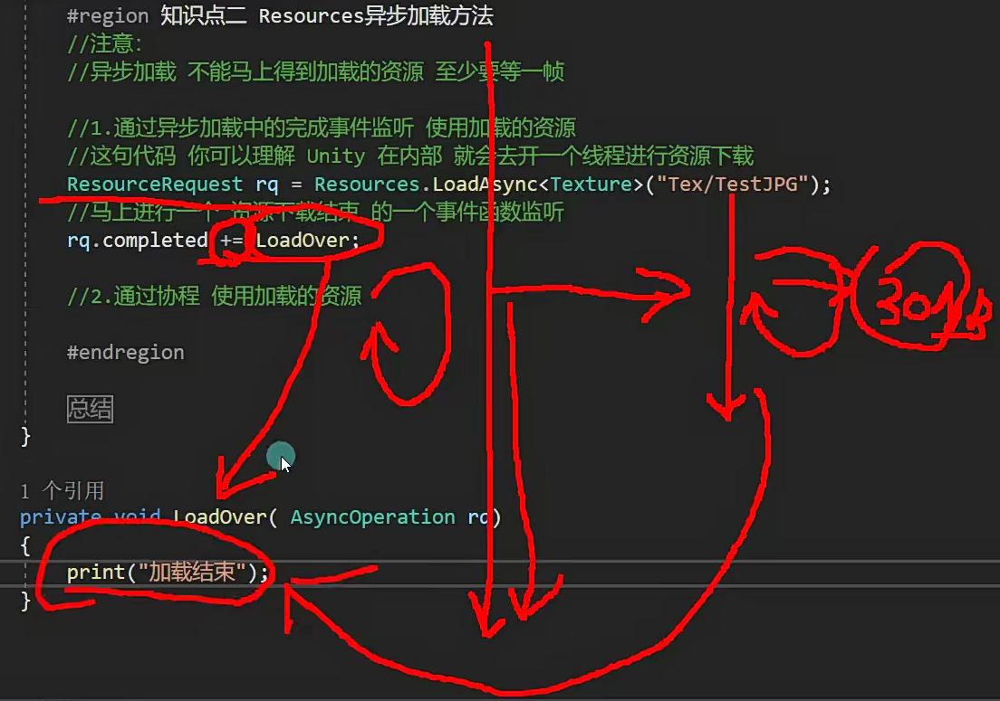

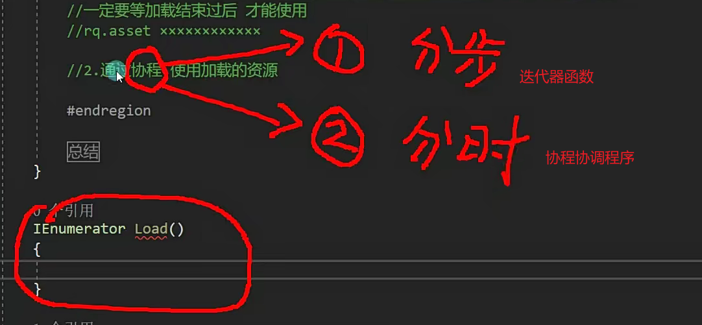

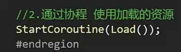

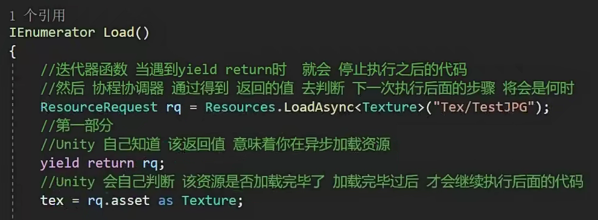

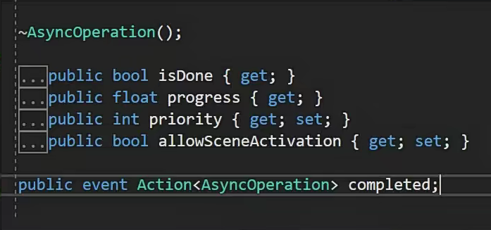

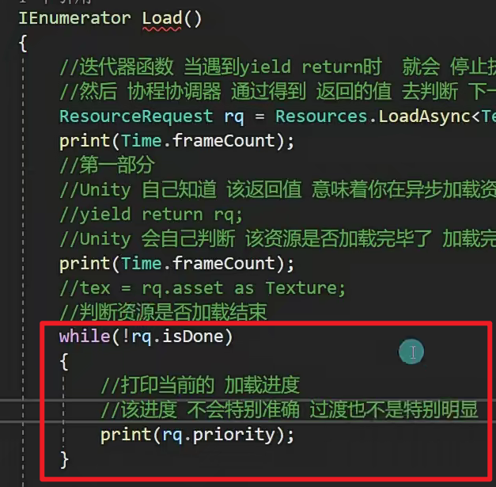

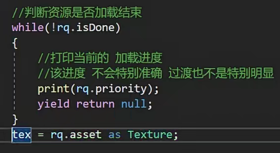

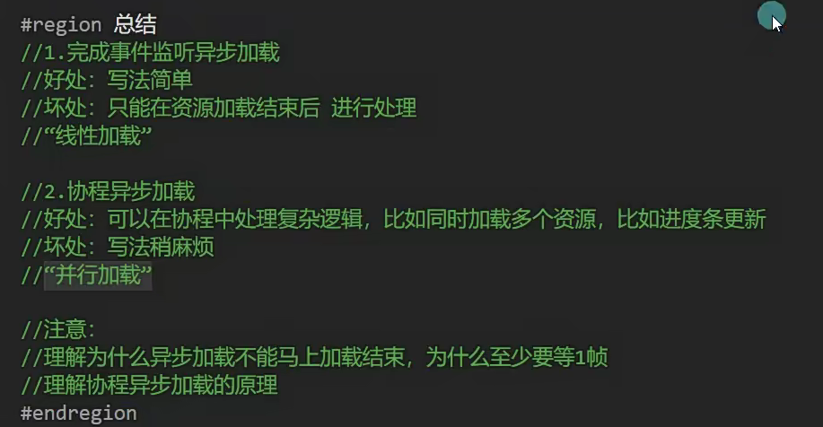

总结：

加载一个资源用监听函数加载函数

加载多个资源拼接，用协程加载函数

测试类：

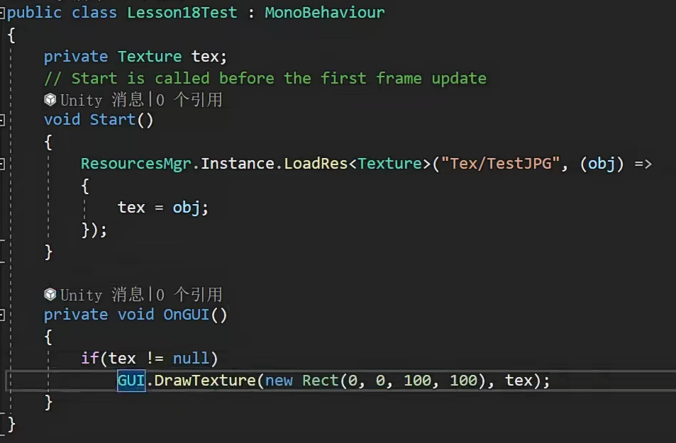

资源管理类：

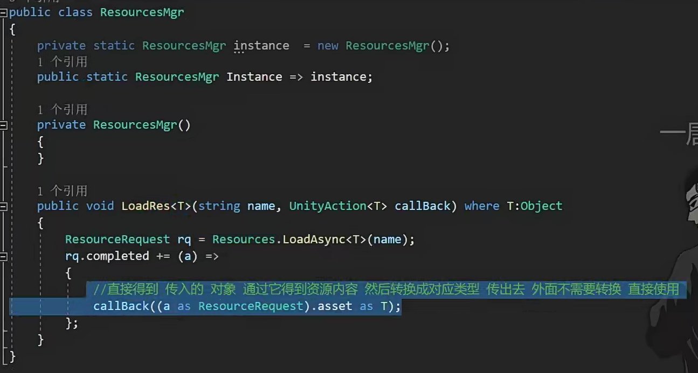

如果不封装是怎么样的？

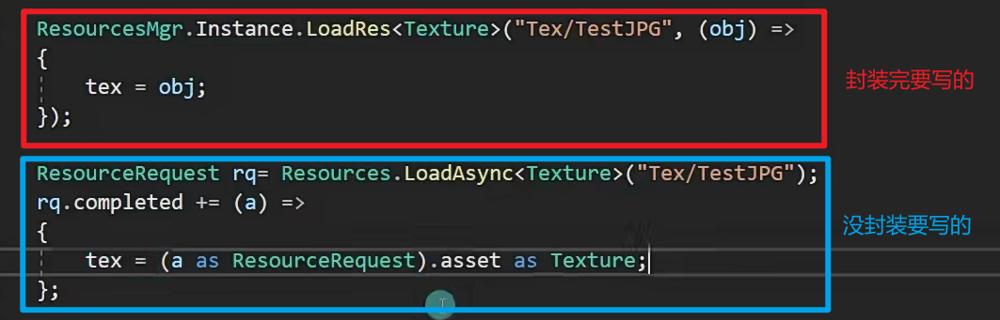

用协程的方法写：

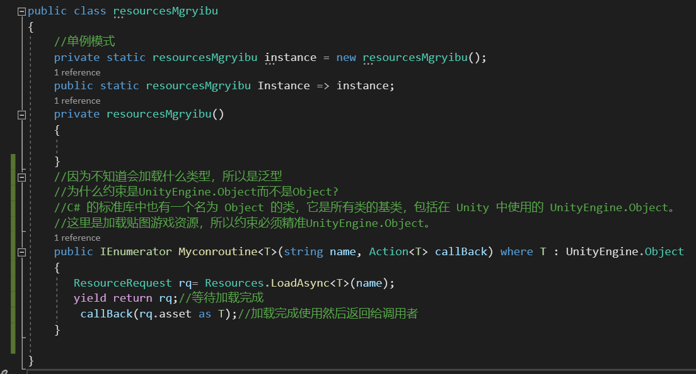

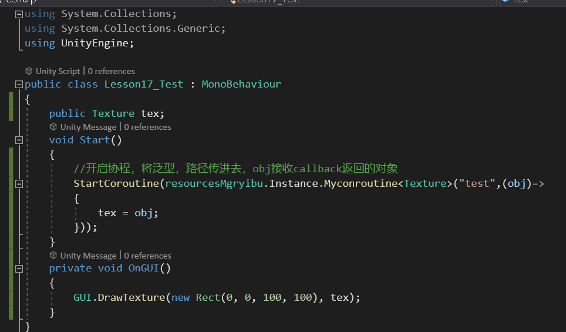

---

---

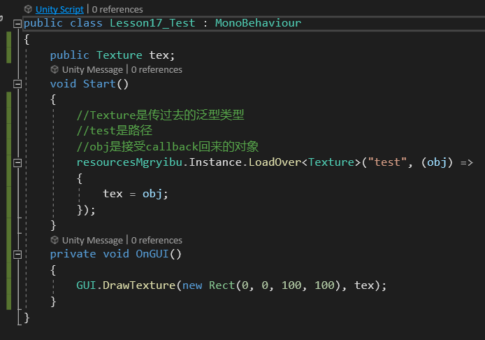

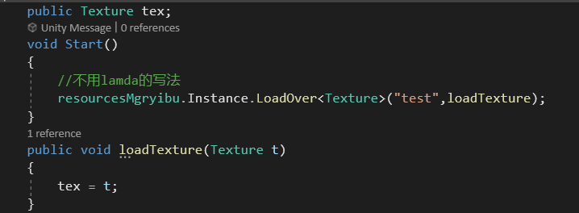
