# 协同程序1

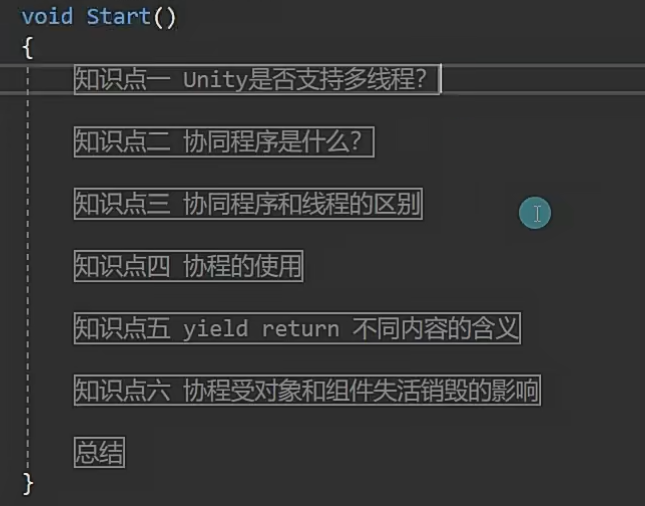

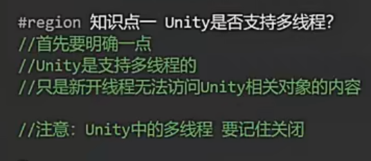

线程是什么？

是c#提供的一个类 Thread

因为是线程，所以unity编辑器关闭了也还是会继续执行

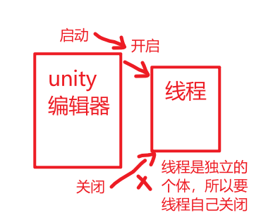

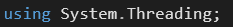

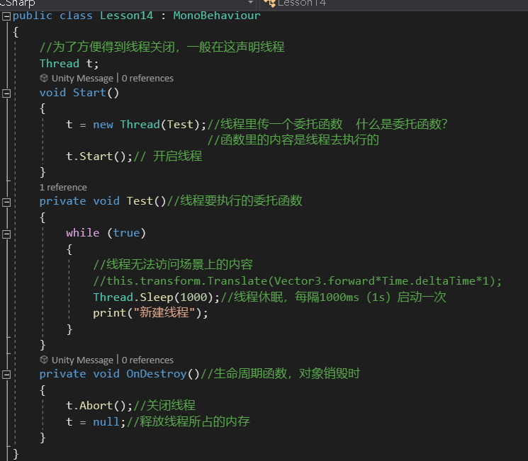

线程有啥意义？

可以把复杂逻辑的算法相关内容放在线程上计算

只管去计算，计算好了把结果放在一个公共的内存空间给unity使用

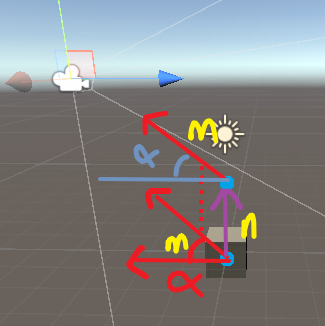

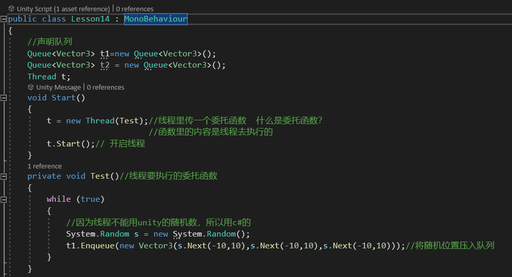

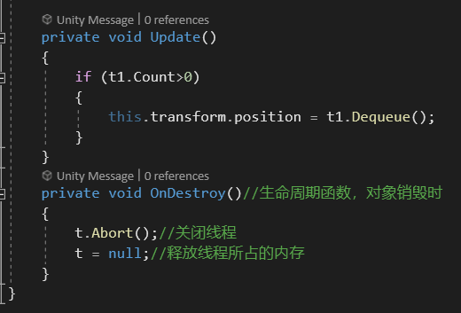

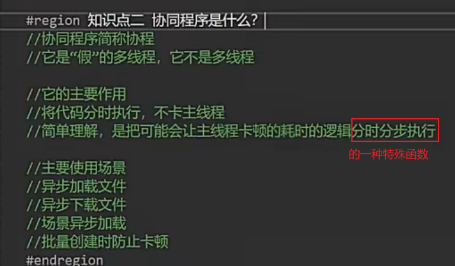

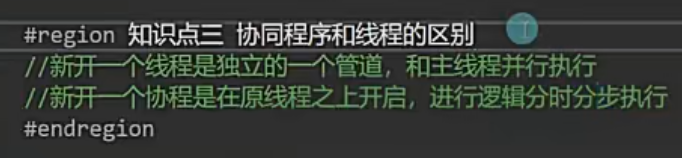

主线程就是一个死循环，协程就是其中的一个特殊函数，每次执行一点点返回一个值，只有当值满足

时才会继续执行，但是不会在这卡死，会处于挂起状态，等待主线程一遍一遍循环直到满足条件

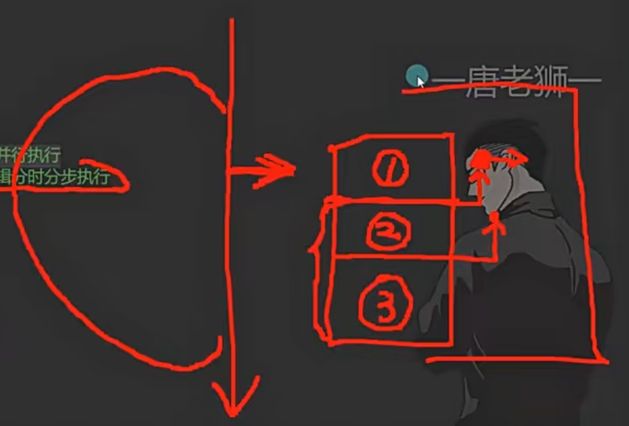
