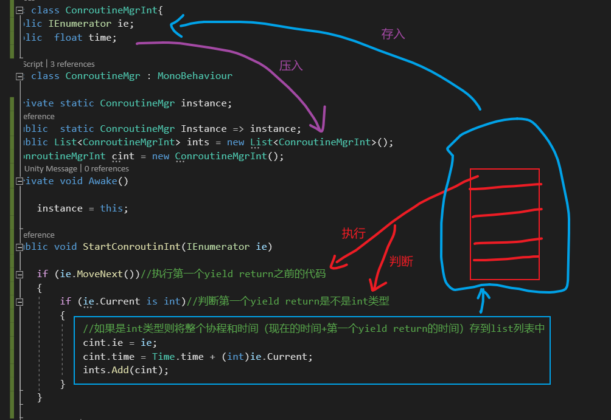

# 协同程序的原理

---

---

 

StartCoroutine( )开启协程得到的就是Ie，然后根据Unity自己的规则一步步执行ie，得到ie yield return返回的内容，判断返回的内容是什么，再做具体逻辑

因为MoveNext( )返回的是bool值，后面是否还有可执行的内容，如果有则返回true

将c#里的迭代器放入unity中使用，由unity的协程管理程序进行调度=unity使用c#的迭代器

分布是c#的迭代器实现的，分时是协程调度的逻辑

协程管理脚本：

因为需要有计时，所以必须继承MonoBehaviour

基础MonoBehaviour单例模式一定是在Awake进行初始化

开启入口和调用：

声明容器和存储类：

协程刚开始的逻辑:

协程后续逻辑：

全部代码：

为什么要从后往前遍历？

如果是正着遍历，可能会漏掉，因为删掉一个，list所有元素会往前靠

从尾部遍历就不会因为元素索引的移位而漏掉元素

为什么后往前遍历执行顺序不变？

在 Unity 中，协程的执行顺序由它们在代码中的定义顺序决定，而不是由它们的等待时间或列表遍历顺序决定。

这是因为 Unity 的协程实现是基于时间片的。当一个协程被启动后，它会在下一帧或指定的等待时间后继续执行，而不是立即执行。因此，协程的执行顺序主要受到其在代码中的定义顺序的影响。

当你在代码中启动多个协程时，它们会按照启动顺序被加入到 Unity 的协程队列中。在每一帧更新时，Unity 会依次处理这些协程，按照它们被添加到队列中的顺序执行。这意味着先添加到队列的协程会先执行，后添加的协程会后执行。

因此，虽然你从后往前遍历 ints 列表，但实际上协程的执行顺序是按照它们在列表中的顺序来决定的。

为什么协程的执行顺序由它们在代码中的定义顺序决定？

这是因为 Unity 的协程系统是基于队列的。

当你在代码中启动一个协程时，它会被添加到 Unity 的协程队列中等待执行。如果在稍后的时间内启动了更多的协程，它们将按照启动顺序依次添加到队列中。在每一帧更新时，Unity 会从协程队列中取出一个协程来执行，然后继续下一个，直到队列中的所有协程都执行完毕。

由于 Unity 使用了队列来管理协程的执行顺序，所以协程的执行顺序与它们在队列中的顺序是一致的，即先进先出（FIFO）。因此，协程的执行顺序会受到它们在代码中启动的顺序的影响，即先启动的协程会先执行，后启动的协程会后执行。

因此，协程的执行顺序由它们在代码中的定义顺序决定，因为这决定了它们在协程队列中的顺序。

