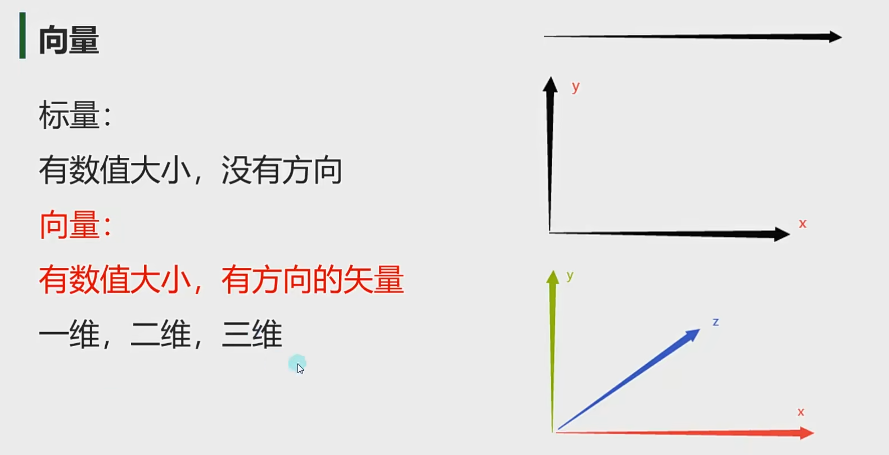

# 向量模长和单位向量

****

**v2：二维向量**

**v3：三维向量**

**同时他们也可以分别代表，二维三维中某一个点的坐标**

****

****

****

****

****

****

****

****

**和Distance有异曲同工之妙，不过一个是两个点的方向出发，一个是向量的角度出发**

** 通过Magnitude可以快速获得某一个向量的长度**

****

****

****

****

****

**1.**

**Distance和向量**

****

**2.**

****

**3.**

****
