# 四元数是什么

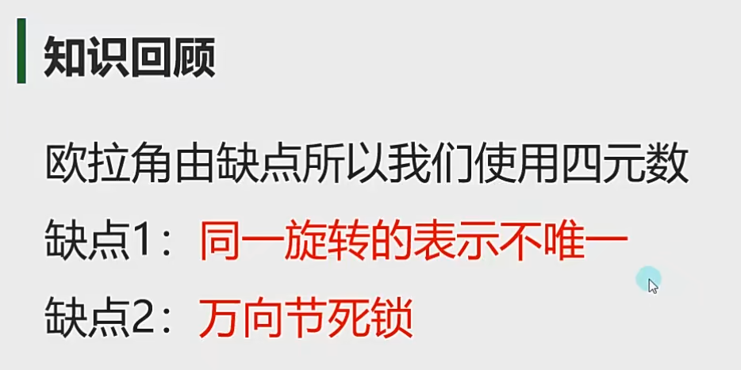

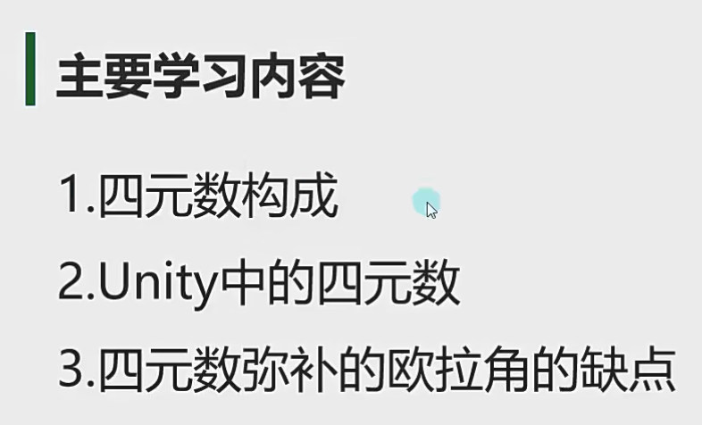

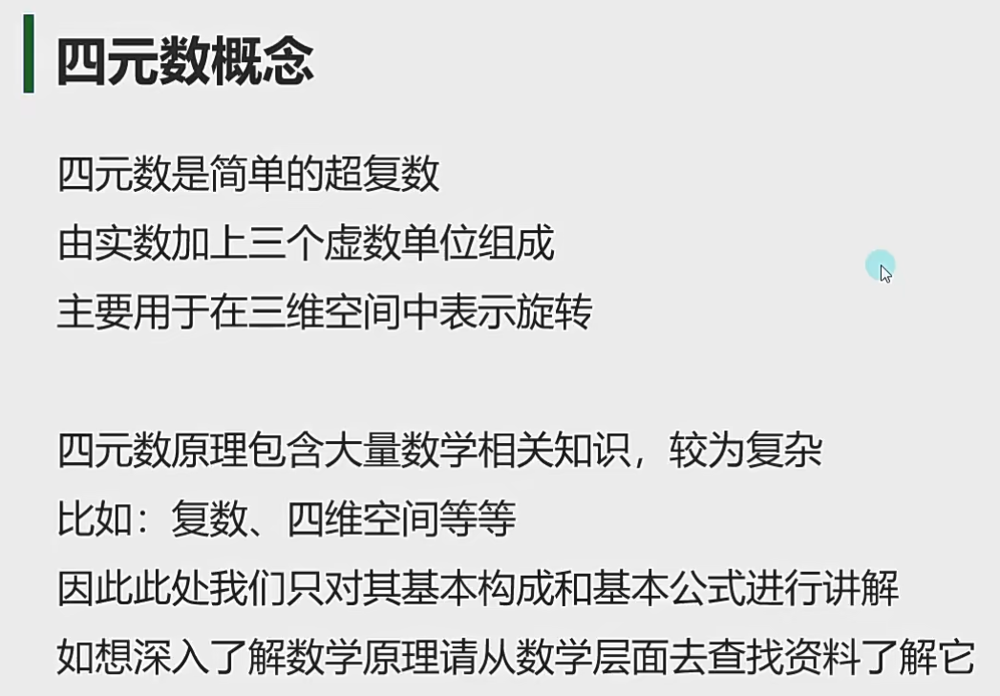

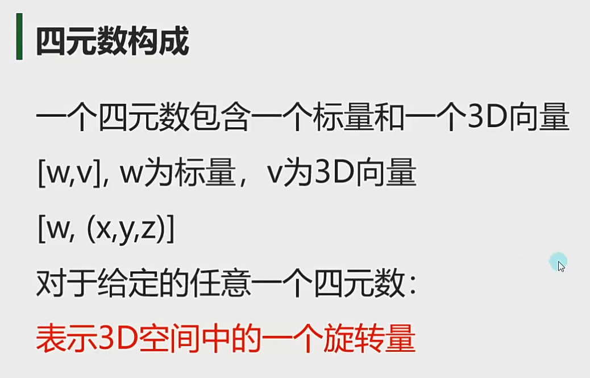

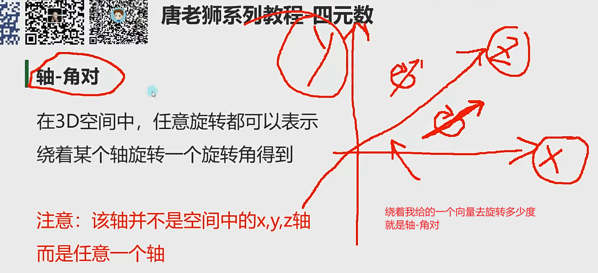

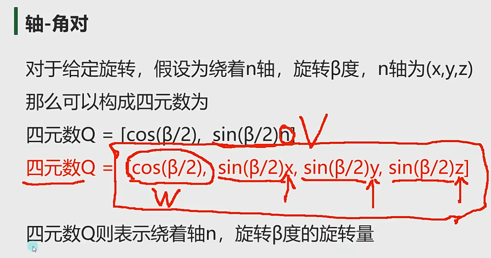

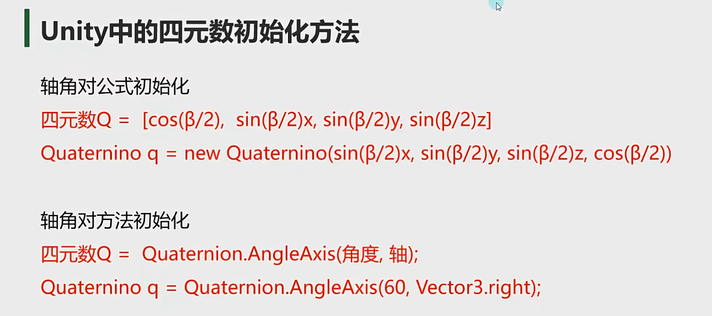

1.先把轴写好

2.再写角度

3.最后把sin乘以轴

一般不使用，面试可能考

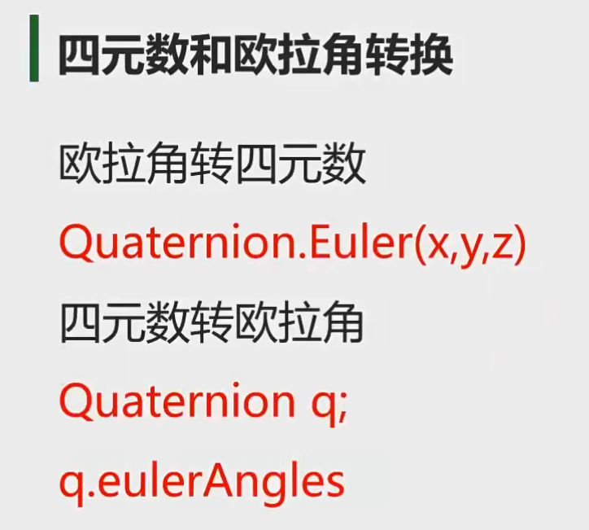

四元数和欧拉角的互相转换

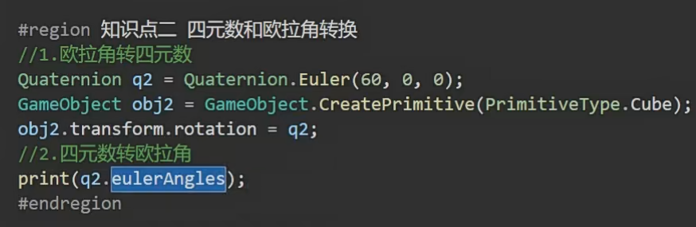

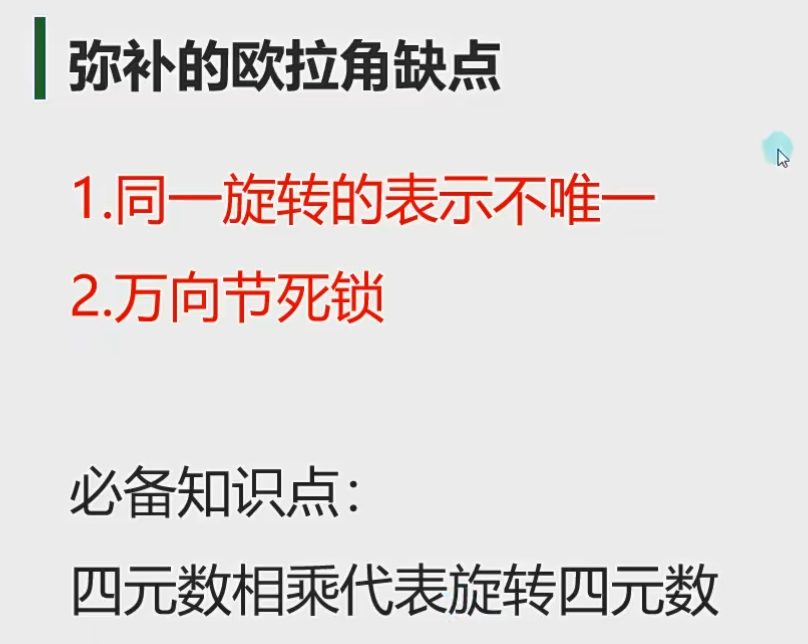

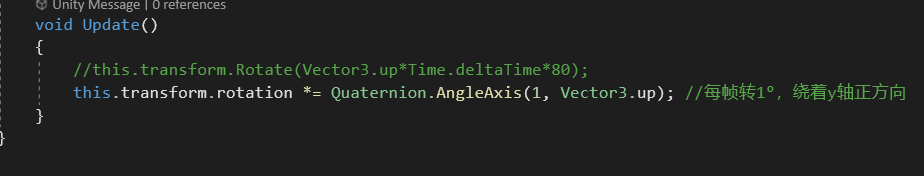

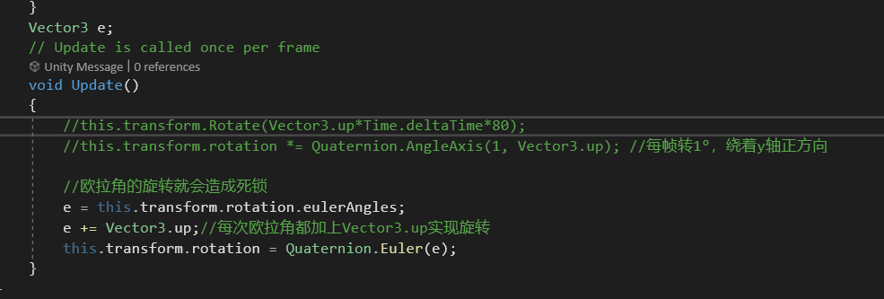

**脚本中transform.ratation属性**

而代码中的transform.ratation属性，这是一个四元数 (x, y, z, w)。

四元数是一个复数，由三个虚数，加一个实数构成。

**但是不要理解为这是x,y,z坐标，w也不是旋转角度**

**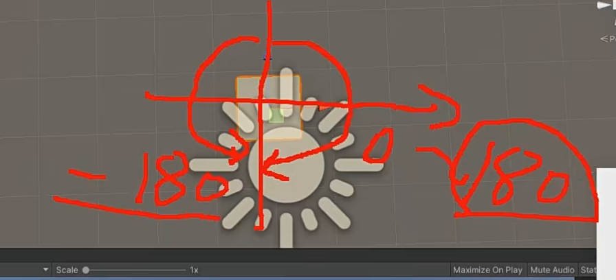**

**四元数旋转，只有-180到180之间的数值变化，可以解决方向不唯一的问题**

**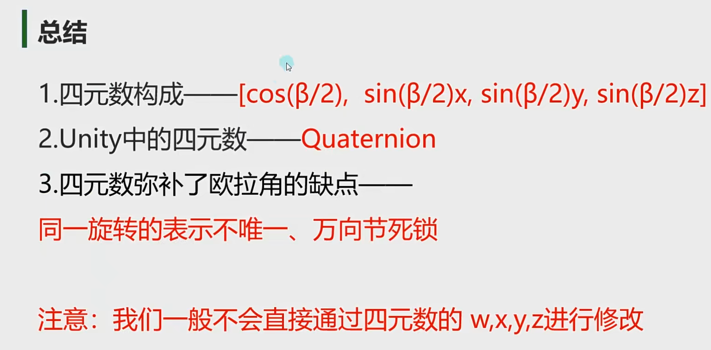**
