# 四元数计算

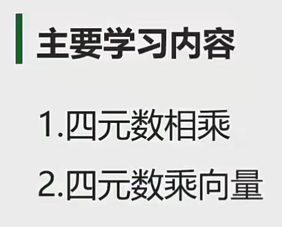

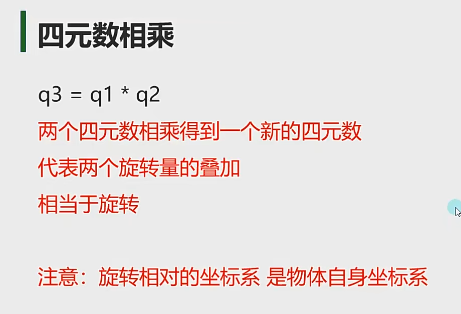

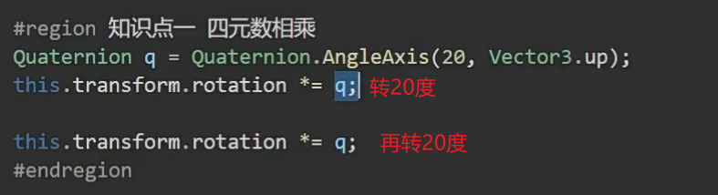

必须向量放在后面乘，不能调换顺序

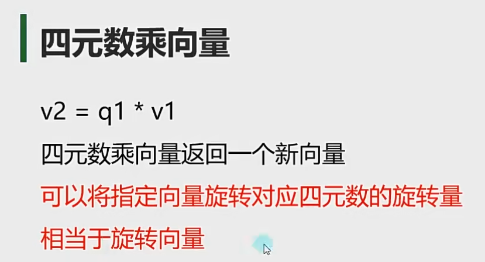

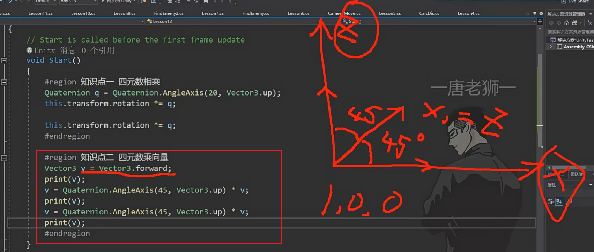

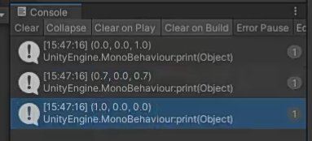

 

有什么用？

eg:实现飞机开火

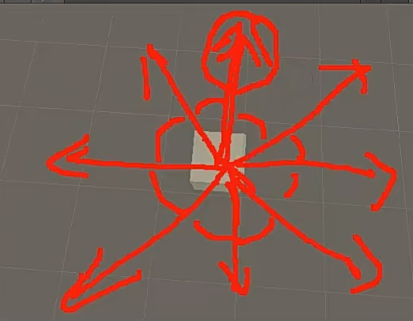

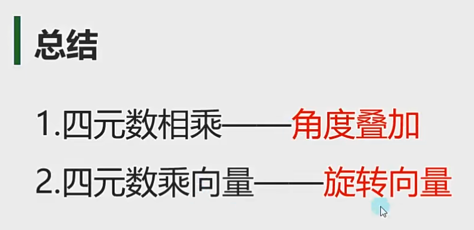

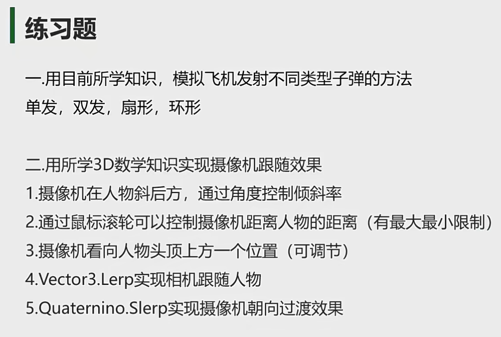

1.

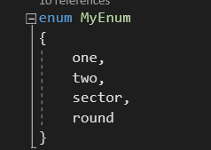

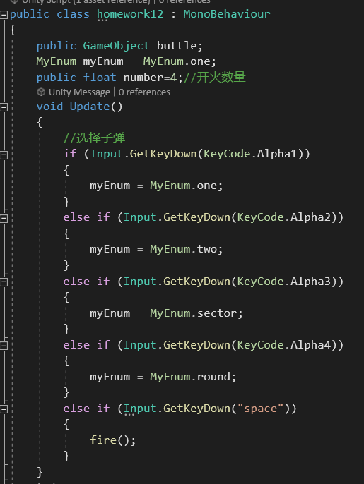

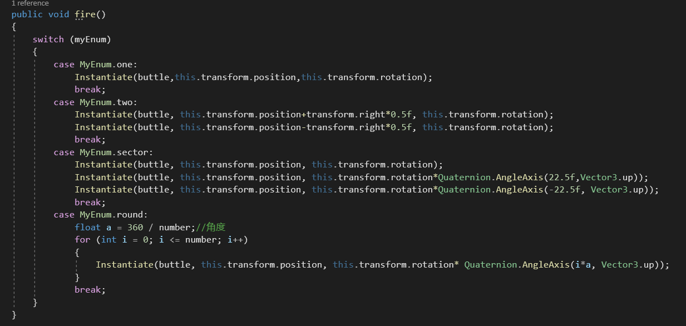

双发：移动发射位置，左右各移动0.5

扇形发射：改变两个子弹的发射角度

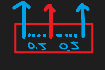

环形发射：改变每颗子弹的间隔角度

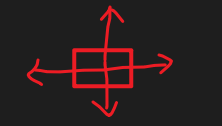

角度：360/4=45°

用循环实现

0*45°=0°；

1*45°=45°；

2*45°=90°

3*45°=135°

4*45°=180°

注意：

Instantiate(物体，位置，四元数角度)；的用法

枚举的用法：先定义枚举，创建枚举对象，改变枚举对象的值，不同的枚举对应不同的操作

然后面向对象的思路，移动子弹，创建的开始就延迟5秒删除

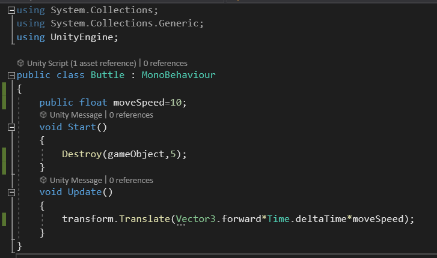

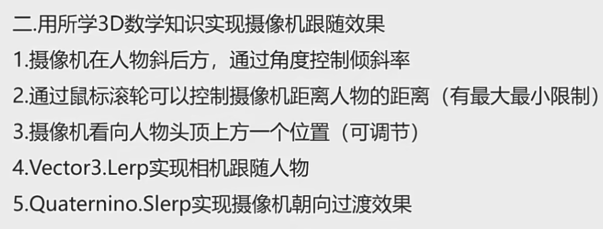

1.改变向量的旋转，改变斜率

2.通过鼠标滚轮滑动，m的值增加和减少

3.通过改变看向的点，改变位置

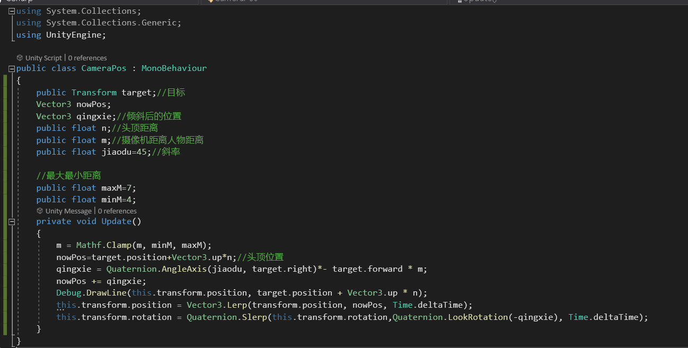
