# 开始界面

   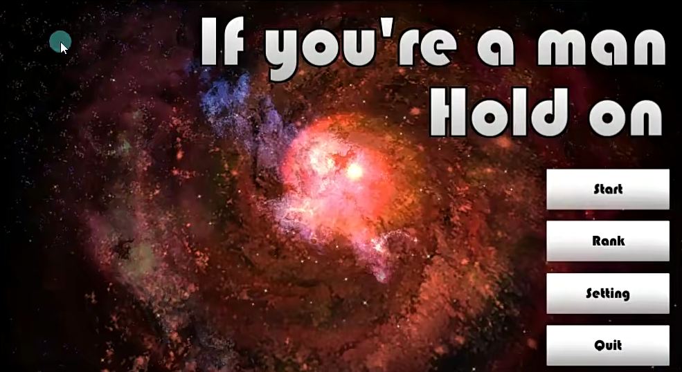

必须先设置分辨率自适应

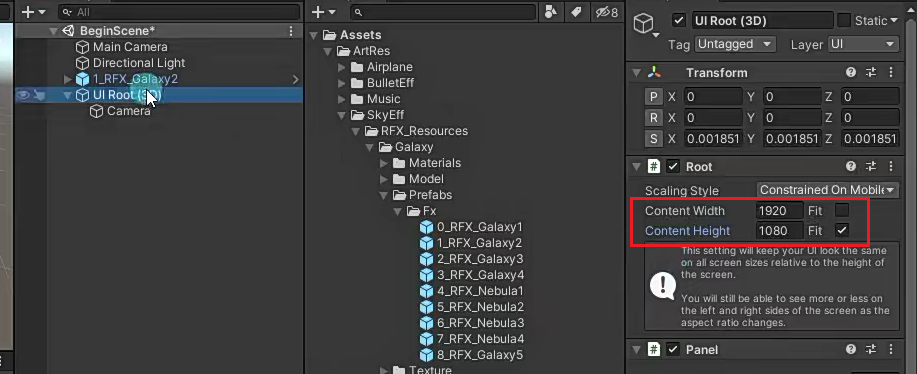

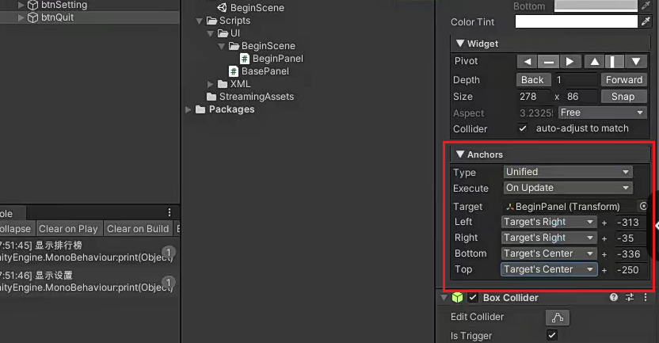

NGUI还需要检查Draw Call

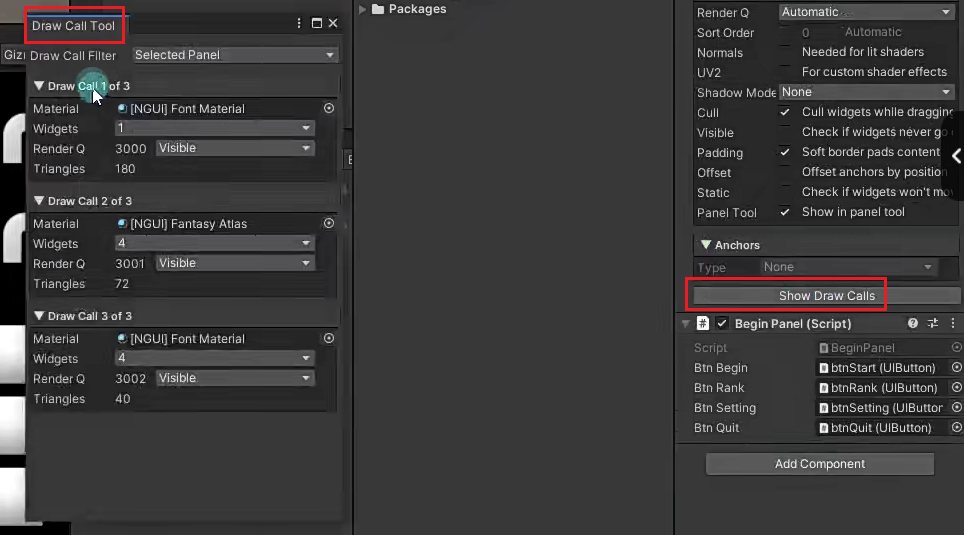

---

---

1.创建UI

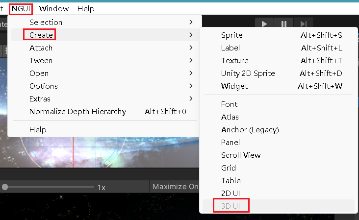

创建的UI摄像机会自动只渲染UI层

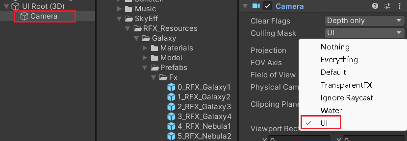

主摄像就会取消UI层的渲染

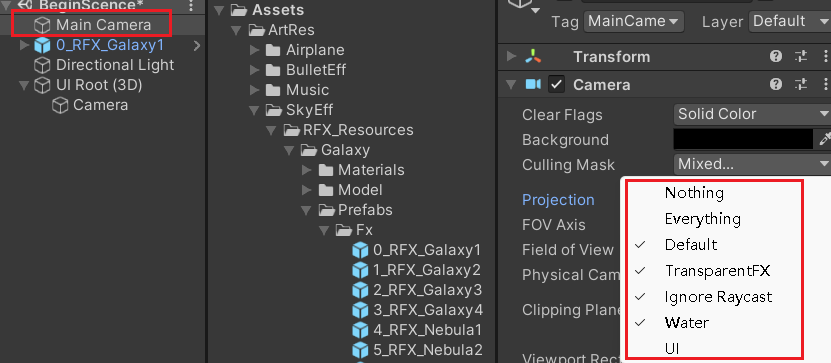

2.拼面板前首先改分辨率，不然错了所有面板都要重新拼，非常重要！！

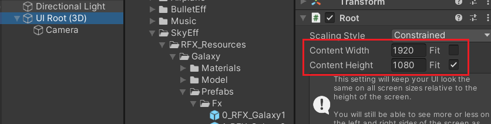

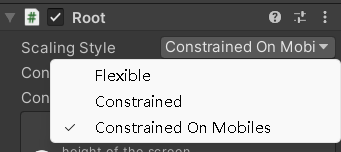

3.开始拼面板

    1.创建面板父物体，panel

        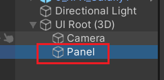

    2.下面加子控件、

一.Label

        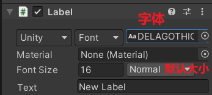

        

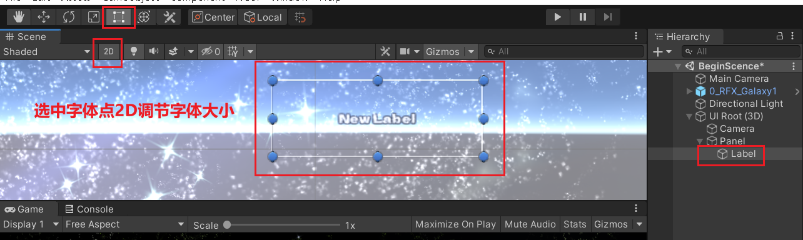

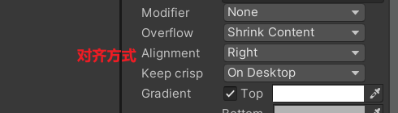

        3.检查并改变分辨率自适应

        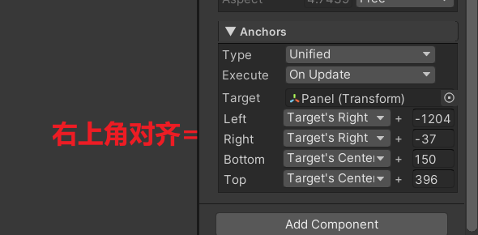

二.Button

    1.创建背景图

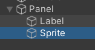

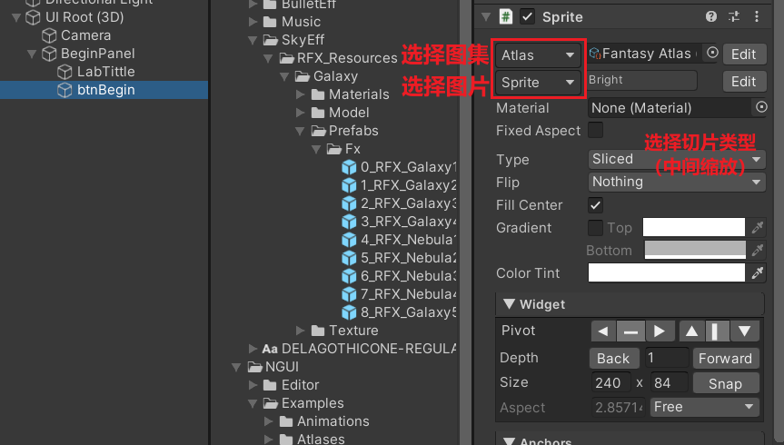

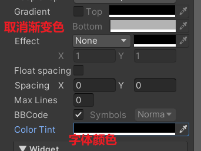

添加碰撞器，添加按钮脚本

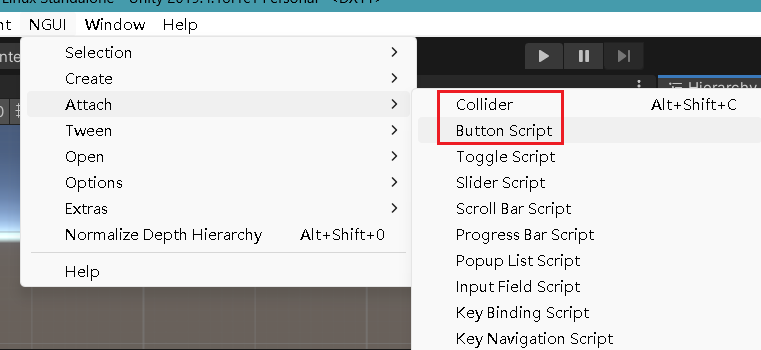

---

---

3.为面板写逻辑

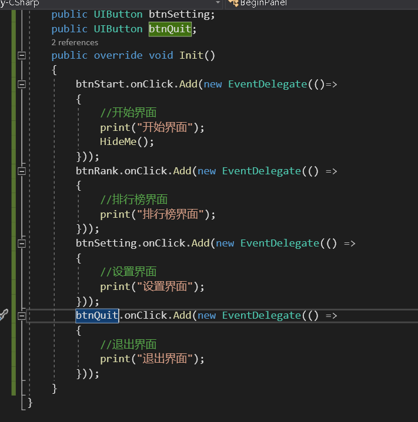

4.检查按钮的分辨率自适应和draw call

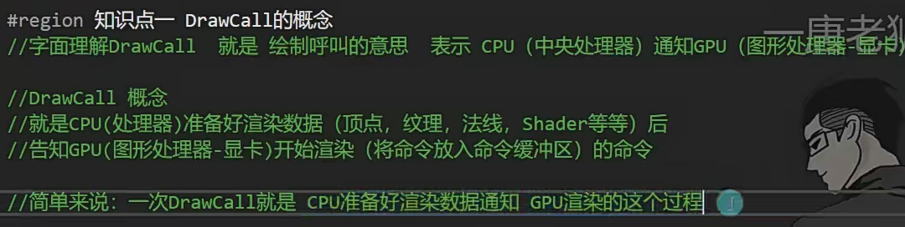

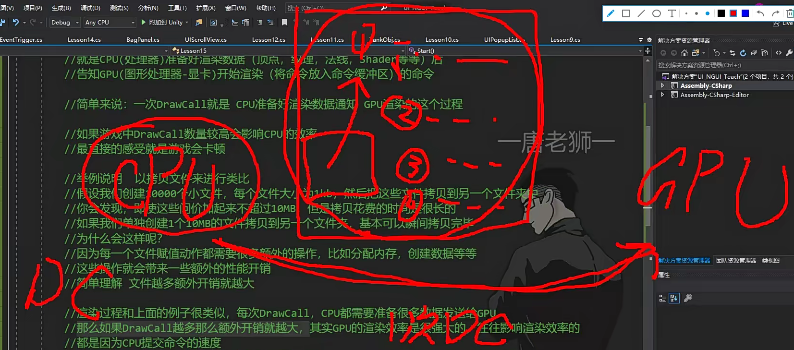

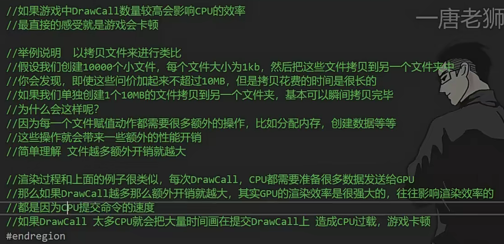

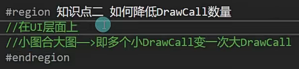

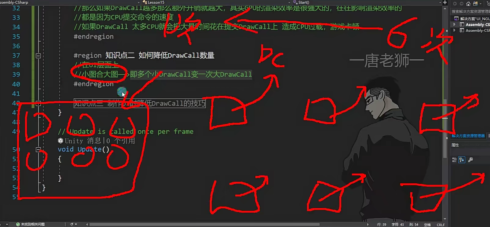

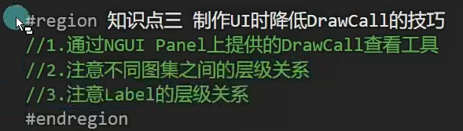

2.同图集的图片不要插入别的图集的图片，如果插入了会打断合并图集的渲染

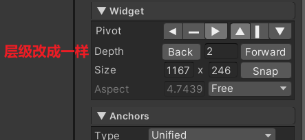
