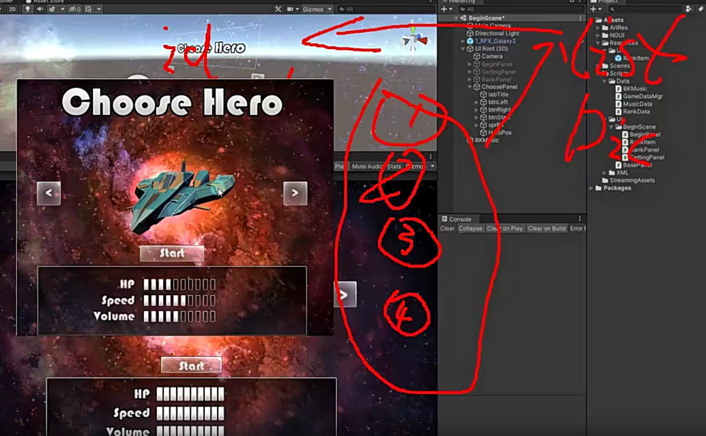
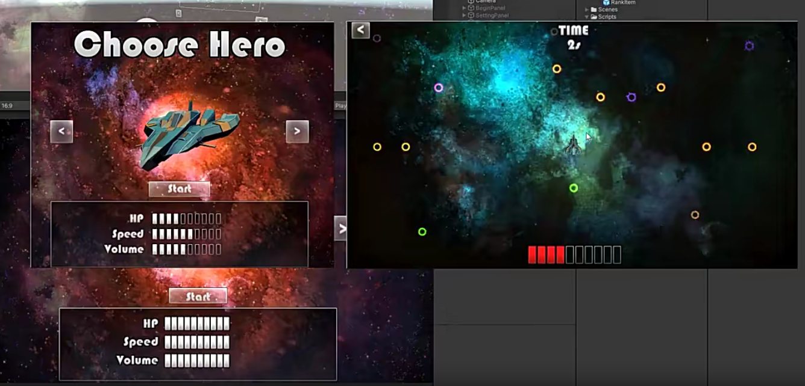
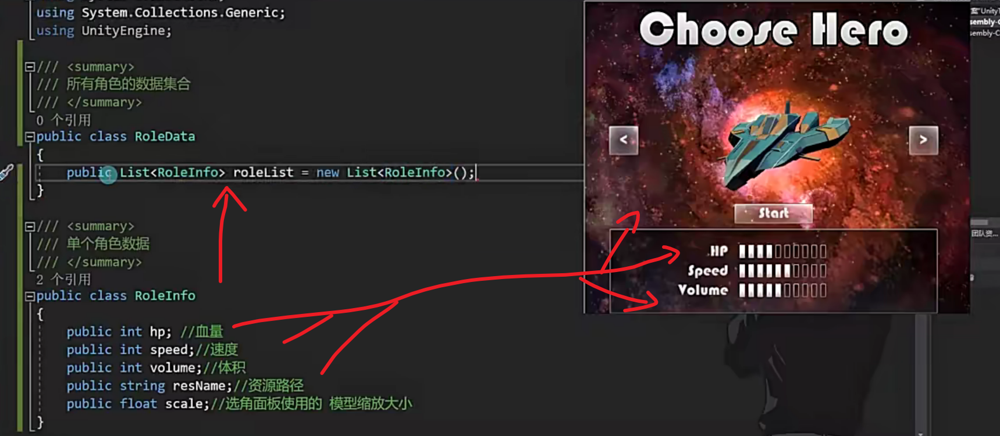
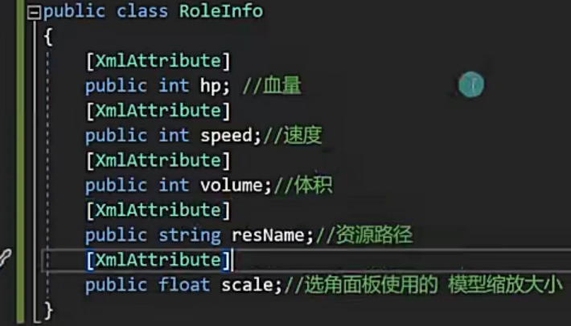
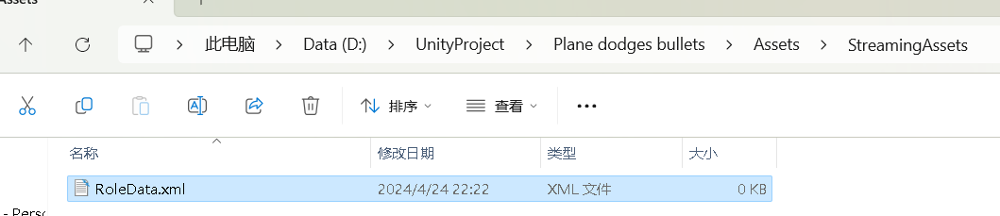
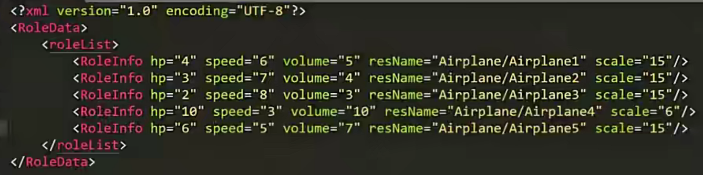
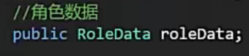
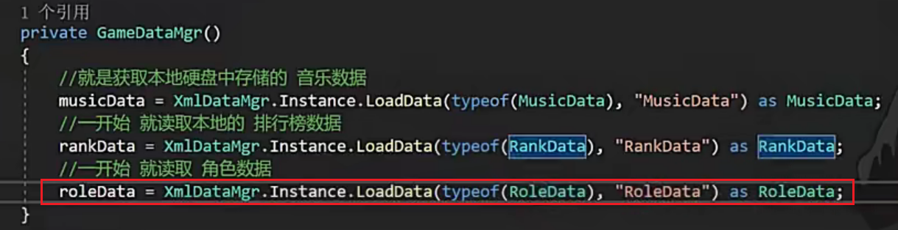
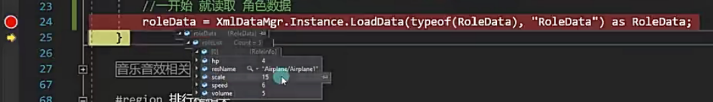
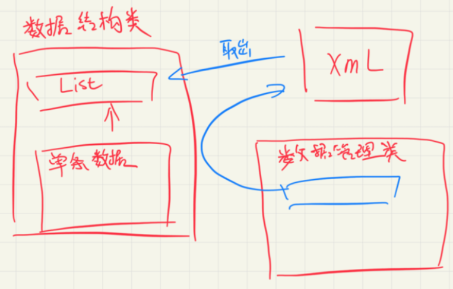

# 选角面板_数据准备

UI界面的内容其实就是游戏数据的一种体现

通过配置文件管理数据，切换信息就是改变id

根据数据进行显示，每次根据选择不同的id，来选择不同的数据（模型，血量等等）

等真正进入游戏后，根据选择的Id调用不同的数据，模型，血量等等

配置文件的主要作用：

可以把数据和游戏逻辑分离开来，游戏逻辑定一套公认的规则

数据都是从本地硬盘读取出来的数据，做商业游戏的套路

数据结构类

OK了吗?

没有，和排行榜不同。

排行榜是游戏运行的时候要去存储数据

而角色数据在游戏运行的时候是不会去修改他的，只会去得到他，从硬盘中读取数据存储到list中，因为不需要跳着查，是按顺序，所以是list

=>提前写好数据读取就完了，所以要提前把xml数据写好

怎么测试？

打断点

