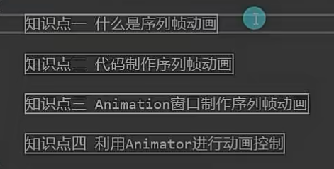
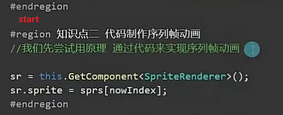
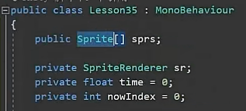
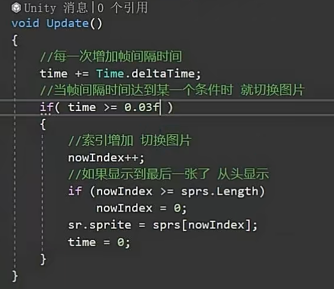
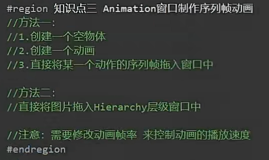
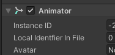
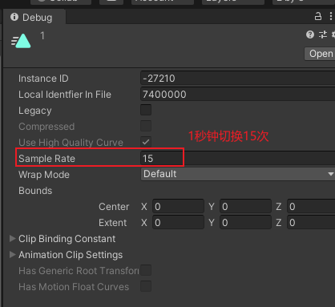
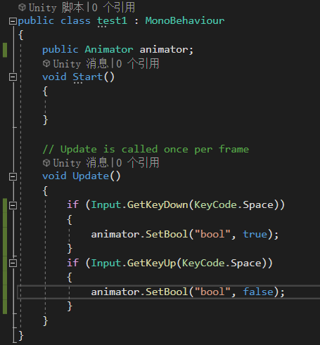
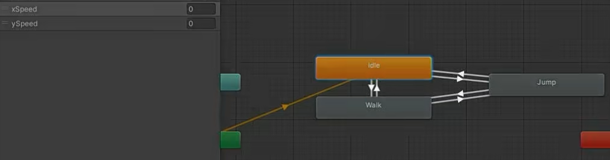

# 2D序列帧动画

数组获得所有的精灵图片-->获得SpriteRender脚本-->时间增加-->切换数组里的图片到SpriteRender

1000ms=1s，所以0.03f是30ms切换一次精灵图片

用新动画系统

****

**利用动画状态机控制2D动画的切换**

补充：因为速度y的值下落一瞬间等于0,所以看起来怪怪的，所以可以用bool值判断，用检测碰撞器的进入和离开改变bool值进行播放跳跃动画
