# SpriteAtlas精灵图集

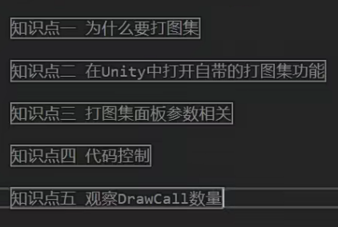

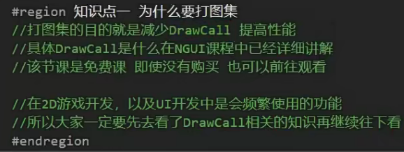

图集就是把很多小图片拼成一个大图片，一次渲染一个大的图片，这样可以减少渲染次数，提高游戏运行速度和内存利用率。

打图集=制作图集，把一个个小图制作成一张大的图集

构建时，就是只在打包成exe时才会生成图集，目前一般选择Always Enable

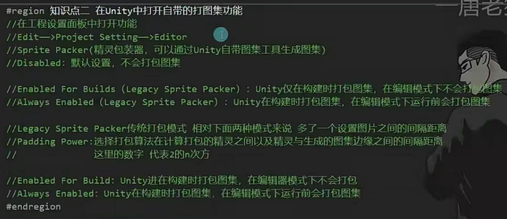

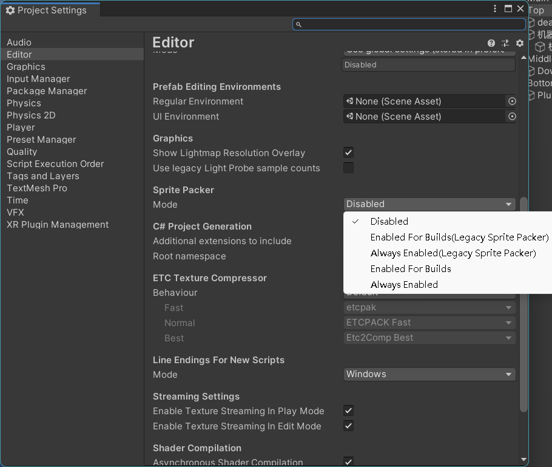

怎么创建一个图集？

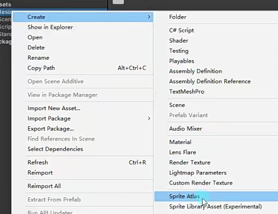

参数设置：

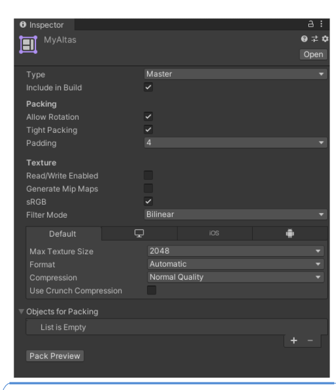

UI不要选Allow Rotation,勾选上会自动将图片以最大密度方式放置图片

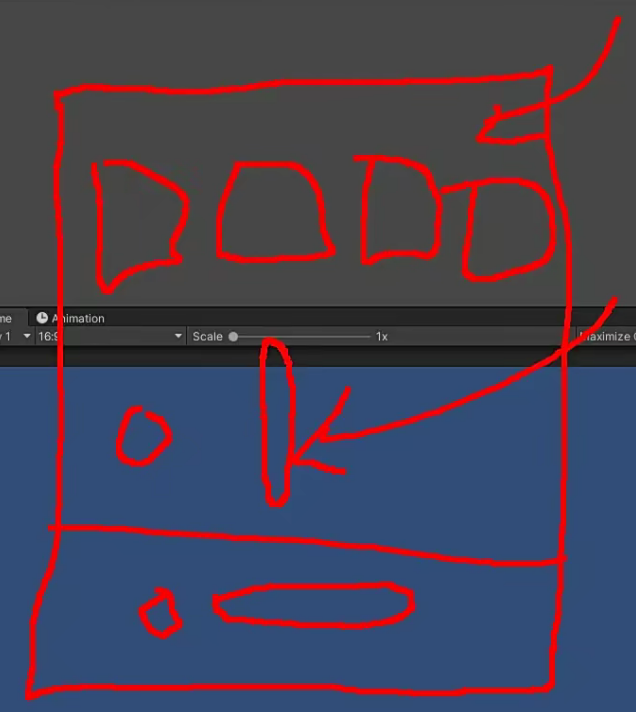

Tight Packing:不以矩形打包，而是图片像素点，透明区域不打包

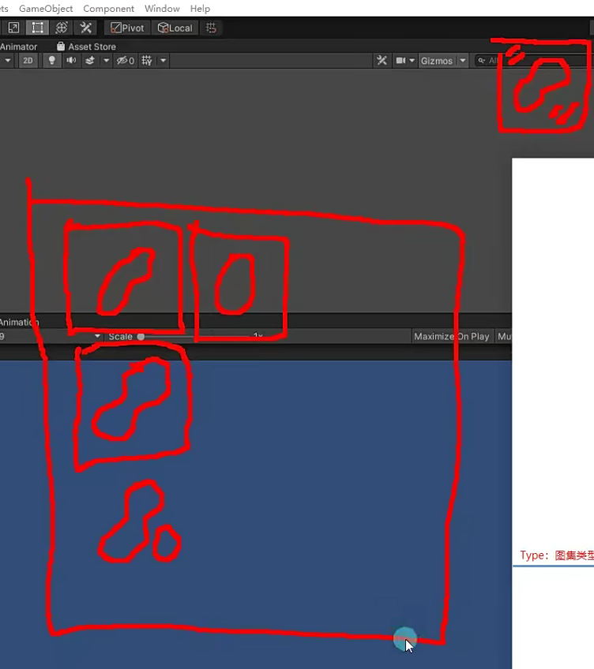

一般2D游戏不勾选Mip Map

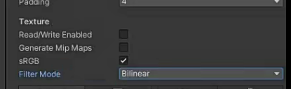

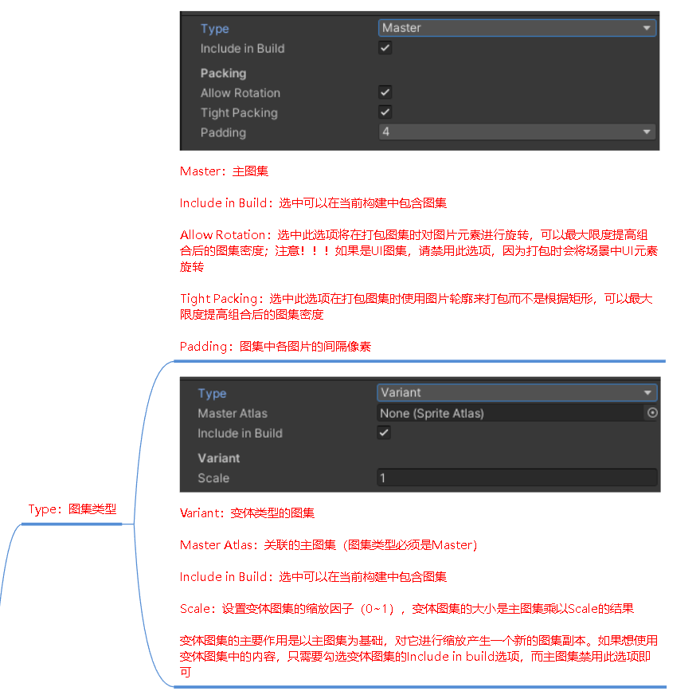

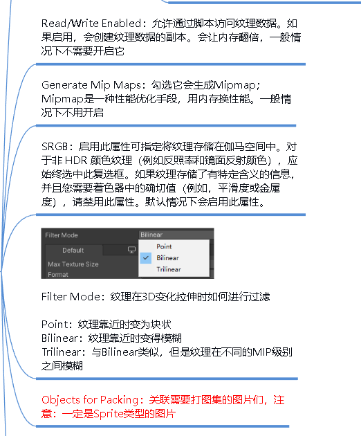

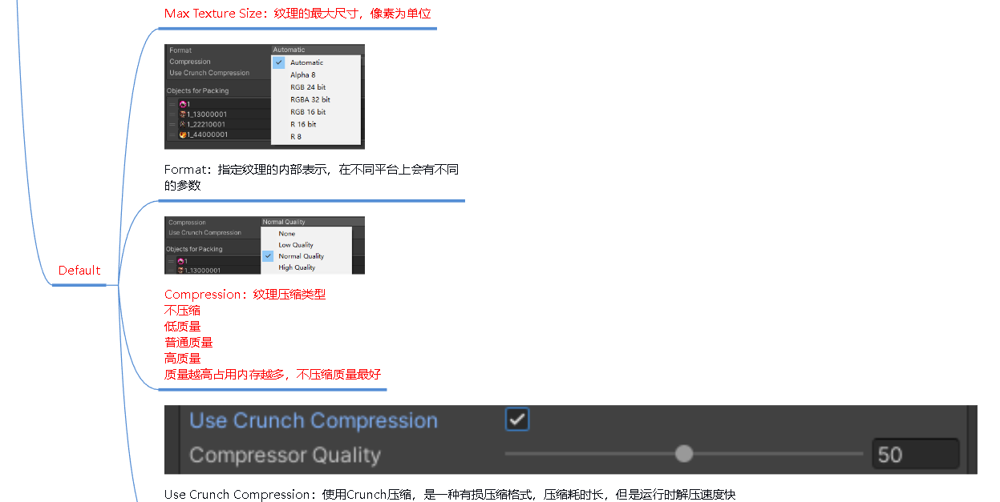

往图集添加需要打包的图片，也可以拖图片和文件夹添加

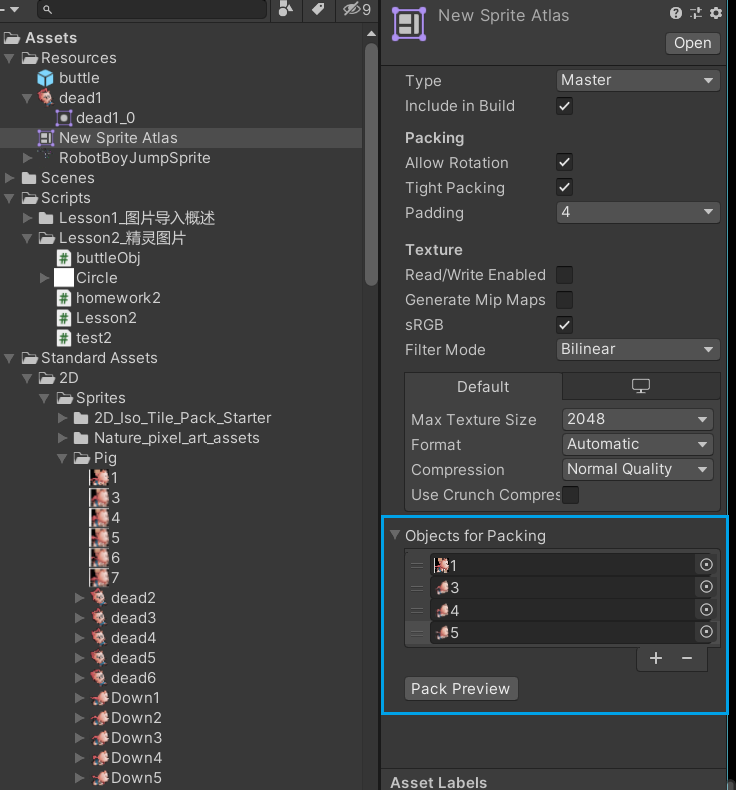

如何使用：

直接将图片拖到场景中使用

怎么看有没有打包成功？

看运行后和运行前draw call有没有变化

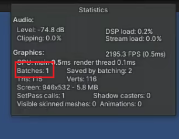

如何通过代码直接将图集中的一个图片加载到场景中

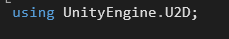

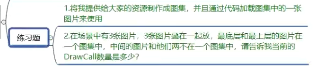

1.

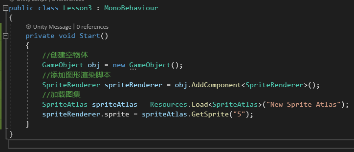

2.DrawCall数量是3，因为最上层和最下层虽然在一个图集，但是两个层之间夹杂了其他层，所有的就会分开渲染

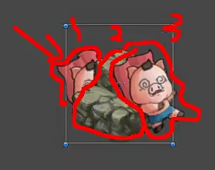
