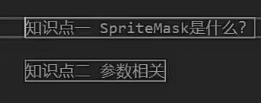
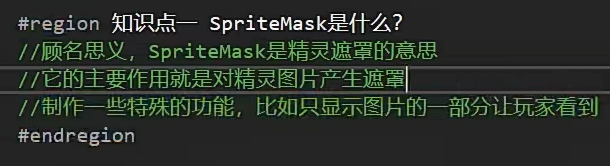
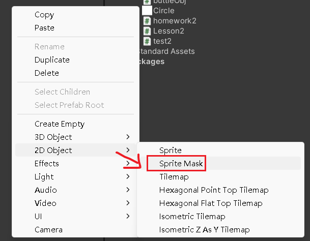
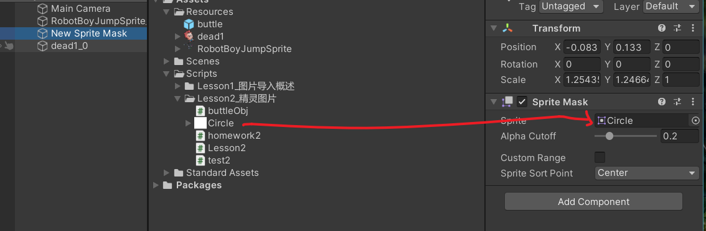
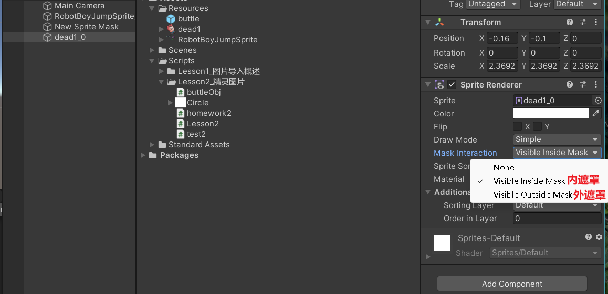
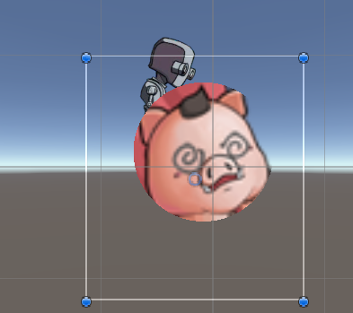
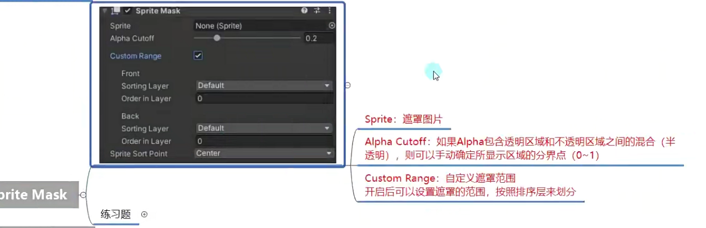
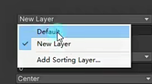
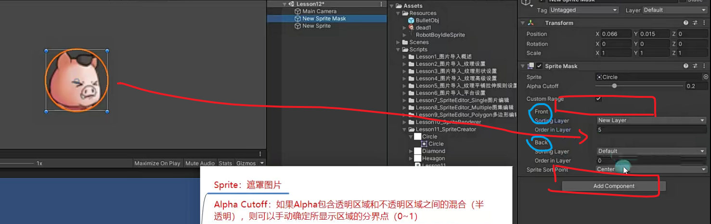
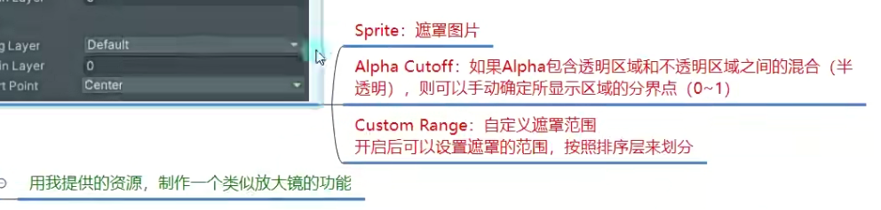

# SpriteMask精灵遮罩

怎么创建遮罩

效果

参数设置

Alpha Cutoff：透明度如果是渐变的可以设置具体的一个分界点0~1

Custom Range：只有大于等于Back小于Front的层级范围才能被影响

当游戏有多个遮罩，每个层级的遮罩需要不同设置时，可以投选自定义遮罩Custom Range

排序层新加的层都会比上一级高，所以无论图片层级填多少，只要是default就会比new layer层级低

作业：

先创建一个小图不需要产生遮罩，层级0层

再创建一个大图设置遮罩显示，层级1层

放大镜遮罩的显示应该是最上层，层级0或1层

