# 单张图片骨骼编辑知识点

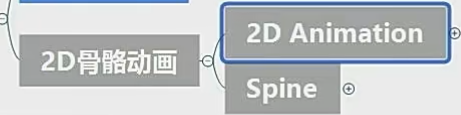

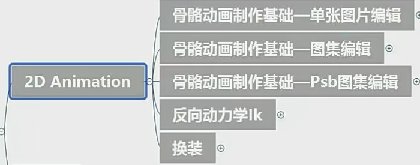

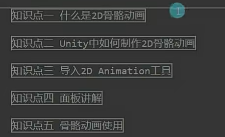

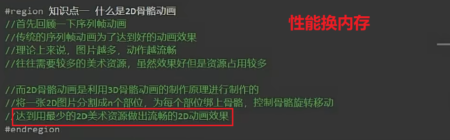

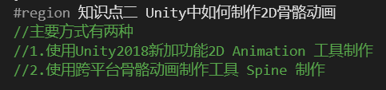

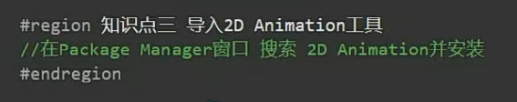

导入示例资源

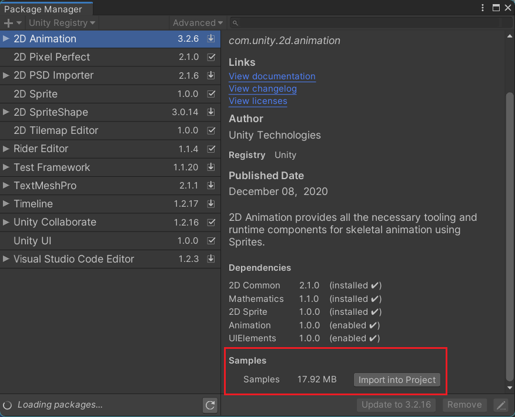

怎么移除图片的骨骼信息？

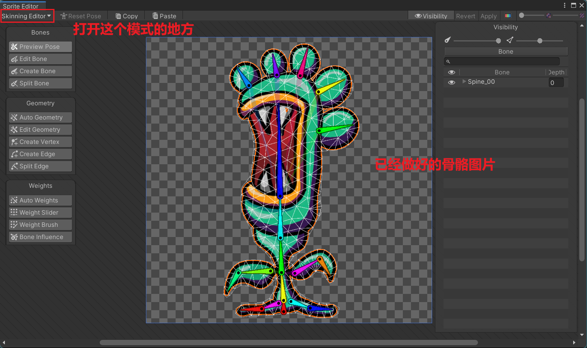

1.打开文件夹所在位置

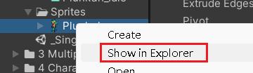

2.删除配置文件的信息

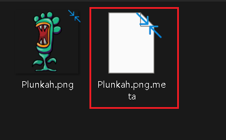

再次打开就没有了

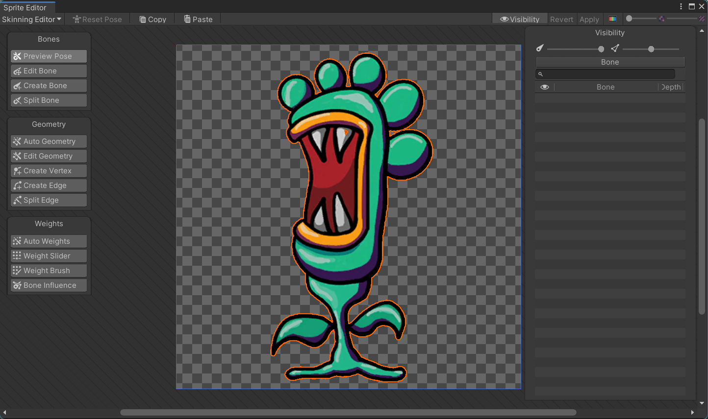

界面参数：

1.

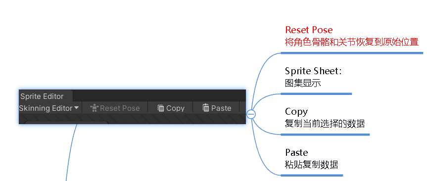

2.

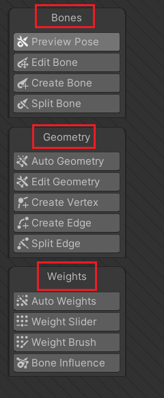

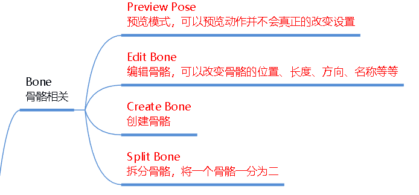

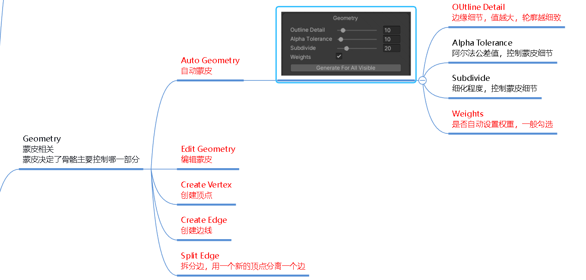

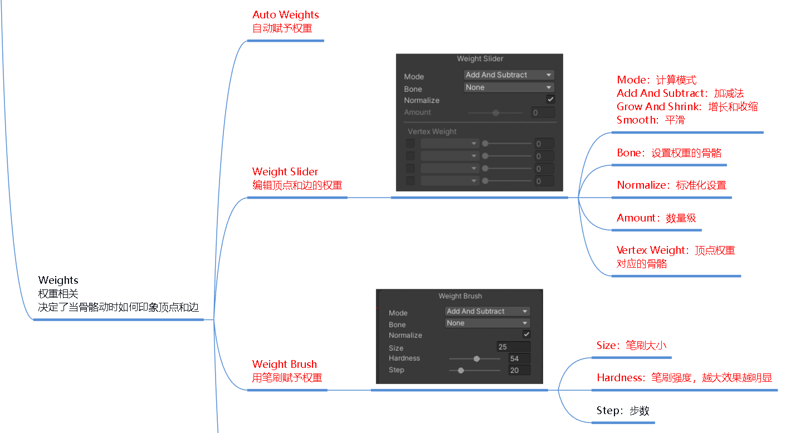

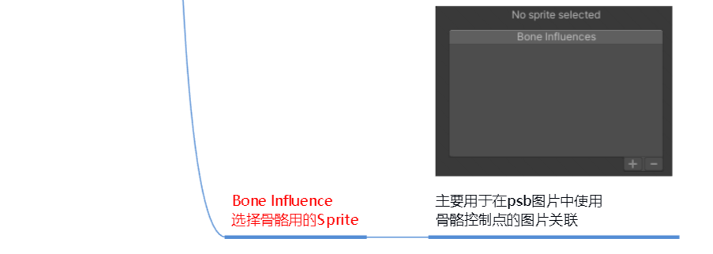

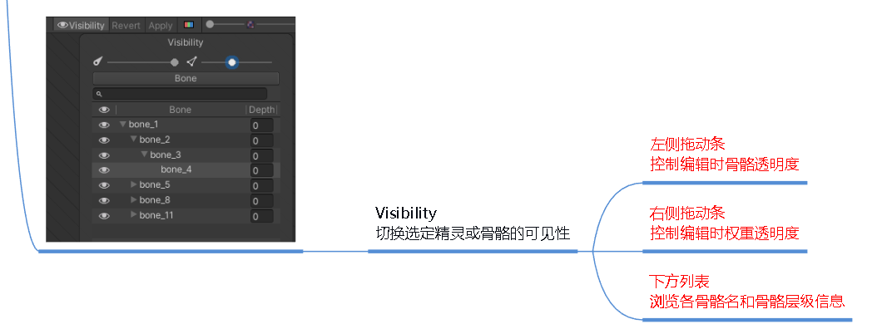

骨骼相关：

有三种添加骨骼的方式：

1.直接末尾添加子骨骼

2.点击骨骼前端添加子骨骼，可以不相连

3.别处右键创建骨骼，这个骨骼与前面创建的骨骼无关

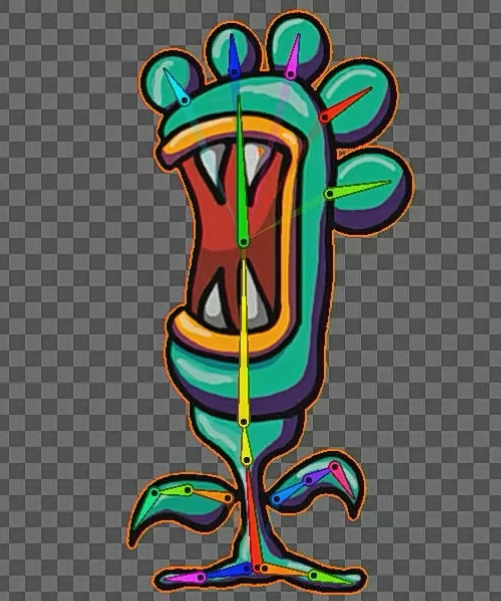

蒙皮相关：

相当于把2D图片用3D面皮拼凑出来

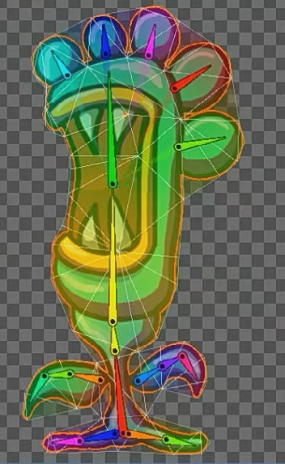

权重相关：

是什么？

顶点受到骨骼影响的程度

权重可以通过颜色看出来受哪个骨骼的影响

不仅受权重影响，父子骨骼也能影响

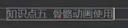

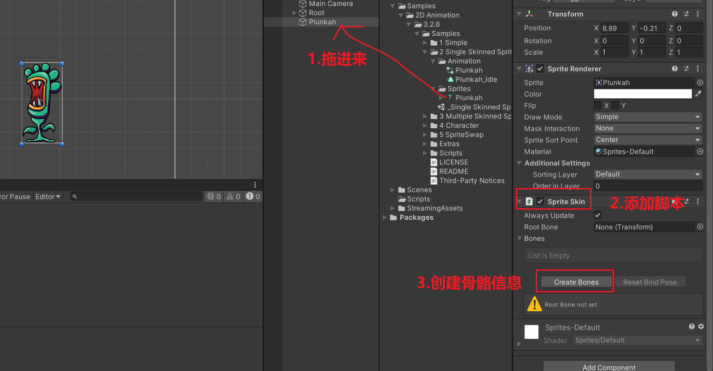

然后再正常创建动画就可以了

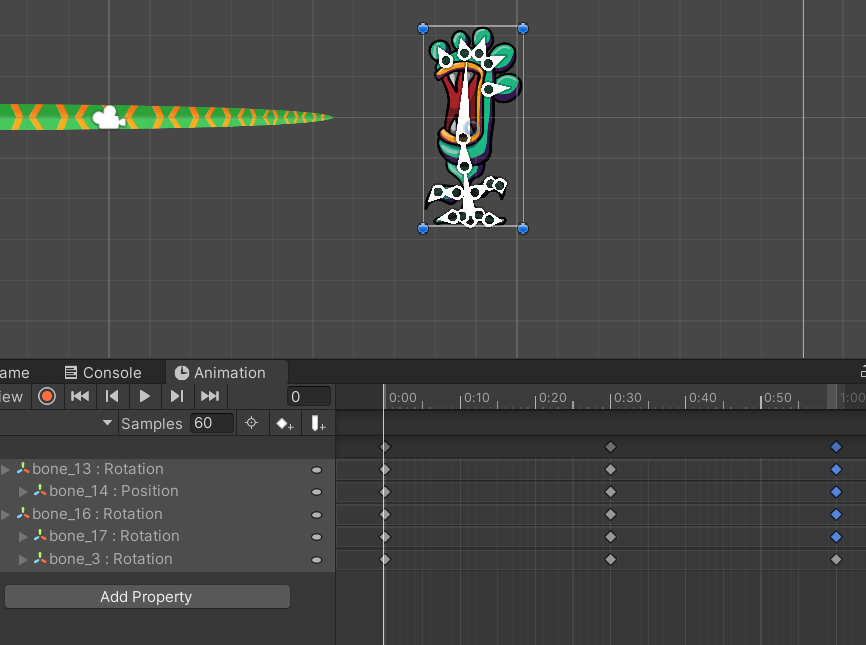

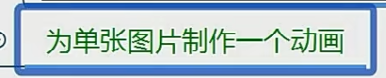
