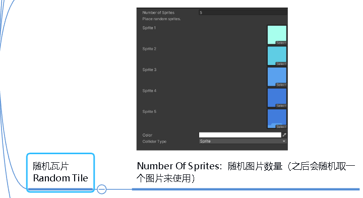

# 瓦片地图拓展包新增瓦片类型

这种新增的瓦片都是在project窗口中创建以后再拖到调色板中

规则瓦片：周边是什么情况的时候，中间使用什么图片

动画瓦片：

不断的切换图片

随机瓦片一般随机生成草和树使用

有点类似规则瓦片，不过这个是已经设置好的规则

权重瓦片，根据权重随机生成瓦片

规则覆盖瓦片分为普通和高级，就是将规则瓦片放进去，普通可以改变图片，高级不仅图片可以改变，也可以改变规则

