# 纹理类型设置-1

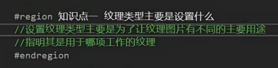

告诉unity这张图片是用来干什么的

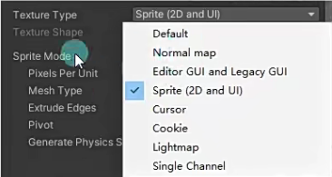

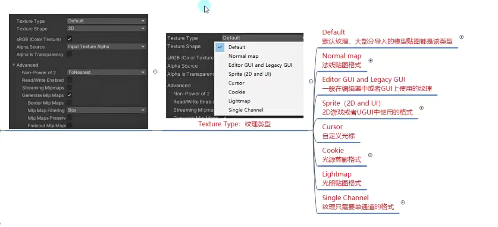

1.

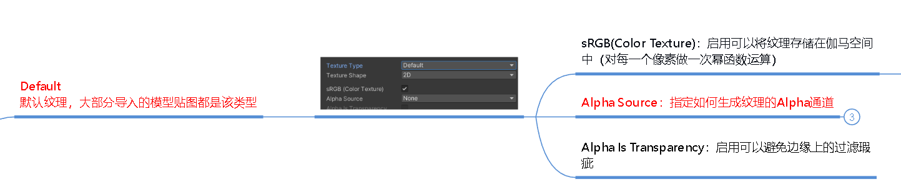

人眼看线性变化的光强不是线性变化的

只有把人眼看到的线性变化光强转化成逻辑上认知的线性变化，才更符合逻辑

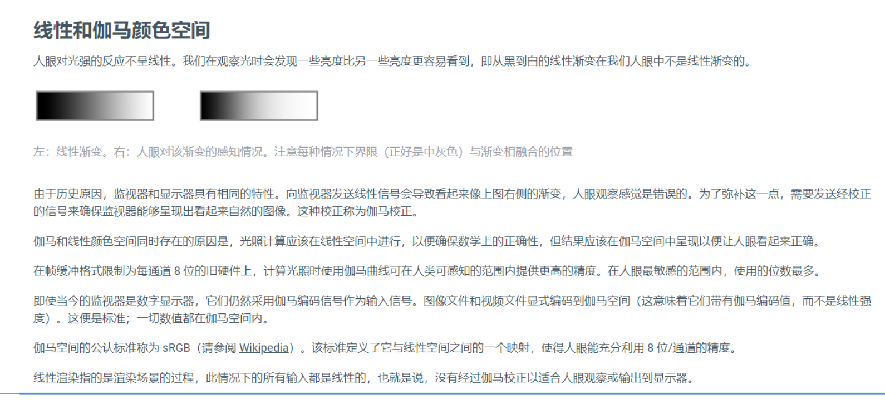

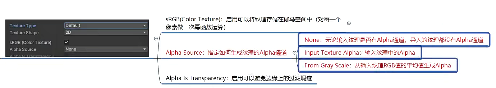

Alpha通道就是透明度通道

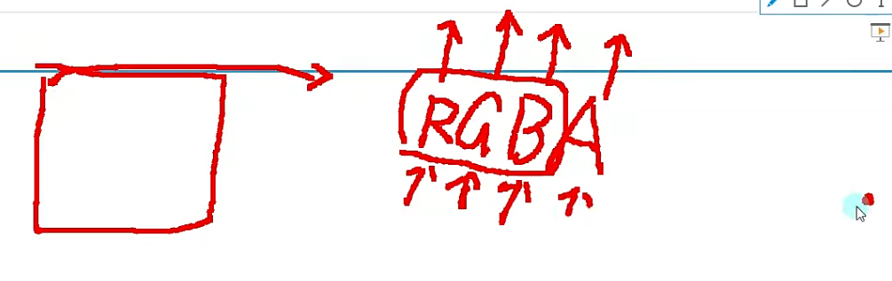

2.

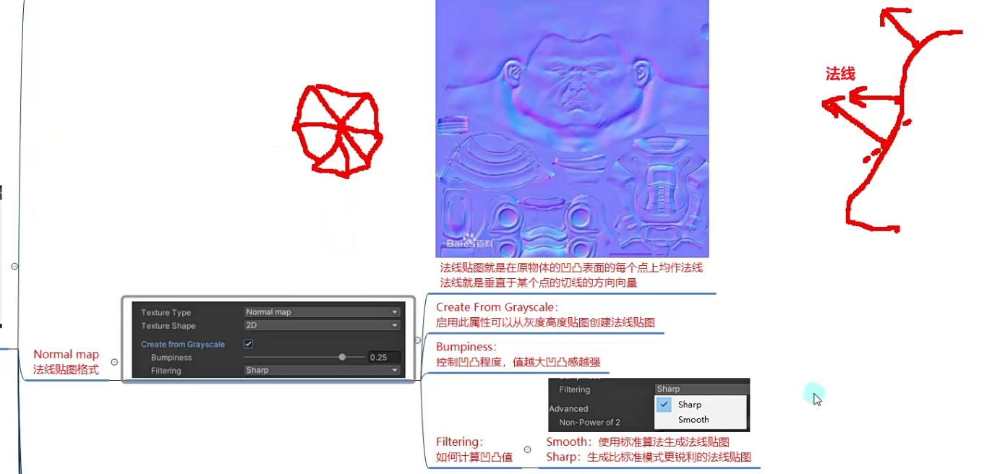

在精细的模型的基础上，先生成一个法线贴图

再将模型变成一个低模，面数更少的模型

渲染时，通过法线贴图结合shader着色器的算法，让每个点受光照影响的一些效果、

达到在一个粗糙的模型上使用精细模型的法线贴图渲染出更精致的效果，更加趋近于精细模型的效果，以达到节省性能的效果

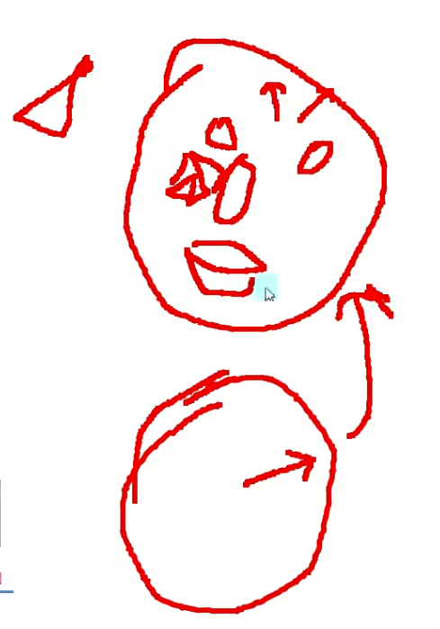

4.

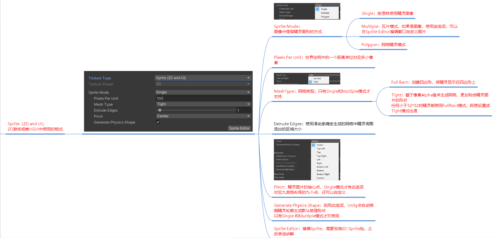

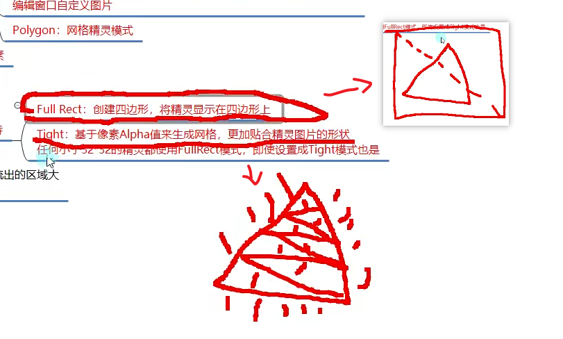

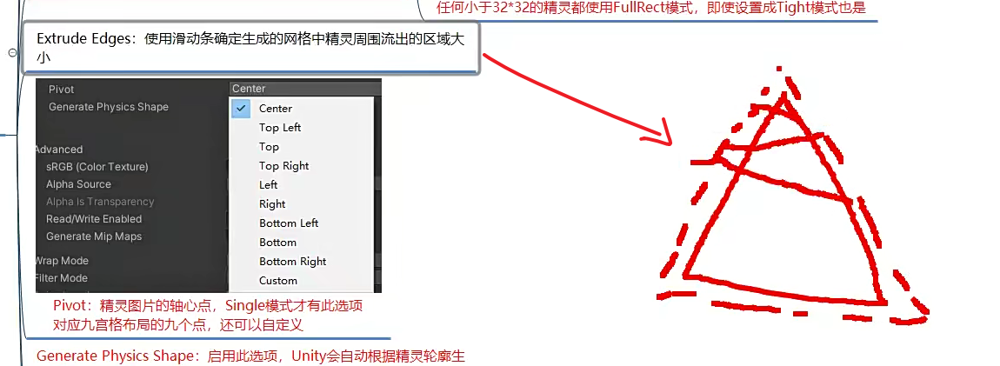

图片的缩放旋转基于的中心点

进行物理判断：

6.

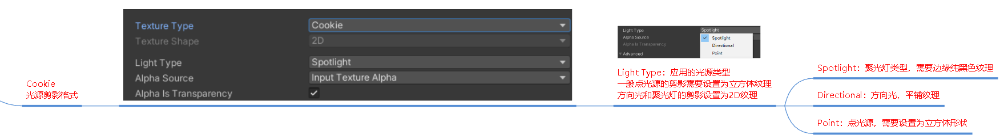

8.

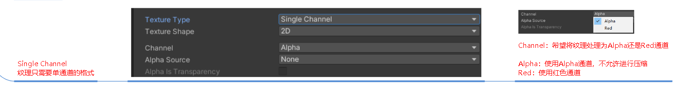
