# 导入环境

1.官网下载pico的SDK,导入到unity中，导入前先将unity平台切换到安卓平台

2.升级XR tool,升级2.5.0版本会报错，所以使用2.4.3

--添加Toolkit包，有的版本可能没有，需要自行添加 com.unity.xr.interaction.toolkit

--打开Player Settings,在XR Plug安卓中选择Pico,设置公司名字，讲Scripting Backend设置为IL2CPP，将MINImum API Level设置为Android 10.0.Target Architectures设置为ARM64并取消勾选ARMv7

--打开package Manager将XR Interaction Toolkit的Samples全部导入

3.新建一个场景，并删除相机，右键在XR选择XR Origin,选择手柄节点后，点击配置图标，选择对应左右手柄预设配置，为XR Origin物体添加PXR_Manager脚本，勾选手部追踪可开启手势识别

---

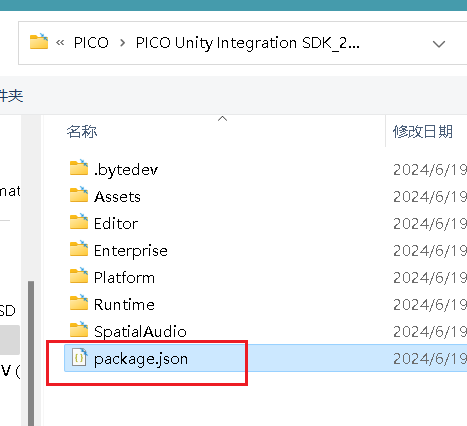

为什么unity导入pico SDK要先转平台到安卓？

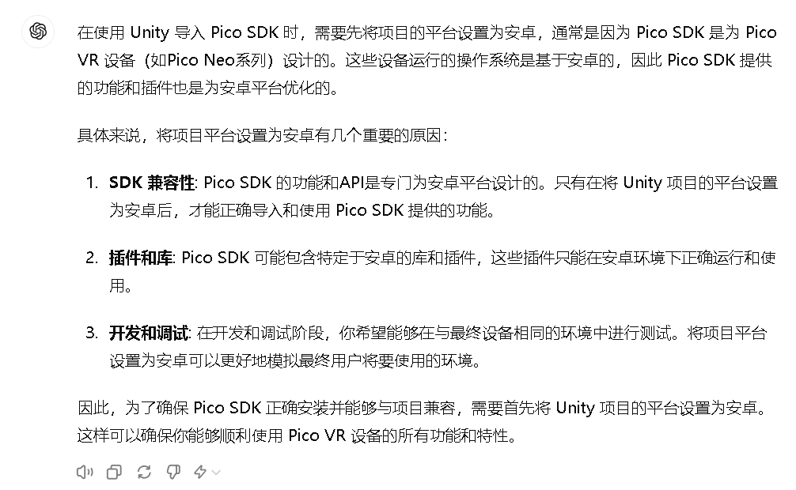

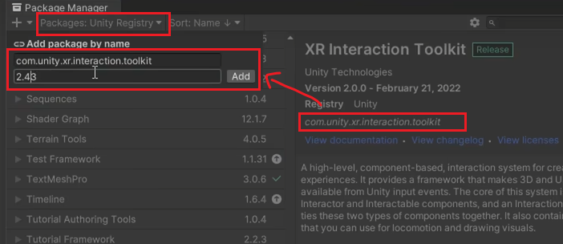

---

---

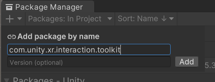

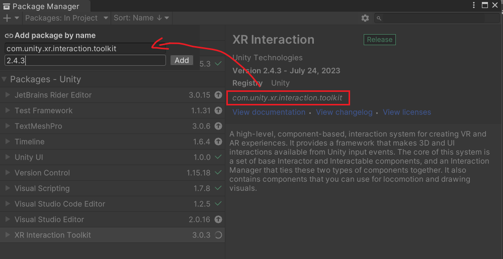

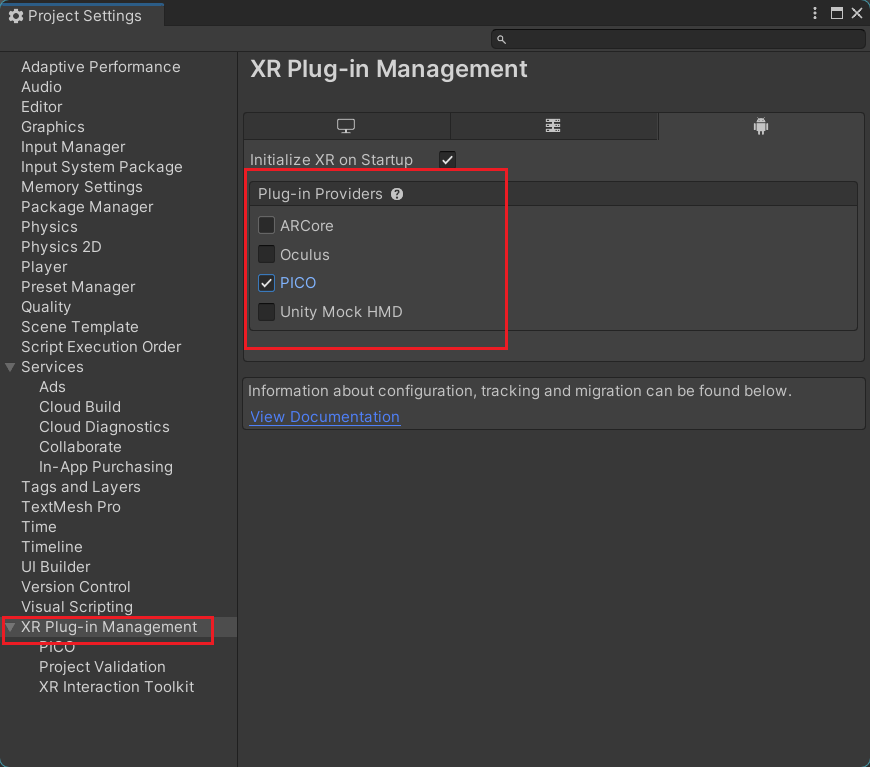

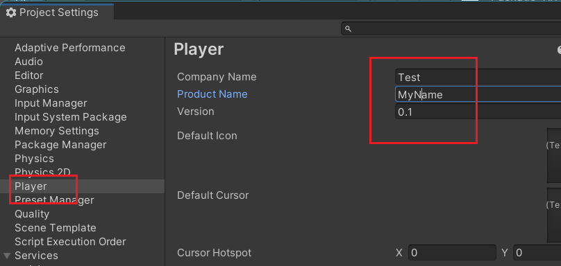

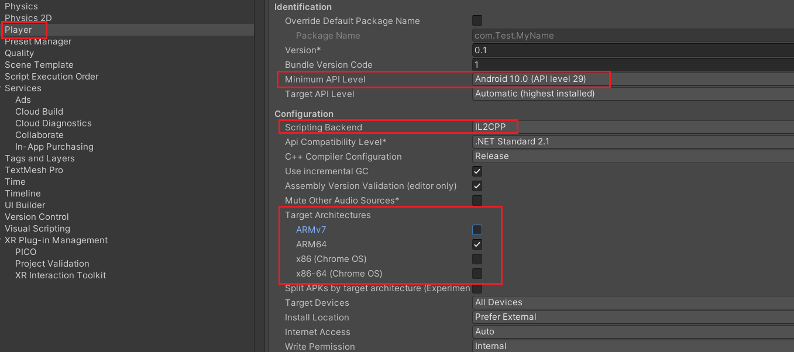

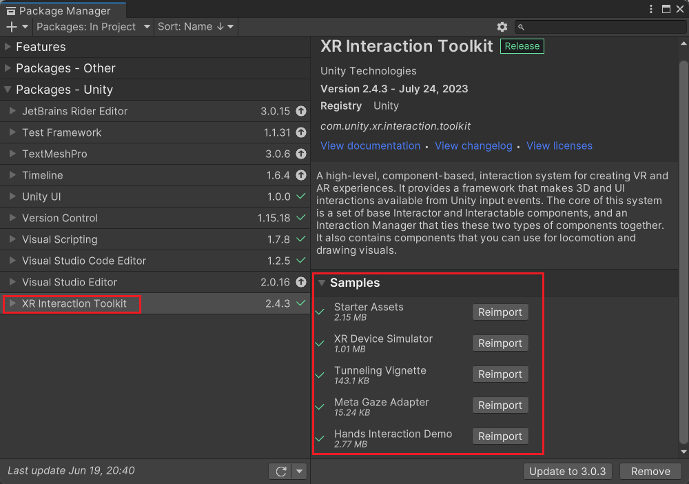

---

---

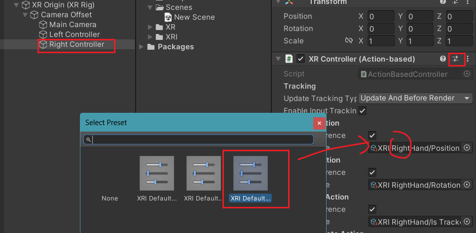

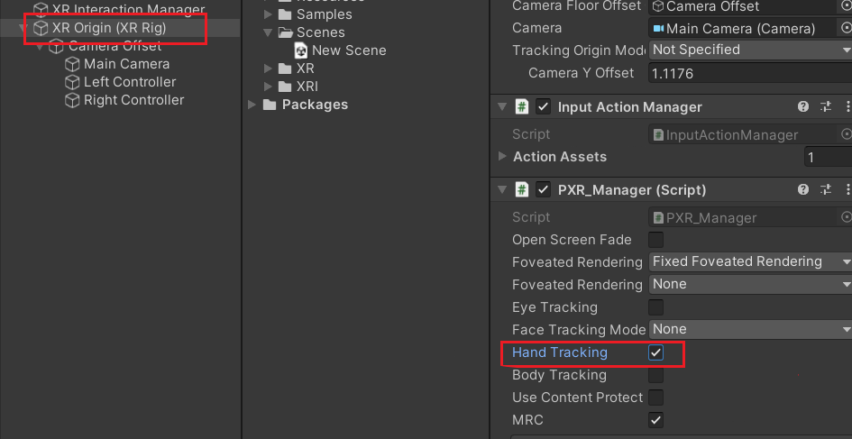

改变XRcontroller中Model Prefabs可设置左右手加载模型，

pico自带的模型在PICO Integration-Assets-Resources-Prefabs中

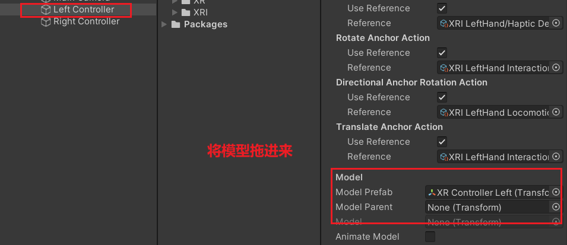

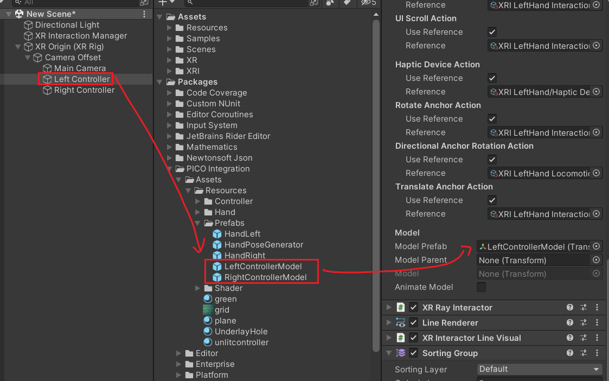

选择不同的手柄模型，设置加载型号

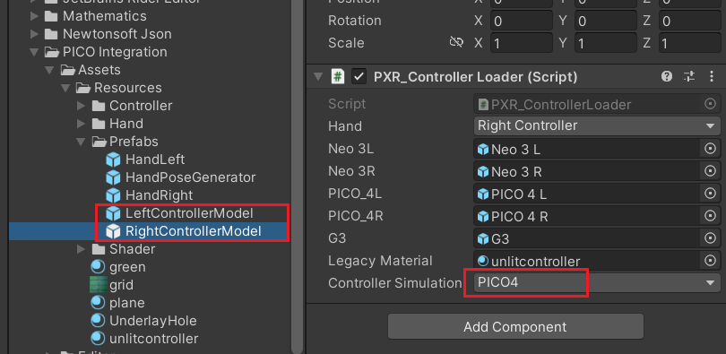

将XR Origin中的model改为地面

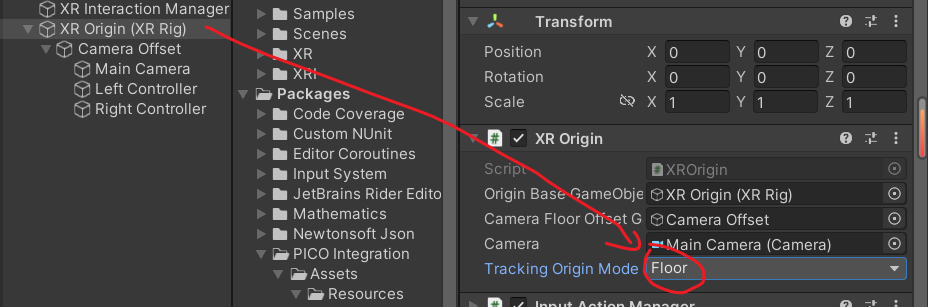

---

---

在package Manager导入pico的预览工具

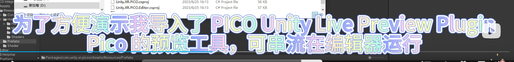

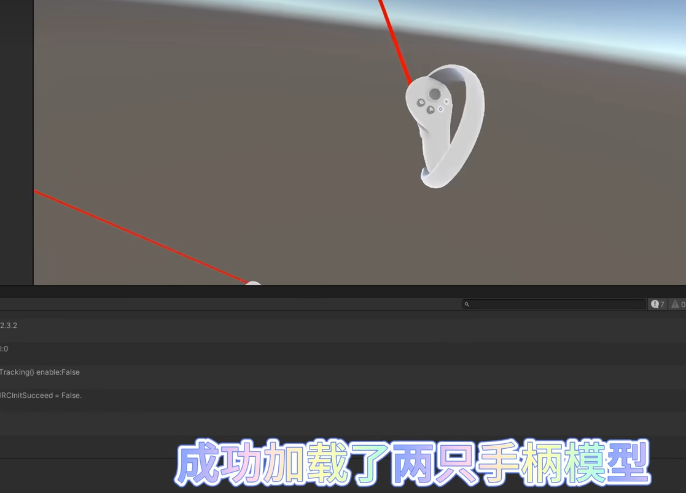

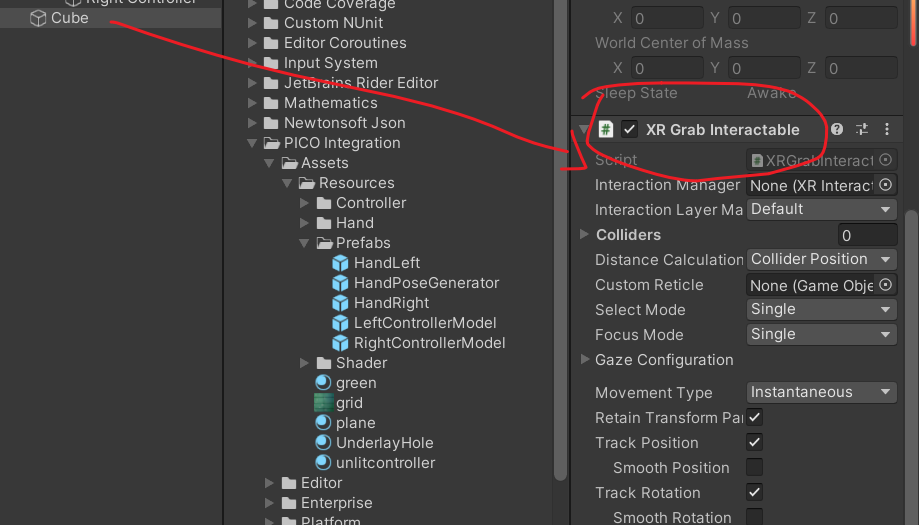

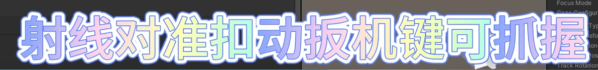
