# 2.xLua导入和AB包相关准备

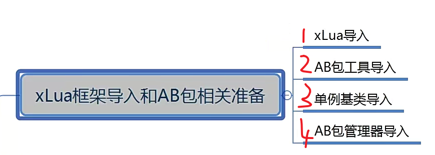

一：xlua的导入

1.

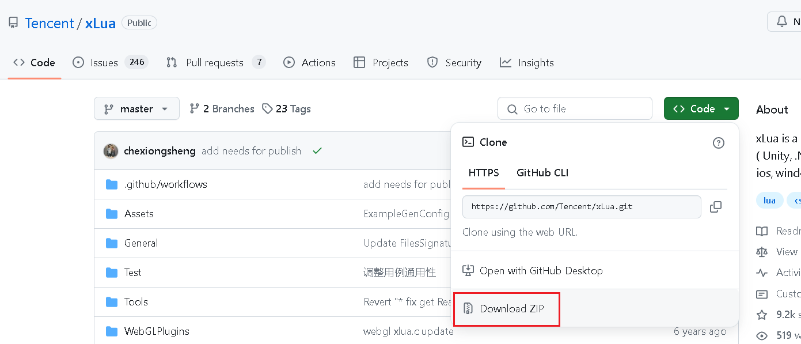

2.

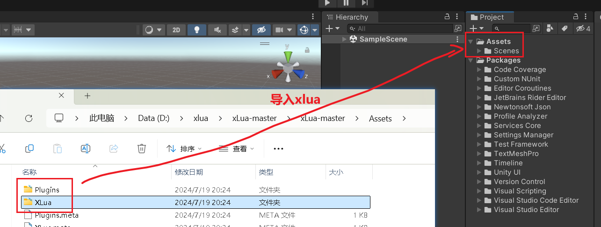

可能会发生命名空间找不到的错误

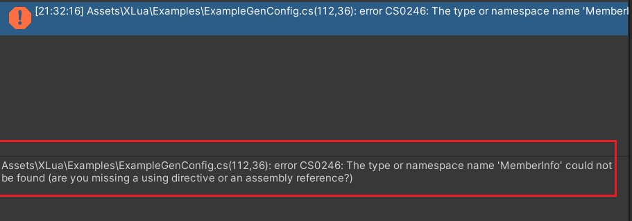

在报错的地方引入命名空间就可以了

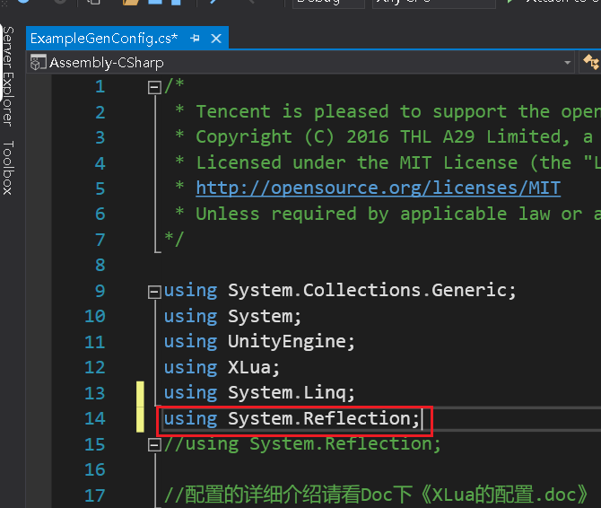

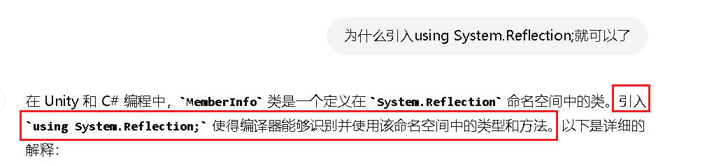

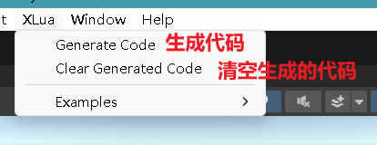

3.

第一次先清空代码，如何生成代码

生成完成会有一个完成的提示

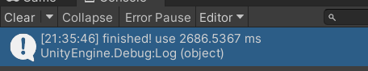

二：AB包的导入

通过github的url导入，在lua热更新AB包中可以找到具体的步骤

三：单例基类的导入

在框架视频里的三个基类

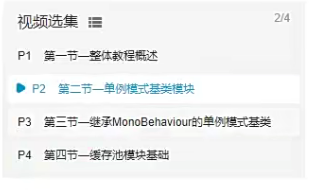

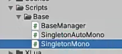

四：AB包管理器的导入

就是之前写的，AssetBundles

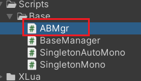

