# 15.面板基类

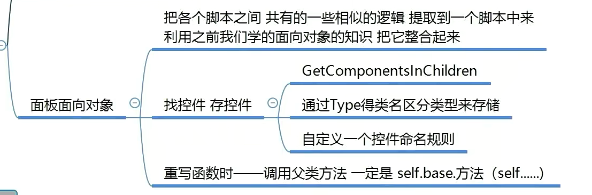

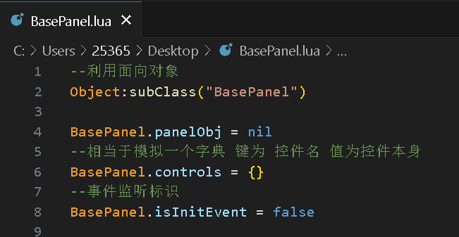

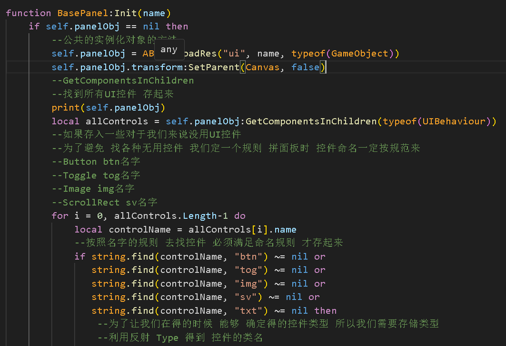

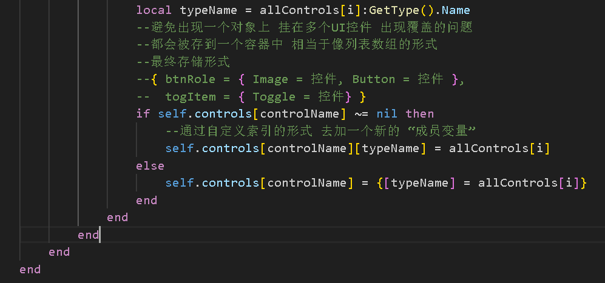

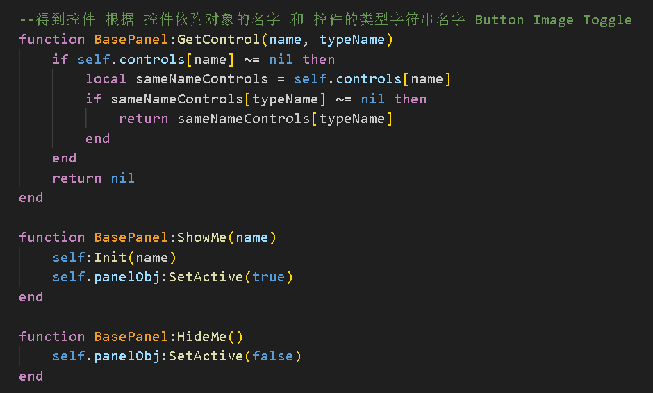

---

---

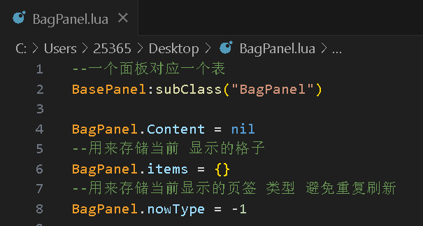

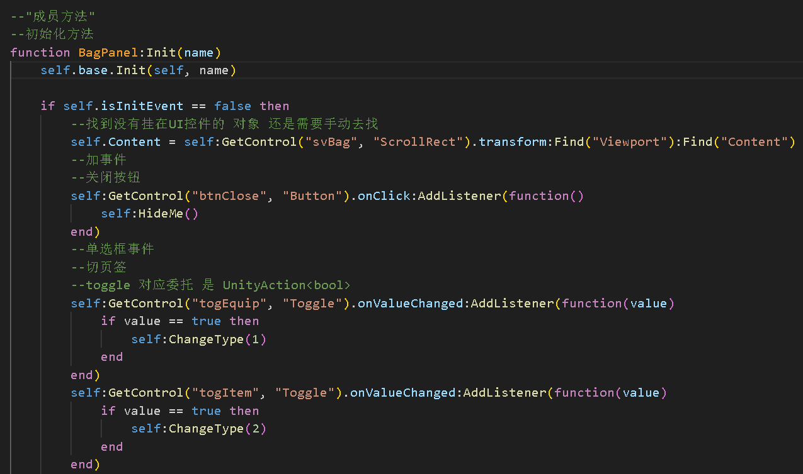

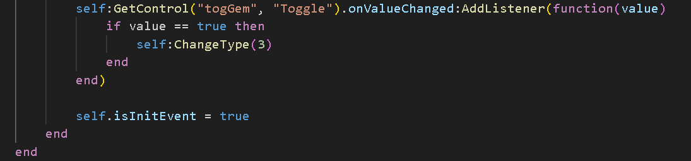

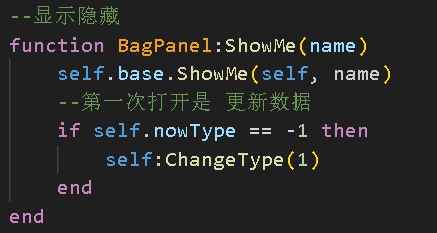

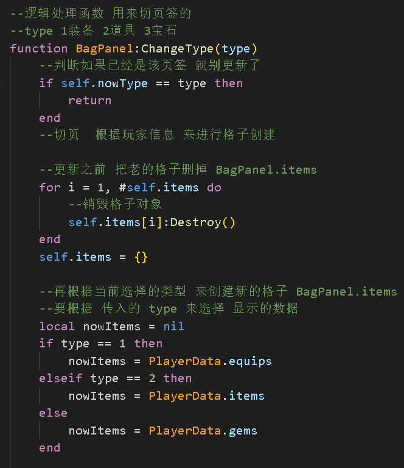

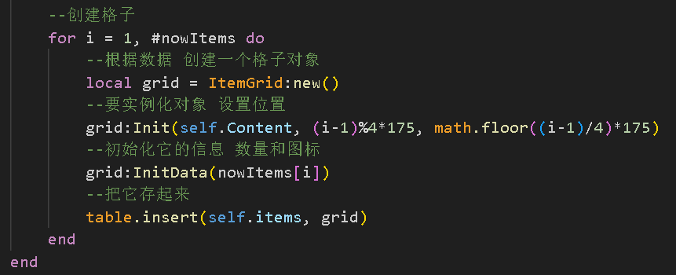

---

---

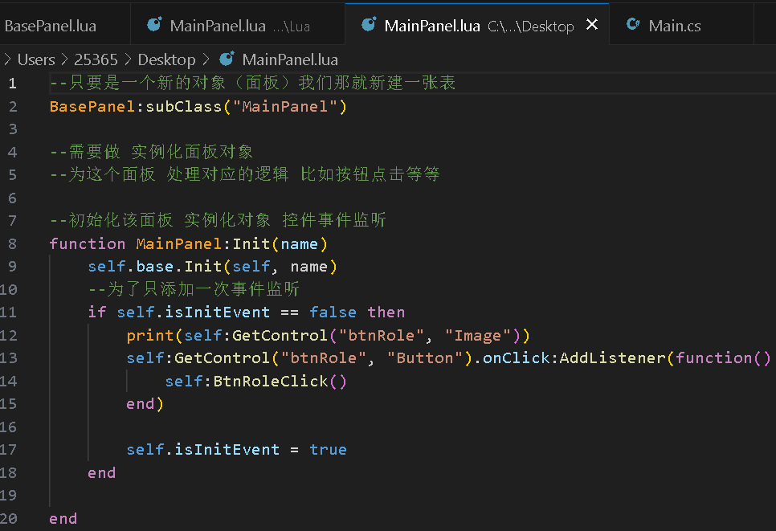

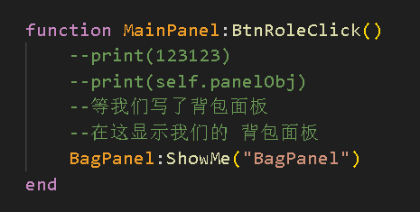

面板基类：

面板属性=nil

控件集合={ } --{控件名{控件名=控件}}

方法一：=>从AB包加载控件实例化，得到所有的控件，

方法二：=>返回存储的控件，面板显存

主面板：

方法一 =>调用基类初始化面板，调用控件加事件

方法二 =>面板显存

背包面板：

方法一 =>调用基类初始化面板，调用控件加事件

方法二 =>初始化格子面板

方法三 =>面板显存
