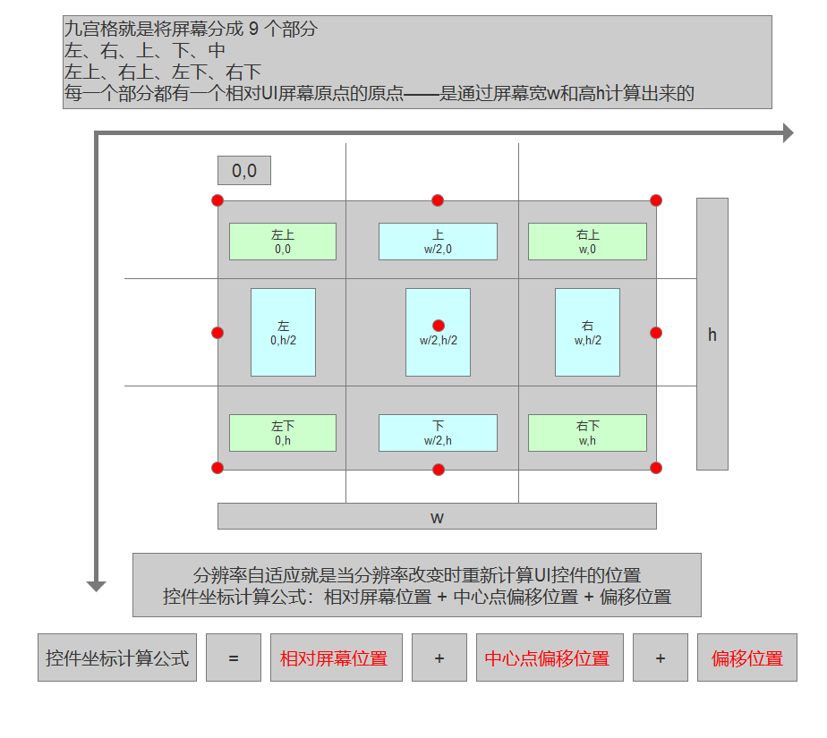
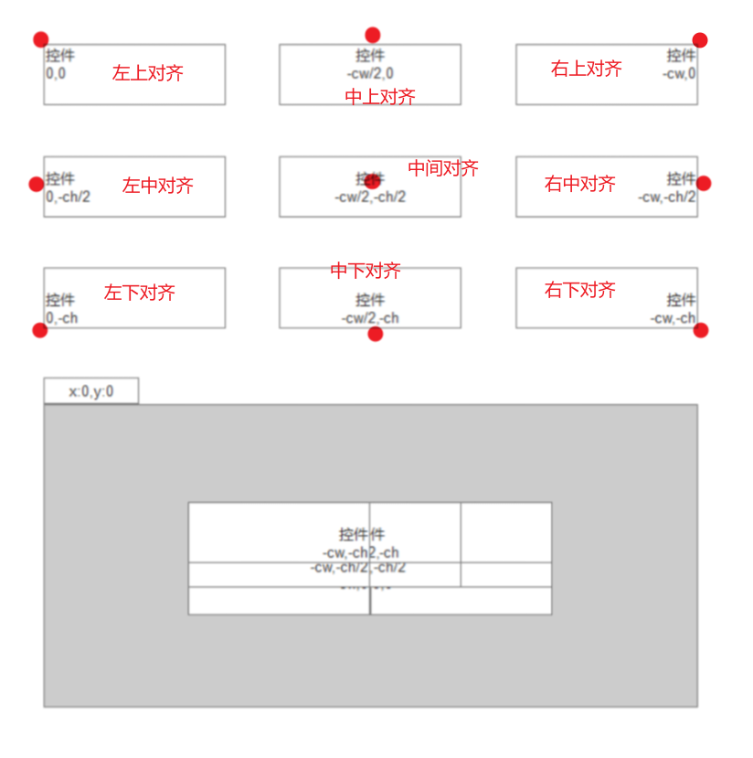

# 实践小项目九宫格布局概念

屏幕九宫格——将一个大的屏幕分成九个小屏幕，定位更准确，一直在计算可以实现屏幕自适应

哪个红点对其原点就是什么对其方式

---

---

控件坐标计算公式=相对屏幕位置+中心点偏移位置+偏移位置

步骤：

1.定义九宫格枚举

2.定义一个初始的位置

3.定义偏移量，控件宽高

3.定义屏幕九宫格（包含最终位置）和控件九宫格

4.控件偏移方法+屏幕九宫格偏移方法

5.定义一个类的属性，每次其他类调用这个类的时候会自动执行里面的方法

{

1.校准屏幕和控件位置

2.加宽高

}
