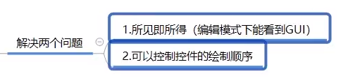
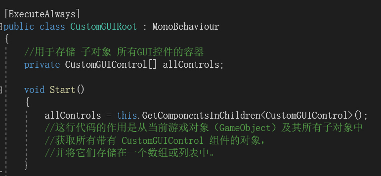
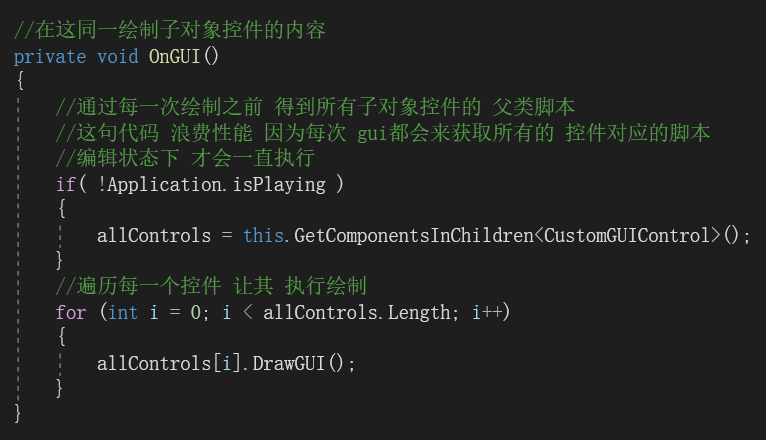
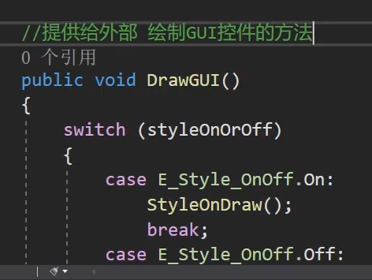
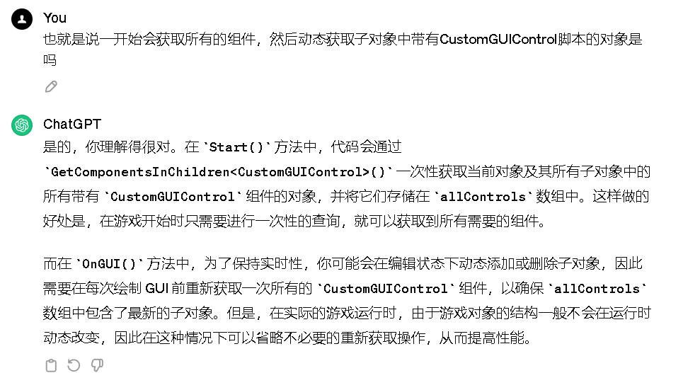
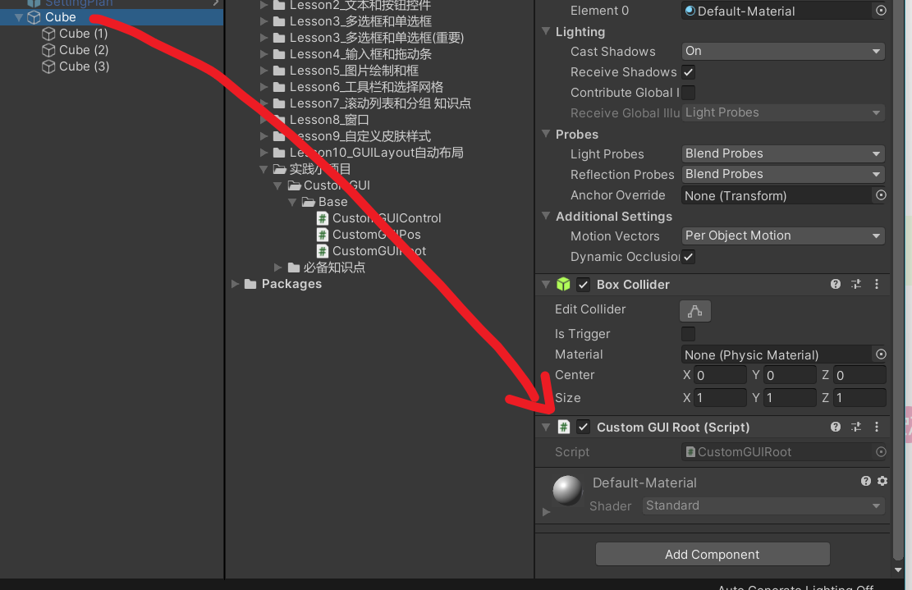
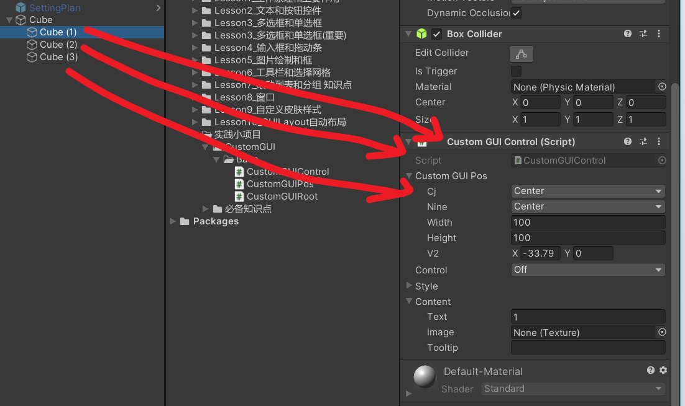
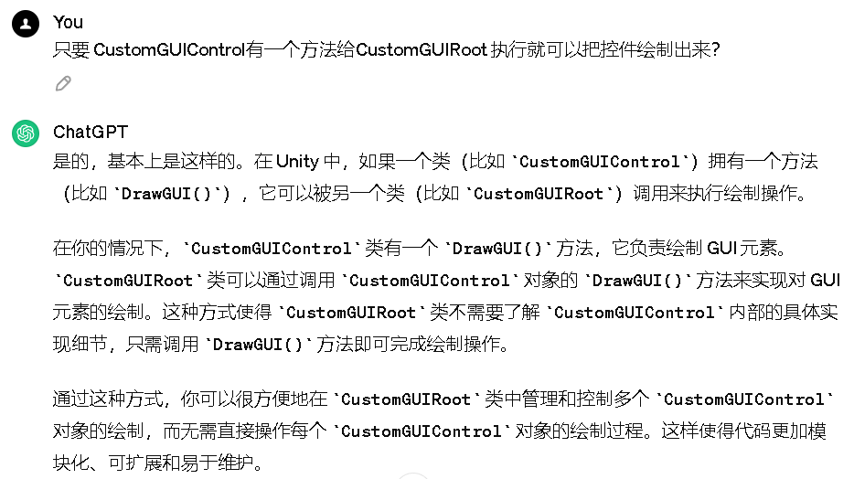
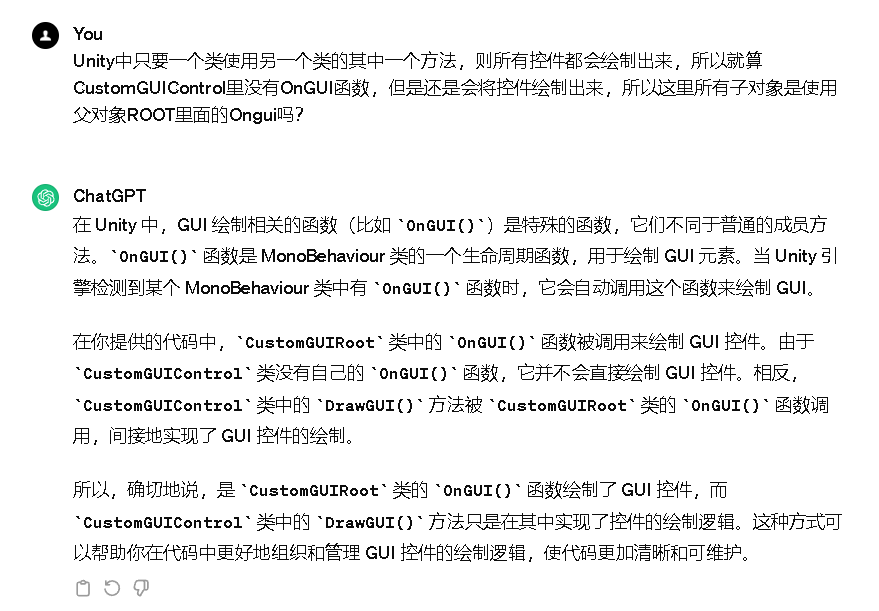

# 实践小项目所见即所得及控制绘制顺序

因为不能给每一个子对象都加一个特性太麻烦了，然后顺便控制层级

全部代码：

将CustomGUIControl的样式开关换成自定义方法

因为得到的所有子对象都是从第0个到第n个绘制，在数组里面就有一个顺序的关系01234，0先绘制，1后绘制依次例推，数组最后一个对象在最上层

因为是cube的子对象，所以都继承cube[ExecuteAlways]的特性，所以都所见即所得

因为

Unity中只要一个类使用另一个类的其中一个方法，则所有控件都会绘制出来，所以就算CustomGUIControl里没有OnGUI函数，但是还是会将控件绘制出来，因为都是在父对象中绘制，所以就是根据数组中存储对象的顺序进行绘制，所以就有了层级关系

