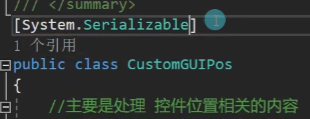
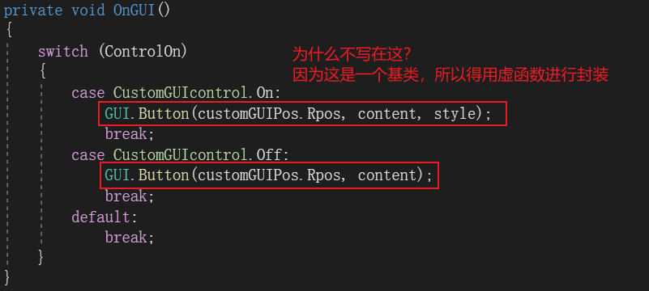
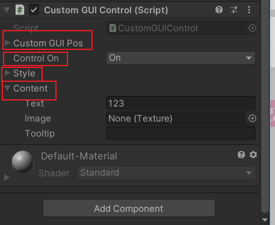
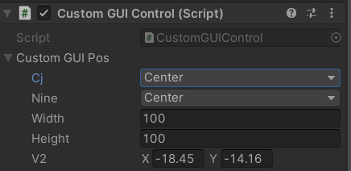
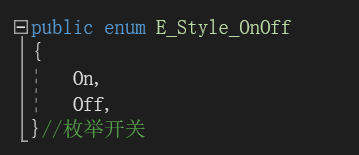
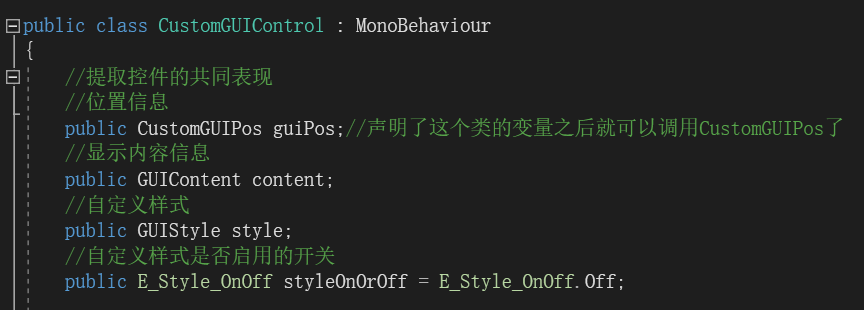
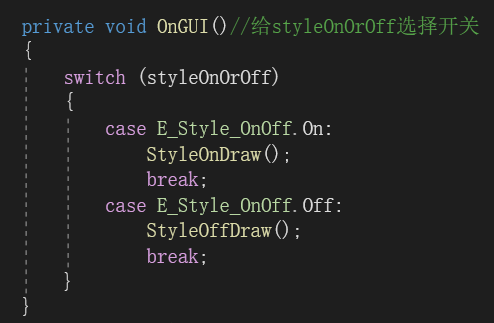
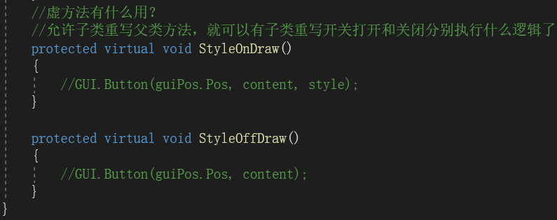

# 实践小项目控件父类

自定义类里面的公共属性不能在面板上出现，需要前面有一个特性，才能在面板显示

因为在类中声明了一个public CustomGUIPos customGUIPos;

所以CustomGUIPos中所有公共变量都会在面板中显示

【样式+调用父类位置信息+内容】

完整代码：

先定义一个枚举

定义公共变量开关

开关选择是否开启自定义样式

虚方法：方便子对象覆写，无论写按钮，还是laybel都可以

步骤:

1.一个父类控件的必须有（位置+类容+样式+样式是否开启）

2.定义一个控件开关的枚举

3.两个虚方法，只要继承了这个父类就自己写自己的样式
