# 实践小项目自定义文本和按钮控件

有什么用？

制作预制体

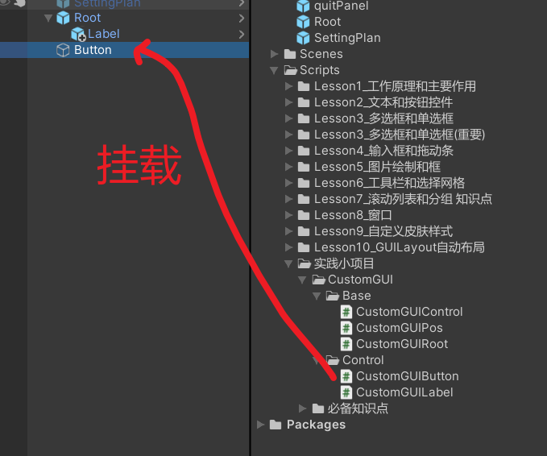

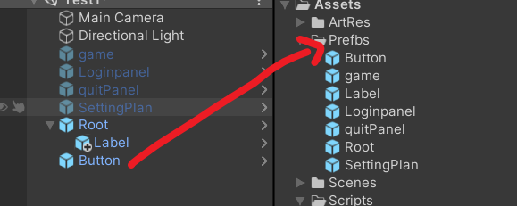

以后要使用按键或者文字内容就可以直接拖出来使用了

但是首先要是在一个写了所见即所得及控制绘制顺序的子对象下，才能所见所得

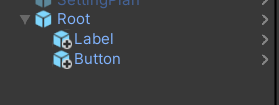

---

---

将CustomGUIControl修改为抽象类，将里面的方法修改为抽象方法

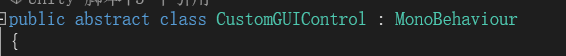

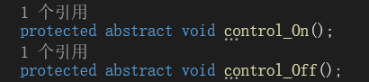

因为是抽象类，所以子类去继承的时候必须重写这两个方法

---

---

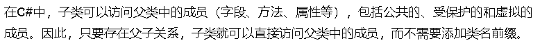

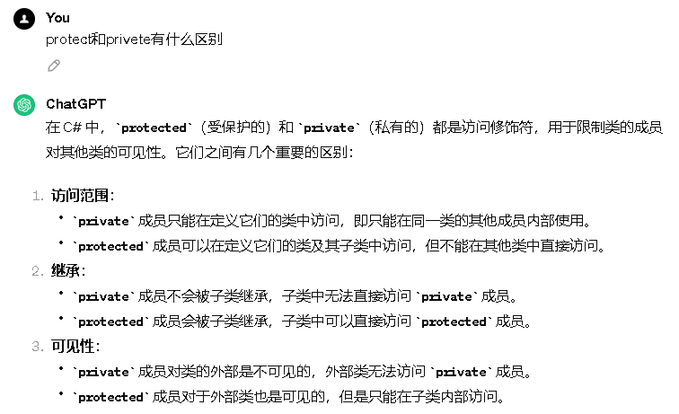

---

---

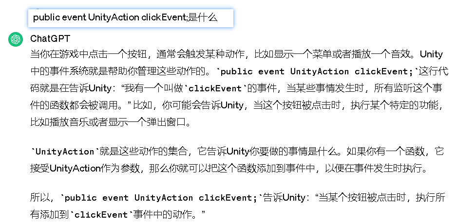

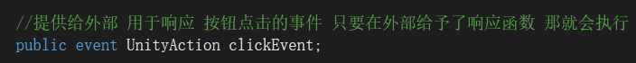

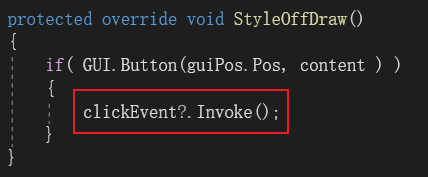

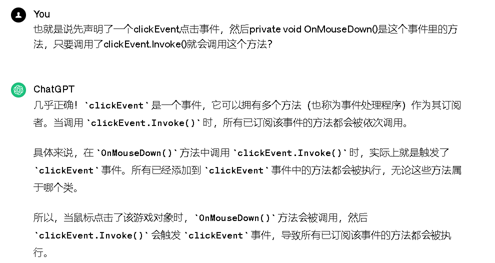

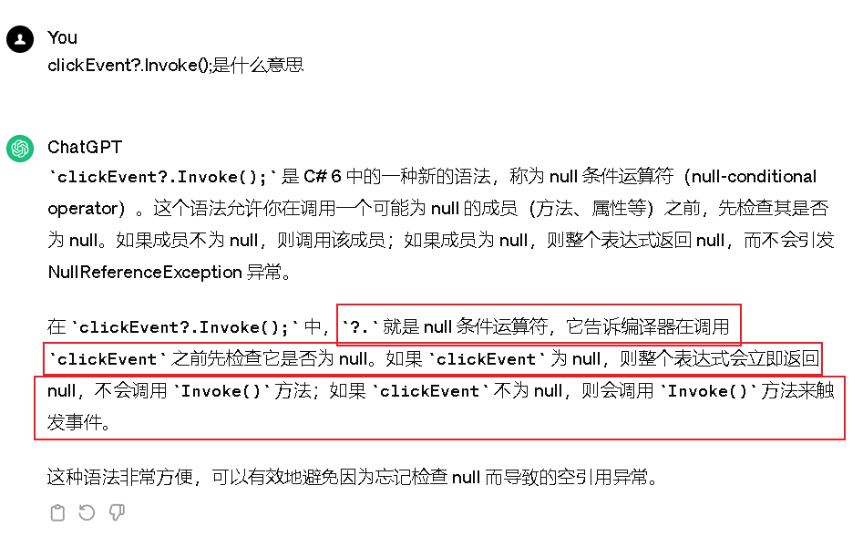

使用事件有一个前提条件，就是要先引用这个工具包

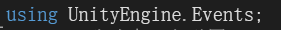

---

---

定义了这个事件有什么用呢？

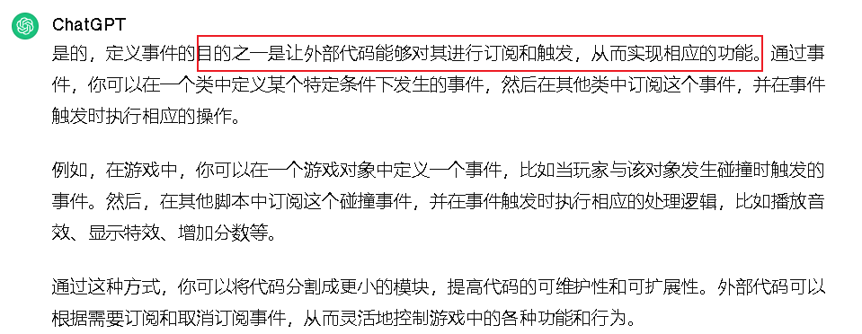

这个外部控制可以是哪里？

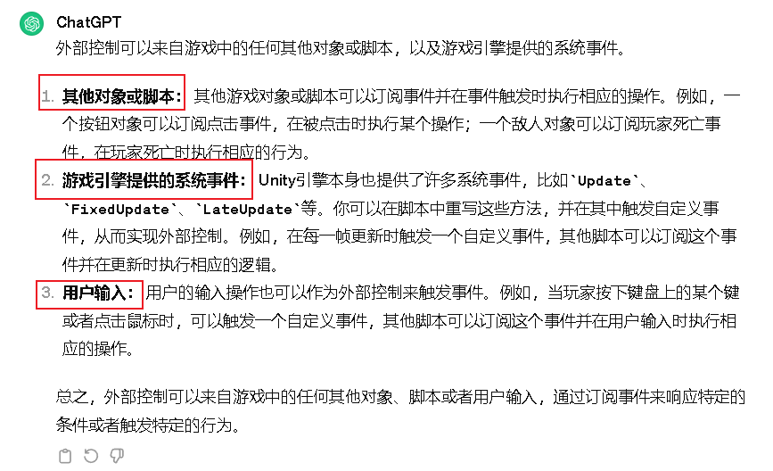

---

---

全部代码：

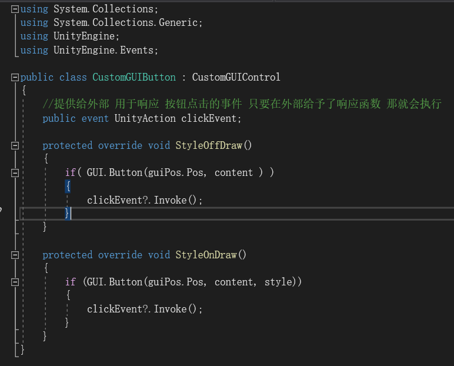

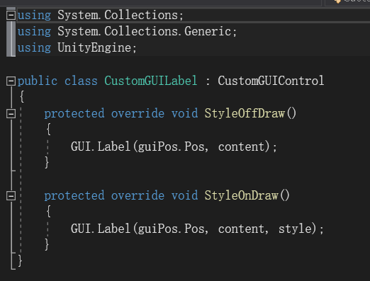
