# MonoBehavior中的重要内容

学习MonoBehavior最好的方法是直接选中，然后f12

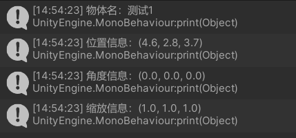

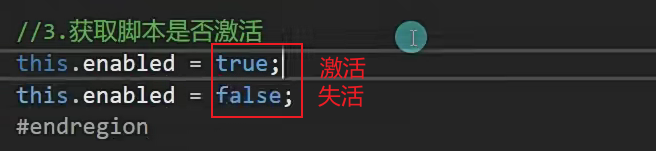

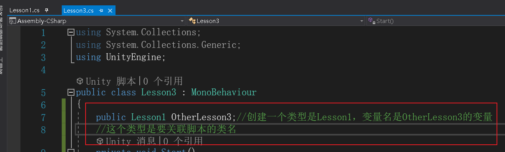

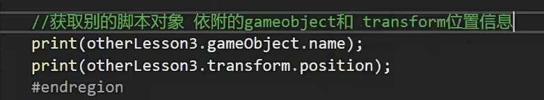

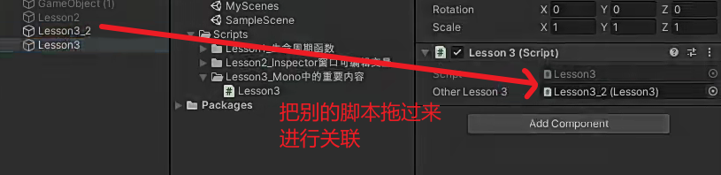

要拖过来的脚本对象，必须挂载了这里指定类型的脚本，比如这里的是获取otherLesson3的脚本对象的物体信息和姓名

而otherLesson3是一个lesson1类型的变量，所以另一个物体必须挂载lesson1脚本

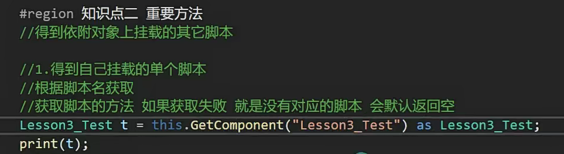

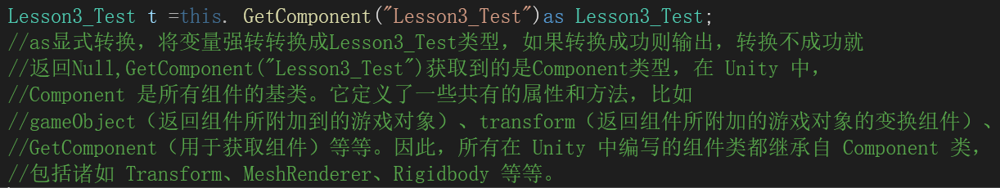

typeof(Lesson3_Test)=获取一个Lesson3_Test的type(类型)

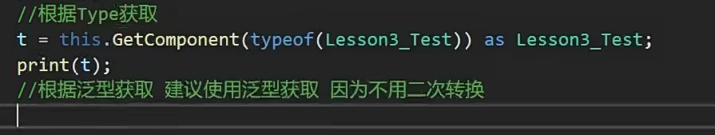

编译器可以根据 **as** 关键字右边的类型 **Lesson3_Test** 推断出变量 **t** 的类型应该是 **Lesson3_Test**

**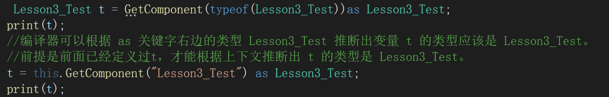**

****

**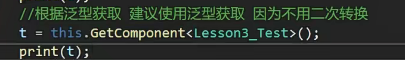**

****

总结：可以打印出来自己的脚本依附的对象挂载的其他脚本

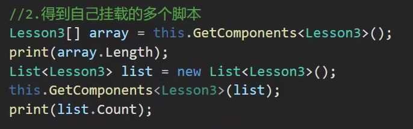

总结：可以得出挂载了这个脚本的数量

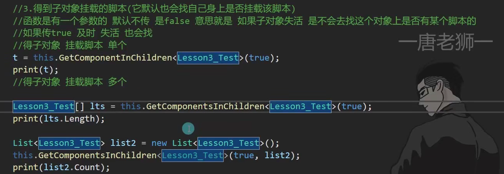

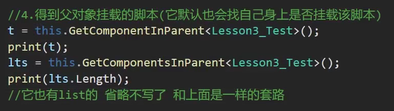

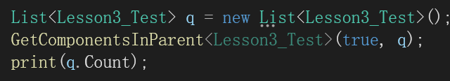

总结:

获取单个脚本就是获得脚本名字依附在那个对象上

多个脚本就是获得对象依附了多少个这个脚本

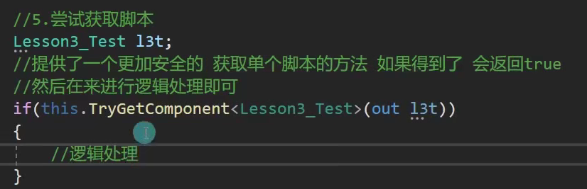

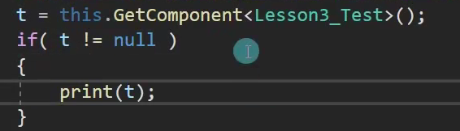

总结：以上两种方法都可以获取单个脚本时为空时，不执行里面的内容

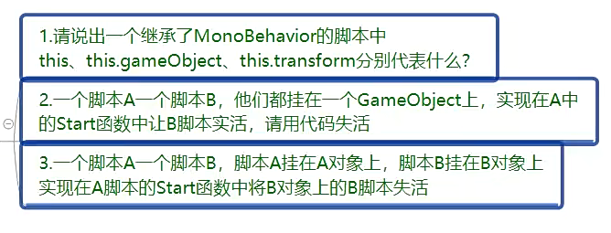

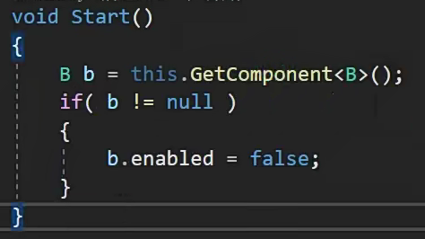

同一对象直接获取就可以了

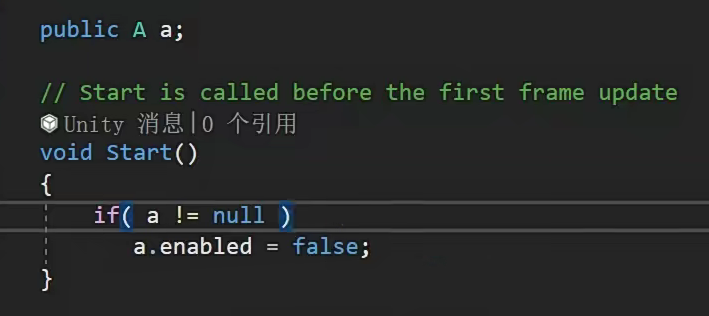

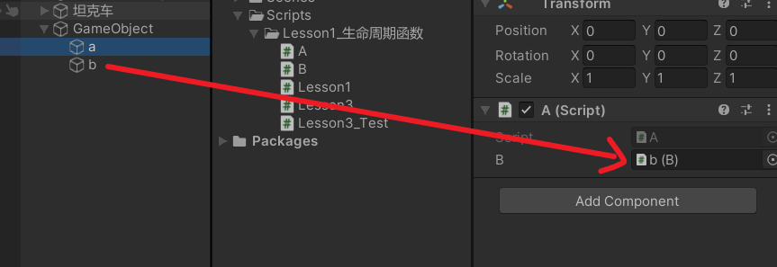

总结：

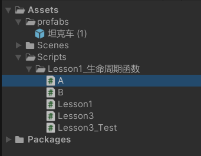

脚本之间都可以用Public B b;（创建一个B类型的b变量）进行关联，只要关联了，把对应脚本拖拽到对象上，再关联就可以实现不同对象间（或者同一对象）的调用
