# GameObject-静态方法

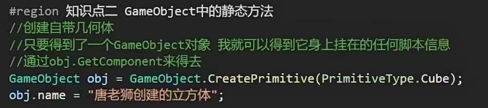

PrimitiveType是一个枚举，里面存着不同的集合体

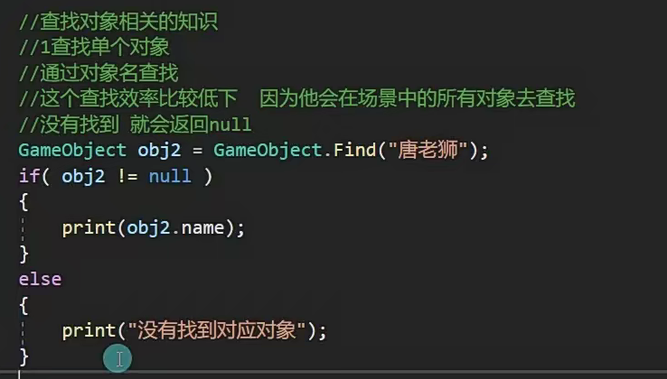

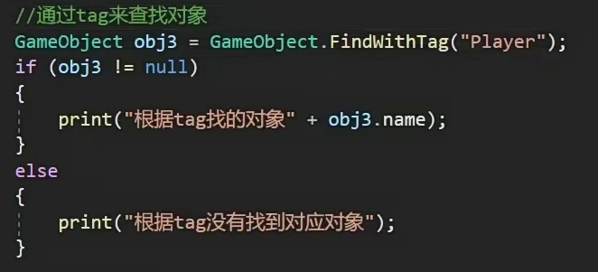

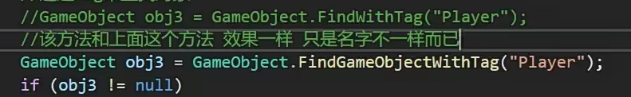

共同点：

以上,find,findObjectTag,findwithTag都只能找到激活的对象，不能找到失活的

如果场景上出现多个相同名字或者Tag标签不能确定找到的对象

作用：

只能找到场景上唯一的名字或者Tag

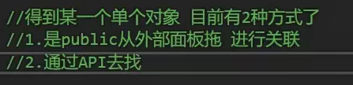

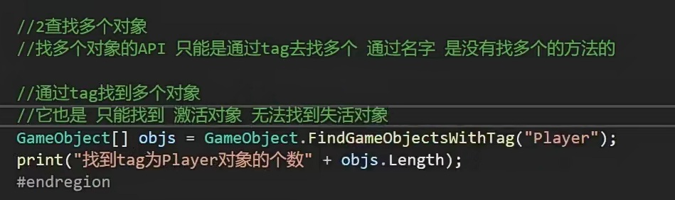

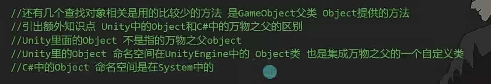

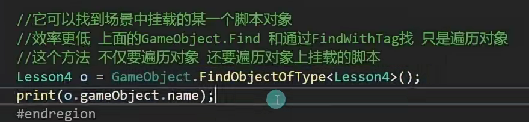

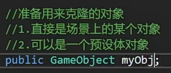

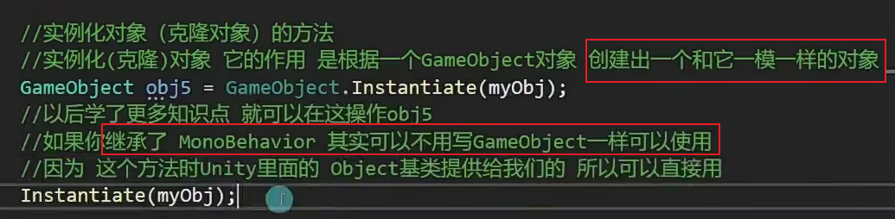

Instantiate=克隆

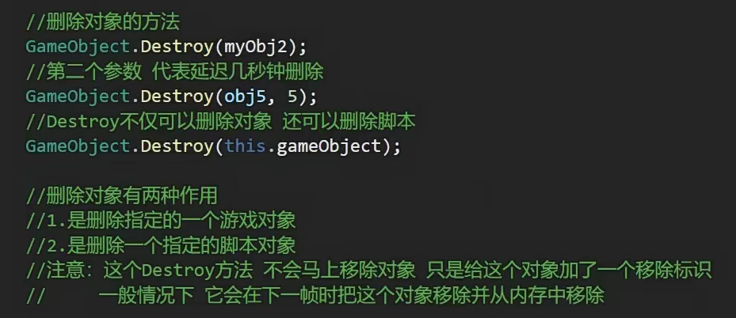

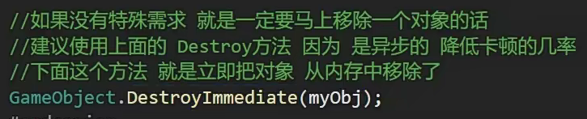

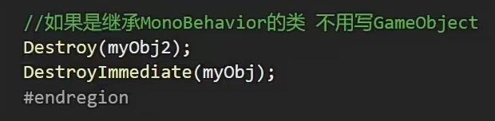

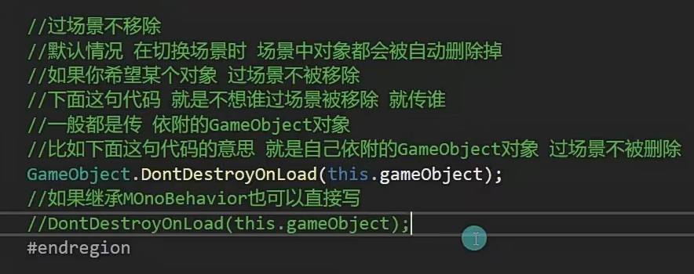

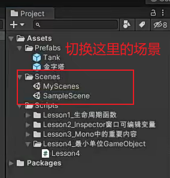
